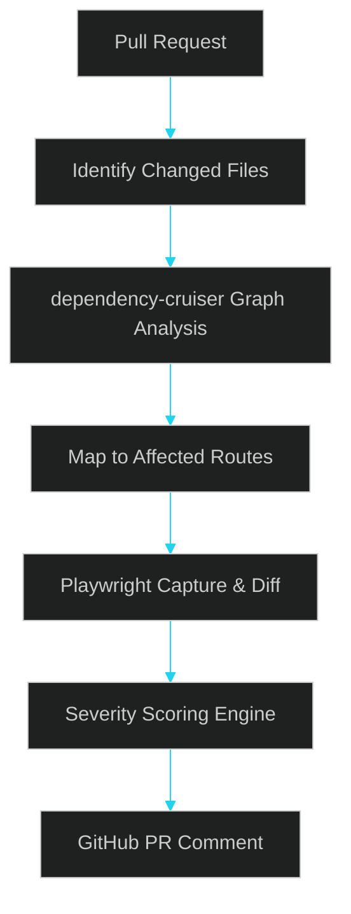
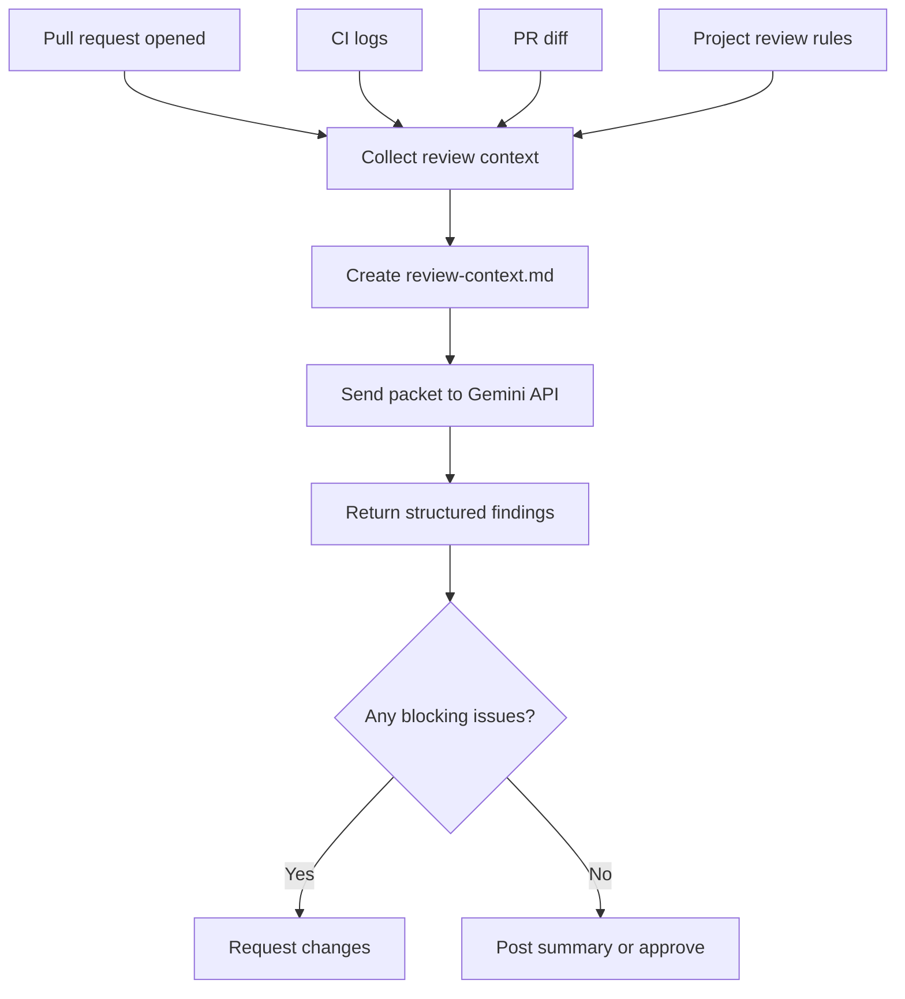
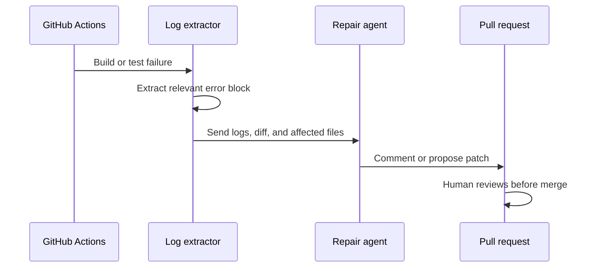
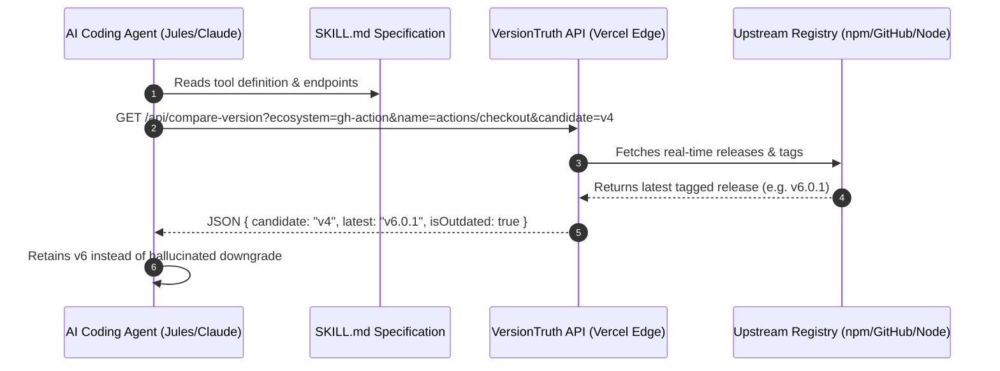

# File: src/App.test.tsx

```tsx
import { describe, test, expect } from 'vitest';
import { render, screen } from '@testing-library/react';
import { createHashRouter } from 'react-router-dom';
import App from '@/App';
import Layout from '@/components/Layout';
import Home from '@/pages/Home';

describe('arii/portfolio Smoke Test', () => {
  test('renders application successfully without errors', () => {
    const testRouter = createHashRouter([
      {
        path: '/',
        element: <Layout />,
        children: [
          {
            index: true,
            element: <Home onNavigate={() => {}} />,
          },
        ],
      },
    ]);

    render(<App router={testRouter} />);

    // Assert that core branding elements from layout and home are rendered
    expect(screen.getAllByText(/Ariel Anders/i).length).toBeGreaterThan(0);
    expect(screen.getAllByText(/Portfolio/i).length).toBeGreaterThan(0);

    // Assert that home content is present
    expect(screen.getAllByText(/Ariel Anders, PhD/i).length).toBeGreaterThan(0);
  });
});

```

# File: src/App.tsx

```tsx
import React from 'react';
import { RouterProvider } from 'react-router-dom';
import { HelmetProvider } from 'react-helmet-async';
import type { createHashRouter } from 'react-router-dom';

export interface AppProps {
  router: ReturnType<typeof createHashRouter>;
}

const App: React.FC<AppProps> = ({ router }) => {
  return (
    <HelmetProvider>
      <RouterProvider router={router} />
    </HelmetProvider>
  );
};

export default App;

```

# File: src/components/AcademicCard.tsx

```tsx
import React from 'react';
import { ExternalLink, GraduationCap, Award, FileText, Video, Play } from 'lucide-react';
import { AcademicPaper } from '@/data/academicResearch';

export interface AcademicCardProps {
  paper: AcademicPaper;
}

const AcademicCard: React.FC<AcademicCardProps> = ({ paper }) => {
  return (
    <div className="rounded-3xl border border-line bg-surface p-6 flex flex-col justify-between transition-all hover:border-accent hover:shadow-glow space-y-4">
      <div className="space-y-3">
        <div className="flex items-center justify-between">
          <div className="h-10 w-10 rounded-2xl bg-accent/10 flex items-center justify-center border border-accent/20">
            {paper.type.includes('Dissertation') || paper.type.includes('Thesis') ? (
              <GraduationCap className="h-5 w-5 text-accent" />
            ) : (
              <Award className="h-5 w-5 text-accent" />
            )}
          </div>
          <span className="rounded-full bg-accent/10 px-2.5 py-0.5 text-[10px] font-semibold uppercase text-accent border border-accent/20">
            {paper.year}
          </span>
        </div>

        <div>
          <span className="text-[10px] text-accent font-bold uppercase tracking-wider block font-sans">
            {paper.type}
          </span>
          <h3 className="text-lg font-bold text-text-main mt-1 font-display leading-snug">
            {paper.title}
          </h3>
          <p className="text-xs text-text-dim font-medium mt-1">
            {paper.venue}
          </p>
        </div>

        <p className="text-sm text-text-dim leading-relaxed font-sans">
          {paper.summary}
        </p>
      </div>

      <div className="space-y-4 pt-4 border-t border-line">
        <div className="flex flex-wrap gap-1.5">
          {paper.tags.map((tag) => (
            <span
              key={tag}
              className="px-2.5 py-0.5 rounded-full text-[10px] font-sans bg-surface text-text-dim border border-line"
            >
              {tag}
            </span>
          ))}
        </div>

        <div className="flex flex-wrap gap-2">
          {paper.pdfUrl && (
            <a
              href={paper.pdfUrl}
              target="_blank"
              rel="noopener noreferrer"
              className="inline-flex items-center space-x-1.5 bg-accent/10 border border-accent/20 px-3 py-1.5 rounded-xl text-xs font-semibold text-accent hover:bg-accent/20 transition-colors"
            >
              <FileText className="h-3.5 w-3.5" />
              <span>Download PDF Report</span>
            </a>
          )}
          {paper.videoUrl && (
            <a
              href={paper.videoUrl}
              target="_blank"
              rel="noopener noreferrer"
              className="inline-flex items-center space-x-1.5 bg-accent/10 border border-accent/20 px-3 py-1.5 rounded-xl text-xs font-semibold text-accent hover:bg-accent/20 transition-colors"
            >
              <Video className="h-3.5 w-3.5" />
              <span>Watch Video Demo</span>
            </a>
          )}
          {paper.playlistUrl && (
            <a
              href={paper.playlistUrl}
              target="_blank"
              rel="noopener noreferrer"
              className="inline-flex items-center space-x-1.5 bg-surface border border-line px-3 py-1.5 rounded-xl text-xs font-semibold text-text-dim hover:text-text-main transition-colors"
            >
              <Play className="h-3.5 w-3.5 text-accent" />
              <span>Watch Playlist</span>
            </a>
          )}
          {paper.link && (
            <a
              href={paper.link}
              target="_blank"
              rel="noopener noreferrer"
              className="inline-flex items-center space-x-1.5 bg-surface border border-line px-3 py-1.5 rounded-xl text-xs font-semibold text-text-dim hover:text-text-main transition-colors"
            >
              <span>View Publication</span>
              <ExternalLink className="h-3.5 w-3.5" />
            </a>
          )}
        </div>
      </div>
    </div>
  );
};

export default AcademicCard;

```

# File: src/components/FlagshipCard.tsx

```tsx
import React from 'react';
import { ExternalLink, ArrowRight, FlaskConical, Activity, Server, FileText, ShoppingBag, Cpu, Video, Play } from 'lucide-react';
import { ResearchTool } from '@/types/research';
import SafeImage from '@/components/ui/SafeImage';
import { GithubIcon } from '@/components/SocialIcons';

export interface FlagshipCardProps {
  tool: ResearchTool;
  onNavigate: (slug: string) => void;
  onImageClick: (src: string) => void;
}

const FlagshipCard: React.FC<FlagshipCardProps> = ({ tool, onNavigate, onImageClick }) => {
  const getToolIcon = (t: ResearchTool) => {
    if (t.id.includes('hrm')) return Activity;
    if (t.id.includes('experiments')) return FlaskConical;
    if (t.id.includes('scraper')) return Server;
    if (t.id.includes('blog-drafter')) return FileText;
    if (t.id.includes('ecommerce')) return ShoppingBag;
    return Cpu;
  };

  const ToolIcon = getToolIcon(tool);
  const imageSrc = tool.id === 'hrm-flagship' ? '/assets/research/hrm-flagship.png' : tool.id === 'repo-auditor-ai' ? '/assets/research/repo-auditor-ai.png' : tool.image || null;

  const isClickable = !!tool.canonicalPath;
  const targetSlug = tool.canonicalPath ? tool.canonicalPath.replace('/research/', '') : '';

  const handleCardClick = () => {
    if (isClickable && targetSlug) {
      onNavigate(targetSlug);
    }
  };

  const handleKeyDown = (e: React.KeyboardEvent) => {
    if ((e.key === 'Enter' || e.key === ' ') && isClickable && targetSlug) {
      if (e.key === ' ') e.preventDefault();
      onNavigate(targetSlug);
    }
  };

  return (
    <div
      onClick={handleCardClick}
      onKeyDown={handleKeyDown}
      tabIndex={isClickable ? 0 : undefined}
      role={isClickable ? 'button' : undefined}
      className={`group rounded-3xl border border-line bg-surface p-0 flex flex-col justify-between overflow-hidden transition-all hover:border-accent hover:shadow-glow ${
        isClickable ? 'cursor-pointer' : ''
      }`}
    >
      {tool.customPreview ? (
        <div className="p-6 bg-bg border-b border-line min-h-[140px] flex flex-col justify-center space-y-2">
          <div className="text-accent font-extrabold text-sm tracking-wider font-display">
            {tool.customPreview.logo.prefix}<span className="text-text-main">{tool.customPreview.logo.accent}</span><span className="text-text-dim font-light">{tool.customPreview.logo.suffix}</span>
          </div>
          <div className="text-text-main font-black text-lg leading-tight font-display">
            {tool.customPreview.headline.map((line, idx) => (<span key={idx} className={line.accent ? 'text-accent' : ''}>{line.text}{' '}</span>))}
          </div>
          <div className="text-xs text-text-dim">{tool.customPreview.tagline}</div>
        </div>
      ) : imageSrc ? (
        <div
          onClick={(e) => {
            e.stopPropagation();
            onImageClick(imageSrc);
          }}
          className="relative aspect-[16/10] max-h-48 sm:max-h-64 overflow-hidden bg-bg border-b border-line cursor-zoom-in group/img"
        >
          <SafeImage
            src={imageSrc}
            alt={tool.imageAlt || tool.title}
            className="w-full h-full object-cover object-top transition-transform duration-500 group-hover/img:scale-102"
            containerClassName="w-full h-full"
          />
        </div>
      ) : null}

      <div className="p-6 flex-grow flex flex-col justify-between space-y-4">
        <div className="space-y-3">
          <div className="flex items-center justify-between">
            <div className="h-10 w-10 rounded-2xl bg-accent/10 flex items-center justify-center border border-accent/20"><ToolIcon className="h-5 w-5 text-accent" /></div>
            {tool.id !== 'phd-thesis' && tool.id !== 'masters-thesis' && (
              <span className="rounded-full bg-accent/10 px-2.5 py-0.5 text-[9px] font-semibold uppercase text-accent border border-accent/20">
                {tool.id === 'boomtick-blog' ? 'Active dev' : 'Flagship'}
              </span>
            )}
          </div>
          <div>
            <span className="text-[10px] text-accent font-bold uppercase tracking-wider block font-sans">{tool.category}</span>
            <h3 className="text-xl font-bold text-text-main mt-1 font-display group-hover:text-accent transition-colors">{tool.title}</h3>
            {tool.subtitle && <p className="text-xs text-accent font-semibold tracking-wide mt-1 uppercase font-sans">{tool.subtitle}</p>}
          </div>
          <p className="text-sm text-text-dim leading-relaxed">{tool.description}</p>
          {tool.inDevMessage && (
            <div className="bg-surface border border-line p-3 rounded-2xl text-xs flex gap-2 items-start text-text-dim">
              <FlaskConical className="h-4 w-4 text-accent shrink-0 mt-0.5" />
              <p><strong className="text-text-main">{tool.inDevMessage.highlight}</strong> {tool.inDevMessage.rest}</p>
            </div>
          )}
        </div>

        <div className="space-y-4 pt-4 border-t border-line">
          <div className="flex flex-wrap gap-1.5">
            {tool.tags.map((tag) => (
              <span key={tag} className="px-2.5 py-0.5 rounded-full text-[10px] font-sans bg-surface text-text-dim border border-line">{tag}</span>
            ))}
          </div>

          <div className="flex flex-wrap gap-3" onClick={(e) => e.stopPropagation()}>
            {tool.canonicalPath && (
              <button
                onClick={(e) => {
                  e.stopPropagation();
                  onNavigate(targetSlug);
                }}
                className="inline-flex items-center space-x-1.5 bg-accent/10 border border-accent/20 px-3.5 py-2 rounded-xl text-xs font-semibold text-accent hover:bg-accent/20 transition-colors min-h-[44px] cursor-pointer"
              >
                <span>Read Deep-Dive</span><ArrowRight className="h-3.5 w-3.5" />
              </button>
            )}
            {tool.videoUrl && (
              <a
                href={tool.videoUrl}
                target="_blank"
                rel="noopener noreferrer"
                onClick={(e) => e.stopPropagation()}
                className="inline-flex items-center space-x-1.5 bg-surface border border-line px-3.5 py-2 rounded-xl text-xs font-semibold text-text-dim hover:bg-surface-alt hover:text-text-main transition-colors min-h-[44px]"
              >
                <Video className="h-3.5 w-3.5 text-accent" /><span>Watch Video</span>
              </a>
            )}
            {tool.externalUrl && (
              <a
                href={tool.externalUrl}
                target="_blank"
                rel="noopener noreferrer"
                onClick={(e) => e.stopPropagation()}
                className={`inline-flex items-center space-x-1.5 px-3.5 py-2 rounded-xl text-xs font-semibold transition-colors min-h-[44px] ${
                  tool.canonicalPath
                    ? 'bg-surface border border-line text-text-dim hover:bg-surface-alt hover:text-text-main'
                    : 'bg-accent/10 border border-accent/20 text-accent hover:bg-accent/20'
                }`}
              >
                <span>{tool.externalLinkDisplayLabel || 'Open Link'}</span><ExternalLink className="h-3.5 w-3.5" />
              </a>
            )}
            {tool.playlistUrl && (
              <a
                href={tool.playlistUrl}
                target="_blank"
                rel="noopener noreferrer"
                onClick={(e) => e.stopPropagation()}
                className="inline-flex items-center space-x-1.5 bg-surface border border-line px-3.5 py-2 rounded-xl text-xs font-semibold text-text-dim hover:bg-surface-alt hover:text-text-main transition-colors min-h-[44px]"
              >
                <Play className="h-3.5 w-3.5 text-accent" />
                <span>Watch Playlist</span>
              </a>
            )}
            {tool.sourceUrl && (
              <a
                href={tool.sourceUrl}
                target="_blank"
                rel="noopener noreferrer"
                onClick={(e) => e.stopPropagation()}
                className="inline-flex items-center space-x-1.5 bg-surface border border-line px-3.5 py-2 rounded-xl text-xs font-semibold text-text-dim hover:bg-surface-alt hover:text-text-main transition-colors min-h-[44px]"
              >
                <span>Source Repo</span><GithubIcon className="h-3.5 w-3.5" />
              </a>
            )}
          </div>
        </div>
      </div>
    </div>
  );
};

export default FlagshipCard;

```

# File: src/components/ImageLightbox.tsx

```tsx
import React from 'react';
import { X } from 'lucide-react';

export interface ImageLightboxProps {
  imageSrc: string | null;
  onClose: () => void;
  altText?: string;
}

const ImageLightbox: React.FC<ImageLightboxProps> = ({
  imageSrc,
  onClose,
  altText = 'Enlarged screenshot preview',
}) => {
  if (!imageSrc) return null;

  const isWebpAvailable = /\.(png|jpe?g)$/i.test(imageSrc);
  const webpSrc = isWebpAvailable ? imageSrc.replace(/\.(png|jpe?g)$/i, '.webp') : null;

  return (
    <div
      className="fixed inset-0 z-50 flex items-center justify-center bg-bg/95 cursor-zoom-out p-4 backdrop-blur-sm"
      onClick={onClose}
    >
      <button
        className="absolute top-4 right-4 text-text-main hover:text-accent p-2 transition-colors focus:outline-none cursor-pointer"
        onClick={onClose}
        aria-label="Close modal"
      >
        <X className="h-8 w-8" />
      </button>
      {isWebpAvailable && webpSrc ? (
        <picture>
          <source srcSet={webpSrc} type="image/webp" />
          
        </picture>
      ) : (
        
      )}
    </div>
  );
};

export default ImageLightbox;

```

# File: src/components/Layout.tsx

```tsx
import React, { useEffect } from 'react';
import { Outlet, useLocation } from 'react-router-dom';
import Navigation from './Navigation';
import Footer from '../layouts/Footer';

export interface LayoutProps {
  className?: string;
}

const Layout: React.FC<LayoutProps> = ({ className }) => {
  const { pathname, hash } = useLocation();

  useEffect(() => {
    if (hash) {
      const id = hash.replace('#', '');
      const element = document.getElementById(id);
      if (element) {
        if (typeof element.scrollIntoView === 'function') {
          element.scrollIntoView({ behavior: 'smooth' });
        }
        return;
      }
    }
    try {
      if (typeof window !== 'undefined' && typeof window.scrollTo === 'function') {
        window.scrollTo(0, 0);
      }
    } catch {
      // Ignore jsdom scrollNotImplemented warnings
    }
  }, [pathname, hash]);

  return (
    <div className={`min-h-screen flex flex-col bg-background text-muted-foreground relative ${className || ''}`}>
      <Navigation />

      {/* Main Outlet Page Container */}
      <main id="main-content" className="flex-grow w-full relative pb-24 lg:pb-12">
        <div className="max-w-6xl mx-auto px-4 py-8">
          <Outlet />
        </div>
      </main>

      <Footer />
    </div>
  );
};

export default Layout;

```

# File: src/components/Navigation.tsx

```tsx
import React, { useState, useEffect } from 'react';
import { Link, useLocation } from 'react-router-dom';
import { Menu, X, Layers, Activity, User, FileText } from 'lucide-react';
import { heroContent } from '@/data/home';

const Navigation: React.FC = () => {
  const [isOpen, setIsOpen] = useState(false);
  const location = useLocation();

  const navLinks = [
    { name: 'Overview', path: '/', icon: Activity },
    { name: 'DevAI', path: '/devai', icon: Layers },
    { name: 'Research', path: '/research', icon: Layers },
    { name: 'Resume', path: '/resume', icon: FileText },
    { name: 'About Ariel', path: '/about', icon: User },
  ];

  const isActive = (path: string) => location.pathname === path;

  useEffect(() => {
    if (isOpen) {
      document.body.style.overflow = 'hidden';
    } else {
      document.body.style.overflow = '';
    }
    return () => {
      document.body.style.overflow = '';
    };
  }, [isOpen]);

  useEffect(() => {
    const handleKeyDown = (e: KeyboardEvent) => {
      if (e.key === 'Escape' && isOpen) {
        setIsOpen(false);
      }
    };
    window.addEventListener('keydown', handleKeyDown);
    return () => window.removeEventListener('keydown', handleKeyDown);
  }, [isOpen]);

  return (
    <>
      <header className="sticky top-0 z-40 w-full border-b border-line bg-bg">
        <div className="mx-auto flex h-14 sm:h-16 max-w-7xl items-center justify-between px-4 sm:px-6 lg:px-8">
          <Link to="/" className="flex items-center space-x-3 group">
            <div className="flex flex-col">
              <span className="text-sm sm:text-base font-bold tracking-tight text-foreground">
                {heroContent.brandTitle}
              </span>
              <span className="hidden sm:block text-xs text-muted-foreground font-mono">
                {heroContent.brandRole}
              </span>
            </div>
          </Link>

          {/* Desktop Navigation */}
          <nav className="hidden md:flex md:items-center md:space-x-1">
            {navLinks.map((link) => {
              const Icon = link.icon;
              const active = isActive(link.path);
              return (
                <Link
                  key={link.name}
                  to={link.path}
                  className={`flex items-center space-x-2 rounded-md px-3.5 py-2 text-sm font-medium transition-colors min-h-[44px] ${
                    active
                      ? 'bg-secondary text-foreground'
                      : 'text-muted-foreground hover:bg-muted hover:text-foreground'
                  }`}
                >
                  <Icon className="h-4 w-4" />
                  <span>{link.name}</span>
                </Link>
              );
            })}
          </nav>

          {/* Mobile Menu Toggle */}
          <button
            onClick={() => setIsOpen(!isOpen)}
            className="flex h-11 w-11 items-center justify-center rounded-md border border-border text-muted-foreground hover:text-foreground md:hidden"
            aria-label="Toggle navigation menu"
            aria-expanded={isOpen}
          >
            {isOpen ? <X className="h-5 w-5" /> : <Menu className="h-5 w-5" />}
          </button>
        </div>
      </header>

      {/* Mobile Fixed Slide-over Modal Drawer */}
      {isOpen && (
        <div
          className="fixed inset-0 z-50 flex justify-end bg-bg/80 backdrop-blur-md md:hidden"
          onClick={() => setIsOpen(false)}
          role="dialog"
          aria-modal="true"
          aria-label="Mobile Navigation Menu"
        >
          <div
            className="w-72 h-full bg-bg border-l border-line p-6 shadow-2xl flex flex-col justify-between"
            onClick={(e) => e.stopPropagation()}
          >
            <div className="space-y-6">
              <div className="flex items-center justify-between pb-4 border-b border-line">
                <span className="text-sm font-bold text-text-main">Navigation</span>
                <button
                  onClick={() => setIsOpen(false)}
                  className="flex h-11 w-11 items-center justify-center rounded-md border border-line text-text-body hover:text-text-main"
                  aria-label="Close menu"
                >
                  <X className="h-5 w-5" />
                </button>
              </div>

              <div className="flex flex-col space-y-2">
                {navLinks.map((link) => {
                  const Icon = link.icon;
                  const active = isActive(link.path);
                  return (
                    <Link
                      key={link.name}
                      to={link.path}
                      onClick={() => setIsOpen(false)}
                      className={`flex items-center space-x-3 rounded-lg px-4 py-3 text-base font-semibold min-h-[44px] transition-colors ${
                        active
                          ? 'bg-accent/15 text-accent border border-accent/30'
                          : 'text-text-body hover:bg-surface hover:text-text-main'
                      }`}
                    >
                      <Icon className="h-5 w-5" />
                      <span>{link.name}</span>
                    </Link>
                  );
                })}
              </div>
            </div>

            <div className="pt-6 border-t border-line">
              <span className="text-xs text-text-dim">
                Ariel Anders, PhD — Roboticist
              </span>
            </div>
          </div>
        </div>
      )}
    </>
  );
};

export default Navigation;

```

# File: src/components/ResearchCard.tsx

```tsx
import React from 'react';
import { Calendar, Clock, ArrowRight } from 'lucide-react';
import { ResearchPost } from '@/types/research';

export interface ResearchCardProps {
  post: ResearchPost;
  onSelect: (slug: string) => void;
}

const ResearchCard: React.FC<ResearchCardProps> = ({ post, onSelect }) => {
  const handleClick = () => {
    onSelect(post.slug);
  };

  const handleKeyDown = (e: React.KeyboardEvent) => {
    if (e.key === 'Enter' || e.key === ' ') {
      e.preventDefault();
      onSelect(post.slug);
    }
  };

  return (
    <article
      onClick={handleClick}
      onKeyDown={handleKeyDown}
      tabIndex={0}
      role="button"
      className="group flex flex-col justify-between rounded-xl border border-border bg-card hover:bg-muted/50 p-6 shadow-sm transition-all hover:border-primary/50 hover:shadow-md cursor-pointer overflow-hidden text-foreground"
    >
      <div className="flex-grow flex flex-col justify-between">
        <div>
          <div className="flex flex-wrap gap-2 mb-3">
            {post.tags.map((tag) => (
              <span
                key={tag}
                className="rounded-full border border-border bg-background px-2 py-0.5 text-[10px] font-medium text-muted-foreground uppercase tracking-wider"
              >
                {tag}
              </span>
            ))}
          </div>
          <h3 className="text-lg font-bold text-foreground group-hover:text-primary transition-colors flex items-start space-x-1">
            <span>{post.title}</span>
          </h3>
          <p className="mt-2 text-sm text-muted-foreground line-clamp-3 leading-relaxed">
            {post.summary}
          </p>
        </div>

        <div className="mt-6 flex items-center justify-between text-xs text-muted-foreground border-t border-border pt-4">
          <div className="flex items-center space-x-4">
            <span className="flex items-center space-x-1">
              <Calendar className="h-3.5 w-3.5" />
              <time dateTime={post.date}>{post.date}</time>
            </span>
            <span className="flex items-center space-x-1">
              <Clock className="h-3.5 w-3.5" />
              <span>{post.readingTime}</span>
            </span>
          </div>
          <ArrowRight className="h-4 w-4 text-primary transition-transform group-hover:translate-x-1" />
        </div>
      </div>
    </article>
  );
};

export default ResearchCard;

```

# File: src/components/SocialIcons.tsx

```tsx
import React from 'react';

export interface SocialIconsProps {
  className?: string;
  iconClassName?: string;
}

export const LinkedinIcon: React.FC<React.SVGProps<SVGSVGElement>> = (props) => (
  <svg
    viewBox="0 0 24 24"
    fill="none"
    stroke="currentColor"
    strokeWidth="2"
    strokeLinecap="round"
    strokeLinejoin="round"
    {...props}
  >
    <path d="M16 8a6 6 0 0 1 6 6v7h-4v-7a2 2 0 0 0-2-2 2 2 0 0 0-2 2v7h-4v-7a6 6 0 0 1 6-6z" />
    <rect x="2" y="9" width="4" height="12" />
    <circle cx="4" cy="4" r="2" />
  </svg>
);

export const GithubIcon: React.FC<React.SVGProps<SVGSVGElement>> = (props) => (
  <svg
    viewBox="0 0 24 24"
    fill="none"
    stroke="currentColor"
    strokeWidth="2"
    strokeLinecap="round"
    strokeLinejoin="round"
    {...props}
  >
    <path d="M9 19c-5 1.5-5-2.5-7-3m14 6v-3.87a3.37 3.37 0 0 0-.94-2.61c3.14-.35 6.44-1.54 6.44-7A5.44 5.44 0 0 0 20 4.77 5.07 5.07 0 0 0 19.91 1S18.73.65 16 2.48a13.38 13.38 0 0 0-7 0C6.27.65 5.09 1 5.09 1A5.07 5.07 0 0 0 5 4.77a5.44 5.44 0 0 0-1.5 3.78c0 5.42 3.3 6.61 6.44 7A3.37 3.37 0 0 0 9 18.13V22" />
  </svg>
);

export const BoomTickIcon: React.FC<React.SVGProps<SVGSVGElement>> = (props) => (
  <svg
    viewBox="0 0 100 100"
    fill="currentColor"
    xmlns="http://www.w3.org/2000/svg"
    {...props}
  >
    <path
      fillRule="evenodd"
      clipRule="evenodd"
      d="M12 15H26V43C29.5 38 35 35.5 42.5 35.5C56 35.5 65 45 65 62.5C65 80 56 89.5 42.5 89.5C35 89.5 29.5 87 26 82V89.5H12V15ZM26 62.5C26 72.5 31.5 77.5 38.5 77.5C45.5 77.5 51 72.5 51 62.5C51 52.5 45.5 47.5 38.5 47.5C31.5 47.5 26 52.5 26 62.5Z"
    />
    <path d="M62 25 L76 15 V35 H88 V48 H76 V68 C76 76 79 79 85 79 C87 79 89 78.5 91 78 V89 C88 90 83 91 78 91 C67 91 62 83 62 69 V48 H53 V35 H62 V25 Z" />
  </svg>
);

export const ScholarIcon: React.FC<React.SVGProps<SVGSVGElement>> = (props) => (
  <svg
    viewBox="0 0 24 24"
    fill="currentColor"
    {...props}
  >
    <path d="M12 24a7 7 0 1 1 0-14 7 7 0 0 1 0 14zm0-24L0 9.5l4.8 3.8v5.7h2.4v-3.8l4.8 3.8 12-9.5L12 0z" />
  </svg>
);

export const MailIcon: React.FC<React.SVGProps<SVGSVGElement>> = (props) => (
  <svg
    viewBox="0 0 24 24"
    fill="none"
    stroke="currentColor"
    strokeWidth="2"
    strokeLinecap="round"
    strokeLinejoin="round"
    {...props}
  >
    <rect width="20" height="16" x="2" y="4" rx="2" />
    <path d="m22 7-8.97 5.7a1.94 1.94 0 0 1-2.06 0L2 7" />
  </svg>
);

const SocialIcons: React.FC<SocialIconsProps> = ({
  className = 'flex items-center gap-4',
  iconClassName = 'w-5 h-5 text-muted-foreground hover:text-foreground transition-colors',
}) => {
  return (
    <div className={className}>
      <a
        href="https://www.linkedin.com/in/ariel-anders/"
        target="_blank"
        rel="noopener noreferrer"
        aria-label="LinkedIn"
        className={iconClassName}
      >
        <LinkedinIcon className="w-full h-full" />
      </a>
      <a
        href="https://github.com/arii"
        target="_blank"
        rel="noopener noreferrer"
        aria-label="GitHub"
        className={iconClassName}
      >
        <GithubIcon className="w-full h-full" />
      </a>
      <a
        href="https://boomtick.blog"
        target="_blank"
        rel="noopener noreferrer"
        aria-label="BoomTick Blog"
        className={iconClassName}
      >
        <BoomTickIcon className="w-full h-full" />
      </a>
    </div>
  );
};

export default SocialIcons;

```

# File: src/components/ToolCard.tsx

```tsx
import React from 'react';
import { ResearchTool } from '@/types/research';
import SafeImage from '@/components/ui/SafeImage';

interface ToolCardProps {
  tool: ResearchTool;
  onNavigate: (slug: string) => void;
}

const ToolCard: React.FC<ToolCardProps> = ({ tool, onNavigate }) => {
  const isClickable = !!tool.externalUrl || !!tool.canonicalPath;

  const handleParentClick = (e: React.MouseEvent) => {
    e.stopPropagation();
    const el = document.getElementById('flagship');
    if (el) {
      el.scrollIntoView({ behavior: 'smooth' });
    } else {
      window.location.hash = '#flagship';
    }
  };

  const content = (
    <div className={`p-4 bg-surface/50 border border-line rounded-2xl transition-all space-y-2 ${isClickable ? 'hover:border-accent cursor-pointer group' : ''}`}>
      {tool.image && (
        <div className="relative mb-3 aspect-video w-full overflow-hidden rounded-lg bg-surface border border-line/50">
          <SafeImage
            src={tool.image}
            alt={tool.imageAlt || tool.title}
            className="h-full w-full object-cover"
            containerClassName="w-full h-full"
            loading="lazy"
          />
          <span className="absolute top-2 right-2 z-10 rounded-full bg-bg/80 px-2.5 py-0.5 text-[10px] font-semibold text-text-main backdrop-blur-sm border border-line">
            {tool.category}
          </span>
        </div>
      )}
      <div className="flex justify-between items-start gap-2">
        <h4 className="font-bold text-text-main text-sm font-display group-hover:text-accent transition-colors">{tool.title}</h4>
        <span className="text-[8px] bg-accent/10 text-accent px-1.5 py-0.5 rounded border border-accent/20 shrink-0">
          {tool.status}
        </span>
      </div>

      {tool.metrics && (
        <div className="text-[11px] font-semibold text-accent">
          {tool.metrics}
        </div>
      )}

      {tool.parentFlagship && (
        <div className="pt-0.5">
          <a
            href="#flagship"
            onClick={handleParentClick}
            className="inline-flex items-center gap-1 text-[10px] bg-accent/10 text-accent hover:bg-accent/20 border border-accent/20 px-2 py-0.5 rounded-full font-medium transition-colors focus:outline-none focus:ring-1 focus:ring-accent"
            aria-label={`Part of ${tool.parentFlagship.title} flagship project`}
          >
            <span>Part of <strong className="font-semibold">{tool.parentFlagship.title}</strong></span>
          </a>
        </div>
      )}

      <p className="text-xs text-text-dim leading-relaxed whitespace-pre-line">{tool.description}</p>

      <div className="flex flex-wrap gap-1.5 pt-1">
        {tool.pdfUrl && (
          <span className="inline-flex items-center gap-1 text-[10px] bg-accent/10 text-accent border border-accent/20 px-2 py-0.5 rounded font-medium">
            📄 PDF Report
          </span>
        )}
        {tool.videoUrl && (
          <span className="inline-flex items-center gap-1 text-[10px] bg-accent/10 text-accent border border-accent/20 px-2 py-0.5 rounded font-medium">
            ▶️ Video Demo
          </span>
        )}
        {tool.playlistUrl && (
          <span className="inline-flex items-center gap-1 text-[10px] bg-accent/10 text-accent border border-accent/20 px-2 py-0.5 rounded font-medium">
            📺 Playlist
          </span>
        )}
        {tool.mediaLinks?.map(link => (
          <a
            key={link.url}
            href={link.url}
            target="_blank"
            rel="noopener noreferrer"
            onClick={(e) => {
              e.stopPropagation();
            }}
            className="inline-flex items-center gap-1 text-[10px] bg-accent/10 text-accent border border-accent/20 px-2 py-0.5 rounded font-medium hover:bg-accent/20 transition-colors cursor-pointer"
          >
            {link.type === 'video' ? '▶️' : link.type === 'pdf' ? '📄' : '🔗'} {link.label}
          </a>
        ))}
        {tool.tags.map(tag => (
          <span key={tag} className="text-[9px] bg-surface px-2 py-0.5 text-text-dim border border-line rounded-full">{tag}</span>
        ))}
      </div>
    </div>
  );

  if (isClickable) {
    if (tool.canonicalPath) {
      const isResearch = tool.canonicalPath.startsWith('/research/');
      const targetSlug = isResearch ? tool.canonicalPath.replace('/research/', '') : tool.canonicalPath;

      return (
        <div
          onClick={() => isResearch ? onNavigate(targetSlug) : window.open(targetSlug, '_blank', 'noopener,noreferrer')}
          className="block outline-none cursor-pointer"
          role="button"
          tabIndex={0}
          onKeyDown={(e) => {
            if (e.key === 'Enter' || e.key === ' ') {
              if (e.key === ' ') e.preventDefault();
              isResearch ? onNavigate(targetSlug) : window.open(targetSlug, '_blank', 'noopener,noreferrer');
            }
          }}
        >
          {content}
        </div>
      );
    } else if (tool.externalUrl) {
      return (
        <a href={tool.externalUrl} target="_blank" rel="noopener noreferrer" className="block outline-none">
          {content}
        </a>
      );
    }
  }

  return content;
};

export default ToolCard;

```

# File: src/components/about/AboutSections.tsx

```tsx
import React from 'react';
import { ExternalLink } from 'lucide-react';
import { ProfileData } from '@/data/aboutData';

export const CareerHighlightsSection: React.FC<{ highlights: ProfileData['highlights'] }> = ({ highlights }) => (
  <div className="space-y-6 bg-surface p-6 sm:p-8 rounded-3xl border border-line">
    <h2 className="text-2xl font-bold text-text-main pb-3 border-b border-line/30">
      Career Highlights
    </h2>
    <div className="space-y-4">
      {highlights.map((item, idx) => (
        <div key={idx} className="flex flex-col sm:flex-row sm:items-baseline justify-between border-b border-line/20 pb-3 last:border-0 last:pb-0 gap-1 sm:gap-4">
          <div className="shrink-0 w-32 text-xs font-mono font-bold text-accent">
            {item.period}
          </div>
          <div className="grow space-y-0.5">
            <span className="text-sm font-bold text-text-main block">{item.title}</span>
            <span className="text-xs text-text-dim block">{item.detail}</span>
          </div>
        </div>
      ))}
    </div>
  </div>
);

export const AtAGlanceSidebar: React.FC<{ details: ProfileData['details'] }> = ({ details }) => (
  <div className="border border-line bg-surface p-6 rounded-3xl space-y-4">
    <h3 className="text-xs font-semibold text-accent uppercase tracking-widest flex items-center space-x-1.5 font-sans">
      <span>At a Glance</span>
    </h3>
    <div className="space-y-4">
      {details.map((detail, idx) => {
        const Icon = detail.icon;
        return (
          <div key={idx} className="flex flex-col border-b border-line/30 pb-3 last:border-0 last:pb-0 gap-1">
            <span className="text-[10px] text-text-dim flex items-center space-x-1.5 shrink-0 font-bold uppercase tracking-wider">
              {Icon && <Icon className="h-3.5 w-3.5 text-text-dim shrink-0" />}
              <span>{detail.label}</span>
            </span>
            {detail.url ? (
              <a
                href={detail.url}
                className="text-xs sm:text-sm font-medium text-accent hover:opacity-80 transition-opacity flex items-center space-x-1"
              >
                <span>{detail.value}</span>
                <ExternalLink className="h-3 w-3 shrink-0 ml-1" />
              </a>
            ) : Array.isArray(detail.value) ? (
              <ul className="text-xs sm:text-sm font-medium text-text-main space-y-1 list-disc list-inside">
                {detail.value.map((item, itemIdx) => (
                  <li key={itemIdx}>{item}</li>
                ))}
              </ul>
            ) : (
              <span className="text-xs sm:text-sm font-medium text-text-main">
                {detail.value}
              </span>
            )}
          </div>
        );
      })}
    </div>
  </div>
);

```

# File: src/components/resume/EducationSection.tsx

```tsx
import React from 'react';
import { GraduationCap } from 'lucide-react';
import { ResumeEducation } from '@/data/resume';

export interface EducationSectionProps {
  education: ResumeEducation[];
}

export const EducationSection: React.FC<EducationSectionProps> = ({ education }) => {
  return (
    <section className="mb-12 print:mb-8 print:break-inside-avoid">
      <div className="flex items-center space-x-3 mb-6 border-b border-border/40 pb-2 print:border-b-2 print:border-black">
        <GraduationCap className="h-6 w-6 text-primary print:text-black" />
        <h2 className="text-2xl font-bold text-foreground print:text-black uppercase tracking-wider">Education</h2>
      </div>
      <div className="space-y-6 print:space-y-4">
        {education.map((edu, idx) => (
          <div key={idx} className="space-y-1.5">
            <div className="flex flex-col justify-between gap-1">
              <h3 className="text-sm font-bold text-foreground print:text-black leading-snug">{edu.degree}</h3>
              <span className="text-xs font-mono text-muted-foreground print:text-text-dim">{edu.period}</span>
            </div>
            <div className="text-xs font-semibold text-primary print:text-black">{edu.institution}</div>
            {edu.details && (
              <p className="text-xs text-muted-foreground italic print:text-text-body">{edu.details}</p>
            )}
            {edu.researchFocus && (
              <div className="mt-2 p-3 bg-secondary/30 rounded-xl border border-border/60 print:bg-transparent print:border-l-2 print:border-black print:rounded-none print:p-0 print:pl-3">
                <p className="text-xs text-muted-foreground leading-relaxed print:text-text-body">{edu.researchFocus}</p>
              </div>
            )}
          </div>
        ))}
      </div>
    </section>
  );
};

```

# File: src/components/resume/ExperienceSection.tsx

```tsx
import React from 'react';
import { Briefcase, ExternalLink } from 'lucide-react';
import { ResumeExperience } from '@/data/resume';

export interface ExperienceSectionProps {
  experiences: ResumeExperience[];
}

export const ExperienceSection: React.FC<ExperienceSectionProps> = ({ experiences }) => {
  return (
    <section className="mb-12 print:mb-8">
      <div className="flex items-center space-x-3 mb-6 border-b border-border/40 pb-2 print:border-b-2 print:border-black">
        <Briefcase className="h-6 w-6 text-primary print:text-black" />
        <h2 className="text-2xl font-bold text-foreground print:text-black uppercase tracking-wider">Experience</h2>
      </div>
      <div className="space-y-8 print:space-y-6">
        {experiences.map((exp, idx) => (
          <div key={idx} className="relative pl-4 sm:pl-6 border-l-2 border-border print:border-black print:pl-4">
            <div className="absolute w-3 h-3 bg-primary rounded-full -left-[7px] top-1.5 print:bg-black" />
            <div className="flex flex-col sm:flex-row sm:items-baseline sm:justify-between mb-1 print:flex-row print:justify-between print:mb-0.5">
              <div className="flex items-center gap-2 flex-wrap">
                <h3 className="text-lg font-bold text-foreground print:text-black leading-tight">{exp.title}</h3>
                {exp.link && (
                  <a href={exp.link} target="_blank" rel="noopener noreferrer" className="text-muted-foreground hover:text-primary transition-colors print:hidden">
                    <ExternalLink className="w-4 h-4" />
                  </a>
                )}
              </div>
              <span className="text-xs font-mono text-muted-foreground print:text-text-dim whitespace-nowrap mt-1 sm:mt-0">{exp.period}</span>
            </div>
            <div className="text-primary font-semibold mb-2 text-base print:text-black print:mb-1">{exp.company}</div>
            {exp.description && (
              <p className="text-sm text-muted-foreground mb-3 leading-relaxed print:text-text-body print:mb-2">{exp.description}</p>
            )}

            {/* Direct Points */}
            {exp.points && (
              <ul className="space-y-1.5 print:space-y-1 mb-3">
                {exp.points.map((point, pIdx) => (
                  <li key={pIdx} className="flex gap-2 text-sm text-muted-foreground leading-relaxed print:text-text-body print:text-[13px]">
                    <span className="text-primary print:text-black mt-0.5 opacity-70">•</span>
                    <span>{point}</span>
                  </li>
                ))}
              </ul>
            )}

            {/* Grouped Sub-Roles (e.g. Robust.AI multi-role) with Indentation */}
            {exp.subRoles && exp.subRoles.length > 0 && (
              <div className="mt-3 space-y-4 pt-2 border-t border-border/40 print:border-border">
                {exp.subRoles.map((subRole, sIdx) => (
                  <div key={sIdx} className="space-y-1.5 pl-3 border-l-2 border-border/60 print:border-border">
                    <div className="flex flex-col sm:flex-row sm:items-baseline sm:justify-between">
                      <span className="text-sm font-bold text-foreground print:text-black">{subRole.title}</span>
                      <span className="text-xs font-mono text-muted-foreground print:text-text-dim">{subRole.period}</span>
                    </div>
                    <ul className="space-y-1">
                      {subRole.points.map((point, pIdx) => (
                        <li key={pIdx} className="flex gap-2 text-sm text-muted-foreground leading-relaxed print:text-text-body print:text-[13px]">
                          <span className="text-primary print:text-black mt-0.5 opacity-70">•</span>
                          <span>{point}</span>
                        </li>
                      ))}
                    </ul>
                  </div>
                ))}
              </div>
            )}
          </div>
        ))}
      </div>
    </section>
  );
};

```

# File: src/components/resume/HonorsSection.tsx

```tsx
import React from 'react';
import { Award, ExternalLink } from 'lucide-react';
import { ResumeHonor } from '@/data/resume';

export interface HonorsSectionProps {
  honors: ResumeHonor[];
}

export const HonorsSection: React.FC<HonorsSectionProps> = ({ honors }) => {
  return (
    <section className="mb-12 print:mb-8 print:break-inside-avoid">
      <div className="flex items-center space-x-3 mb-6 border-b border-border/40 pb-2 print:border-b-2 print:border-black">
        <Award className="h-6 w-6 text-primary print:text-black" />
        <h2 className="text-2xl font-bold text-foreground print:text-black uppercase tracking-wider">Honors & Recognition</h2>
      </div>
      <div className="space-y-3">
        {honors.map((honor, idx) => (
          <div key={idx} className="flex items-start justify-between gap-3 text-sm">
            <div className="space-y-0.5">
              <div className="flex items-center gap-1.5 flex-wrap">
                <span className="font-semibold text-foreground print:text-black block leading-snug">{honor.title}</span>
                {honor.link && (
                  <a href={honor.link} target="_blank" rel="noopener noreferrer" className="text-muted-foreground hover:text-primary transition-colors print:hidden">
                    <ExternalLink className="w-3.5 h-3.5" />
                  </a>
                )}
              </div>
              {honor.organization && (
                <span className="text-xs text-muted-foreground print:text-text-dim block">{honor.organization}</span>
              )}
            </div>
            <span className="text-xs font-mono text-muted-foreground print:text-text-dim whitespace-nowrap shrink-0">{honor.year}</span>
          </div>
        ))}
      </div>
    </section>
  );
};

```

# File: src/components/resume/ProjectsSection.tsx

```tsx
import React from 'react';
import { FolderGit2, ExternalLink } from 'lucide-react';
import { ResumeProject } from '@/data/resume';

export interface ProjectsSectionProps {
  projects: ResumeProject[];
}

export const ProjectsSection: React.FC<ProjectsSectionProps> = ({ projects }) => {
  return (
    <section className="mb-10 print:mb-6 print:break-inside-avoid">
      <div className="flex items-center space-x-2.5 mb-4 border-b border-border/40 pb-2 print:border-b-2 print:border-black">
        <FolderGit2 className="h-5 w-5 text-primary print:text-black" />
        <h2 className="text-xl font-bold text-foreground print:text-black uppercase tracking-wider">Impact Projects</h2>
      </div>
      <div className="space-y-3.5">
        {projects.map((project, idx) => (
          <div key={idx} className="bg-card border border-border/80 p-3.5 rounded-xl space-y-2 hover:border-primary/50 transition-colors print:border-none print:p-0 print:bg-transparent">
            <div className="flex items-start justify-between gap-2">
              <div className="flex items-center gap-1.5 flex-wrap">
                <h3 className="text-xs font-bold text-foreground print:text-black">{project.title}</h3>
                {project.link && (
                  <a href={project.link} target="_blank" rel="noopener noreferrer" className="text-muted-foreground hover:text-primary transition-colors print:hidden" title="Direct Outbound Link">
                    <ExternalLink className="w-3.5 h-3.5" />
                  </a>
                )}
              </div>
              {project.metric && (
                <span className="shrink-0 px-2 py-0.5 text-[10px] font-mono font-semibold rounded-md bg-primary/10 text-primary border border-primary/20 print:border-border print:text-black print:bg-transparent">
                  {project.metric}
                </span>
              )}
            </div>
            <p className="text-[11px] text-muted-foreground leading-relaxed print:text-text-body">{project.description}</p>
            {project.techStack && (
              <div className="flex flex-wrap gap-1 pt-1 print:hidden">
                {project.techStack.map((tech, tIdx) => (
                  <span key={tIdx} className="px-1.5 py-0.5 text-[9px] font-mono rounded bg-secondary/80 text-foreground border border-border/50">
                    {tech}
                  </span>
                ))}
              </div>
            )}
          </div>
        ))}
      </div>
    </section>
  );
};

```

# File: src/components/resume/PublicationsSection.tsx

```tsx
import React from 'react';
import { FileText, ExternalLink } from 'lucide-react';
import { ResumePublication } from '@/data/resume';

export interface PublicationsSectionProps {
  publications: ResumePublication[];
  scholarUrl: string;
}

export const PublicationsSection: React.FC<PublicationsSectionProps> = ({
  publications,
  scholarUrl
}) => {
  return (
    <section className="mb-10 print:mb-6 print:break-inside-avoid">
      <div className="flex items-center justify-between mb-4 border-b border-border/40 pb-2 print:border-b-2 print:border-black">
        <div className="flex items-center space-x-2.5">
          <FileText className="h-5 w-5 text-primary print:text-black" />
          <h2 className="text-xl font-bold text-foreground print:text-black uppercase tracking-wider">Publications & Theses</h2>
        </div>
        <a
          href={scholarUrl}
          target="_blank"
          rel="noopener noreferrer"
          className="inline-flex items-center gap-1 text-xs font-semibold text-primary hover:underline print:hidden"
        >
          <span>Google Scholar</span>
          <ExternalLink className="w-3 h-3" />
        </a>
      </div>

      <div className="space-y-3">
        {publications.map((pub) => (
          <div
            key={pub.id}
            className="bg-card/40 border border-border/60 p-3.5 rounded-xl space-y-1.5 hover:border-primary/40 transition-colors print:bg-transparent print:border-none print:p-0"
          >
            <div className="flex items-start justify-between gap-2">
              <div className="space-y-0.5">
                <div className="flex items-center gap-1.5 flex-wrap">
                  <span className="px-1.5 py-0.5 text-[9px] font-mono uppercase font-bold rounded bg-secondary text-foreground print:bg-transparent print:text-black print:border print:border-black">
                    {pub.type}
                  </span>
                  <span className="text-[11px] text-muted-foreground font-mono">{pub.year}</span>
                </div>
                <h3 className="text-xs font-bold text-foreground print:text-black leading-snug">
                  {pub.title}
                </h3>
              </div>
              {pub.link && (
                <a
                  href={pub.link}
                  target="_blank"
                  rel="noopener noreferrer"
                  className="text-muted-foreground hover:text-primary transition-colors shrink-0 mt-0.5 print:hidden"
                  title="View Publication"
                >
                  <ExternalLink className="w-3.5 h-3.5" />
                </a>
              )}
            </div>

            {pub.authors && pub.authors.length > 0 && (
              <p className="text-[11px] text-muted-foreground font-medium">{pub.authors.join(', ')}</p>
            )}

            {pub.venue && (
              <p className="text-[11px] text-muted-foreground/80 italic print:text-text-body">{pub.venue}</p>
            )}
          </div>
        ))}
      </div>
    </section>
  );
};

```

# File: src/components/resume/ResumeHeader.tsx

```tsx
import React from 'react';
import { Download } from 'lucide-react';

export interface ResumeHeaderProps {
  pdfUrl: string;
}

export const ResumeHeader: React.FC<ResumeHeaderProps> = ({
  pdfUrl
}) => {
  return (
    <header className="border-b border-line/20 pb-6 sm:pb-8">
      <div className="flex flex-col sm:flex-row sm:justify-between sm:items-baseline gap-4">
        <div className="space-y-1">
          <h1 className="text-2xl sm:text-3xl md:text-4xl font-black tracking-tight text-text-main leading-tight">
            <span className="print:hidden">Resume</span>
            <span className="hidden print:inline text-black">Ariel Anders, PhD</span>
          </h1>
          <p className="text-text-dim text-sm sm:text-base leading-relaxed print:text-black">
            Roboticist &amp; Senior Software Engineer &middot; Professional experience, technical skills, and education.
          </p>
        </div>

        <div className="print:hidden shrink-0">
          <a
            href={pdfUrl}
            target="_blank"
            rel="noopener noreferrer"
            className="inline-flex items-center space-x-2 bg-foreground text-background hover:bg-foreground/90 transition-colors px-4 py-2.5 rounded-lg text-sm font-semibold cursor-pointer min-h-[44px]"
          >
            <Download className="w-4 h-4" />
            <span>View PDF</span>
          </a>
        </div>
      </div>
    </header>
  );
};

```

# File: src/components/resume/SkillsSection.tsx

```tsx
import React from 'react';
import { Code2 } from 'lucide-react';
import { ResumeSkillGroup } from '@/data/resume';

export interface SkillsSectionProps {
  skills: ResumeSkillGroup[];
}

export const SkillsSection: React.FC<SkillsSectionProps> = ({ skills }) => {
  return (
    <section className="mb-12 print:mb-8 print:break-inside-avoid">
      <div className="flex items-center space-x-3 mb-6 border-b border-border/40 pb-2 print:border-b-2 print:border-black">
        <Code2 className="h-6 w-6 text-primary print:text-black" />
        <h2 className="text-2xl font-bold text-foreground print:text-black uppercase tracking-wider">Technical Skills</h2>
      </div>
      <div className="space-y-6">
        {skills.map((skillGroup, idx) => {
          const skillsList = Array.isArray(skillGroup.skills)
            ? skillGroup.skills
            : (skillGroup.skills as string).split(',').map(s => s.trim());

          return (
            <div key={idx} className="space-y-2">
              <h3 className="text-xs font-mono uppercase tracking-widest text-muted-foreground print:text-black font-bold">
                {skillGroup.category}
              </h3>
              <div className="flex flex-wrap gap-1.5">
                {skillsList.map((skill, sIdx) => (
                  <span
                    key={sIdx}
                    className="inline-flex items-center px-2.5 py-1 rounded-md text-xs font-medium bg-secondary text-foreground border border-border/60 print:border-border print:bg-transparent print:text-black"
                  >
                    {skill}
                  </span>
                ))}
              </div>
            </div>
          );
        })}
      </div>
    </section>
  );
};

```

# File: src/components/resume/TeachingSection.tsx

```tsx
import React from 'react';
import { BookOpen } from 'lucide-react';
import { ResumeTeaching } from '@/data/resume';

export interface TeachingSectionProps {
  teaching: ResumeTeaching[];
}

export const TeachingSection: React.FC<TeachingSectionProps> = ({ teaching }) => {
  return (
    <section className="mb-12 print:mb-8 print:break-inside-avoid">
      <div className="flex items-center space-x-3 mb-6 border-b border-border/40 pb-2 print:border-b-2 print:border-black">
        <BookOpen className="h-6 w-6 text-primary print:text-black" />
        <h2 className="text-2xl font-bold text-foreground print:text-black uppercase tracking-wider">Teaching & Leadership</h2>
      </div>
      <div className="space-y-4">
        {teaching.map((item, idx) => (
          <div key={idx} className="space-y-1">
            <div className="flex items-baseline justify-between gap-2">
              <h3 className="text-sm font-bold text-foreground print:text-black">{item.title}</h3>
              <span className="text-xs font-mono text-muted-foreground print:text-text-dim shrink-0">{item.period}</span>
            </div>
            <p className="text-xs text-muted-foreground leading-relaxed print:text-text-body">{item.details}</p>
          </div>
        ))}
      </div>
    </section>
  );
};

```

# File: src/components/ui/HeroPathCard.tsx

```tsx
import React from 'react';
import { Link } from 'react-router-dom';
import { ArrowRight } from 'lucide-react';
import type { FeaturedCardItem } from '@/config/content';

export interface HeroPathCardProps {
  card: FeaturedCardItem;
  onNavigate?: (href: string) => void;
}

const getCredibilityBadge = (id: string) => {
  switch (id) {
    case 'devai-products':
      return '3 live products';
    case 'devai-tools':
      return 'CI pipeline: active';
    case 'robotics-research':
      return 'MIT CSAIL · PhD';
    default:
      return null;
  }
};

const HeroPathCard: React.FC<HeroPathCardProps> = ({ card, onNavigate }) => {
  const handleClick = (e: React.MouseEvent) => {
    if (onNavigate) {
      e.preventDefault();
      onNavigate(card.href);
    }
  };

  const badge = getCredibilityBadge(card.id);

  return (
    <button
      onClick={handleClick}
      className="text-left w-full group bg-surface/60 hover:bg-surface/90 border border-line hover:border-accent/40 hover:-translate-y-1 hover:shadow-lg rounded-xl p-5 sm:p-6 cursor-pointer transition-all duration-300 flex flex-col justify-between space-y-3.5 shadow-md focus:outline-none focus:ring-2 focus:ring-accent/50 h-full"
    >
      <div className="space-y-2.5">
        {badge && (
          <span className="inline-flex items-center px-2 py-0.5 rounded-md text-[10px] font-bold tracking-wider bg-slate-blue/10 text-slate-blue-light uppercase">
            {badge}
          </span>
        )}
        <h3 className="text-xl sm:text-2xl font-extrabold text-text-main group-hover:text-accent transition-colors tracking-tight">
          {card.title}
        </h3>
        <p className="text-sm text-text-body leading-relaxed">
          {card.description}
        </p>
      </div>
      <div className="mt-auto pt-2">
        <Link
          to={card.href}
          onClick={handleClick}
          className="inline-flex items-center gap-1.5 text-xs sm:text-sm font-bold text-accent group-hover:underline focus:outline-none"
          aria-label={`${card.title} - ${card.ctaText}`}
        >
          <span>{card.ctaText}</span>
          <ArrowRight className="w-4 h-4 group-hover:translate-x-1 transition-transform" />
        </Link>
      </div>
    </button>
  );
};

export default HeroPathCard;

```

# File: src/components/ui/OptimizedVideo.tsx

```tsx
import React, { useState } from 'react';

export interface VideoSource {
  src: string;
  type?: string;
}

export interface OptimizedVideoProps extends React.VideoHTMLAttributes<HTMLVideoElement> {
  webmSrc?: string;
  mp4Src?: string;
  sources?: VideoSource[];
  poster?: string;
  containerClassName?: string;
  ariaLabel?: string;
  fallbackText?: string;
}

const resolveAssetUrl = (url?: string): string | undefined => {
  if (!url) return undefined;
  if (url.startsWith('http://') || url.startsWith('https://') || url.startsWith('data:')) {
    return url;
  }
  const baseUrl = import.meta.env.BASE_URL || '/';
  const cleanUrl = url.replace(/^\//, '');
  return baseUrl.endsWith('/') ? `${baseUrl}${cleanUrl}` : `${baseUrl}/${cleanUrl}`;
};

const OptimizedVideo: React.FC<OptimizedVideoProps> = ({
  src,
  webmSrc,
  mp4Src,
  sources = [],
  poster,
  containerClassName = '',
  className = '',
  ariaLabel,
  fallbackText,
  autoPlay = true,
  loop = true,
  muted = true,
  playsInline = true,
  ...props
}) => {
  const [hasError, setHasError] = useState(false);
  const [isLoading, setIsLoading] = useState(true);

  const resolvedPoster = resolveAssetUrl(poster);

  const resolvedSources: VideoSource[] = [...sources];

  if (webmSrc) {
    resolvedSources.push({ src: webmSrc, type: 'video/webm' });
  }
  if (mp4Src) {
    resolvedSources.push({ src: mp4Src, type: 'video/mp4' });
  }
  if (src && !webmSrc && !mp4Src && resolvedSources.length === 0) {
    const type = src.endsWith('.webm') ? 'video/webm' : src.endsWith('.mp4') ? 'video/mp4' : undefined;
    resolvedSources.push({ src, type });
  }

  const normalizedSources = resolvedSources.map((s) => ({
    ...s,
    src: resolveAssetUrl(s.src) || s.src,
  }));

  return (
    <div className={`relative overflow-hidden bg-surface ${containerClassName}`}>
      {isLoading && (
        <div className="absolute inset-0 animate-pulse bg-surface-alt" aria-hidden="true" />
      )}
      {!hasError ? (
        <video
          autoPlay={autoPlay}
          loop={loop}
          muted={muted}
          playsInline={playsInline}
          poster={resolvedPoster}
          aria-label={ariaLabel}
          className={`w-full h-full object-cover transition-opacity duration-300 ${isLoading ? 'opacity-0' : 'opacity-100'} ${className}`}
          onLoadedData={() => setIsLoading(false)}
          onError={() => {
            setHasError(true);
            setIsLoading(false);
          }}
          {...props}
        >
          {normalizedSources.map((source, index) => (
            <source key={index} src={source.src} type={source.type} />
          ))}
          {fallbackText || 'Your browser does not support video playback.'}
        </video>
      ) : (
        <div
          className="flex h-full w-full items-center justify-center bg-surface-alt/80 px-4 text-center text-xs font-mono text-text-dim"
          role="region"
          aria-label={ariaLabel || 'Video player unavailable'}
        >
          <span>{fallbackText || ariaLabel || 'Video playback unavailable'}</span>
        </div>
      )}
    </div>
  );
};

export default OptimizedVideo;

```

# File: src/components/ui/SafeImage.tsx

```tsx
import React, { useState } from 'react';

export interface SafeImageSource {
  srcSet: string;
  type?: string;
  media?: string;
}

export interface SafeImageProps extends React.ImgHTMLAttributes<HTMLImageElement> {
  fallbackSrc?: string;
  containerClassName?: string;
  webpSrc?: string;
  sources?: SafeImageSource[];
  disableWebpAutoInfer?: boolean;
}

const resolveAssetUrl = (url?: string): string | undefined => {
  if (!url) return undefined;
  if (url.startsWith('http://') || url.startsWith('https://') || url.startsWith('data:')) {
    return url;
  }
  const baseUrl = import.meta.env.BASE_URL || '/';
  const cleanUrl = url.replace(/^\//, '');
  return baseUrl.endsWith('/') ? `${baseUrl}${cleanUrl}` : `${baseUrl}/${cleanUrl}`;
};

const SafeImage: React.FC<SafeImageProps> = ({
  src,
  alt,
  fallbackSrc,
  containerClassName = '',
  className = '',
  webpSrc,
  sources,
  disableWebpAutoInfer = false,
  ...props
}) => {
  const [hasError, setHasError] = useState(false);
  const [isLoading, setIsLoading] = useState(true);

  // Resolve main image source
  const resolvedSrc = resolveAssetUrl(src);

  // Determine WebP source
  let resolvedWebpSrc = resolveAssetUrl(webpSrc);
  if (!resolvedWebpSrc && src && !disableWebpAutoInfer && /\.(png|jpe?g)$/i.test(src)) {
    const autoWebp = src.replace(/\.(png|jpe?g)$/i, '.webp');
    resolvedWebpSrc = resolveAssetUrl(autoWebp);
  }

  // Resolve additional sources if present
  const resolvedSources = sources?.map((source) => ({
    ...source,
    srcSet: resolveAssetUrl(source.srcSet) || source.srcSet,
  }));

  const hasPictureSources = Boolean(resolvedWebpSrc || (resolvedSources && resolvedSources.length > 0));

  const imageElement = (
     setIsLoading(false)}
      onError={() => {
        setHasError(true);
        setIsLoading(false);
      }}
      {...props}
    />
  );

  return (
    <div className={`relative overflow-hidden bg-surface ${containerClassName}`}>
      {isLoading && (
        <div className="absolute inset-0 animate-pulse bg-surface-alt" aria-hidden="true" />
      )}
      {!hasError ? (
        hasPictureSources ? (
          <picture>
            {resolvedSources?.map((source, index) => (
              <source
                key={index}
                srcSet={source.srcSet}
                type={source.type}
                media={source.media}
              />
            ))}
            {resolvedWebpSrc && (
              <source srcSet={resolvedWebpSrc} type="image/webp" />
            )}
            {imageElement}
          </picture>
        ) : (
          imageElement
        )
      ) : fallbackSrc ? (
        
      ) : (
        <div
          className="flex h-full w-full items-center justify-center bg-surface-alt/80 px-4 text-center text-xs font-mono text-text-dim"
          role="img"
          aria-label={alt}
        >
          <span>{alt || 'Preview unavailable'}</span>
        </div>
      )}
    </div>
  );
};

export default SafeImage;

```

# File: src/config/content.ts

```ts
export interface FeaturedCardItem {
  id: string;
  title: string;
  description: string;
  ctaText: string;
  href: string;
  badge?: string;
}

export const FEATURED_CARDS: FeaturedCardItem[] = [
  {
    id: 'devai-products',
    title: "Products built with DevAI",
    description: "Live full-stack consumer apps and platforms built with autonomous agent workflows.",
    ctaText: "View Products",
    href: "/devai",
  },
  {
    id: 'devai-tools',
    title: "DevAI Orchestration",
    description: "How I build: Engineering multi-agent workflows, automated code-auditing guardrails, and agentic CI/CD pipelines to enforce production standards.",
    ctaText: "Read Articles",
    href: "/devai#articles",
  },
  {
    id: 'robotics-research',
    title: "Robotics Research",
    description: "Research and publications spanning robotics, motion planning, autonomy, and real-world systems.",
    ctaText: "Read Research",
    href: "/research",
  },
];

```

# File: src/content/research/ai-experiments.md

---
type: study
title: "AI Experiments (In Progress)"
date: "2026-08-15"
author: "Ariel Anders"
category: "AI Experiments"
tags: ["ETL", "WCS Scraper", "Printful API", "LLM", "RAG", "Automation", "Visual Testing"]
excerpt: "A collection of custom dev tools, background ETL pipelines, and automated UI testing workflows I am currently building."
readTime: 10
status: "In Progress"
---

A collection of custom dev tools, background ETL pipelines, and automated UI testing workflows I am currently building.

---

### Quick Status

- **[WCS Scraping & ETL](#1-wcs-event-telemetry-scraping-etl-pipeline)** *(Production)* — 100% automated weekly sync with zero manual maintenance.
- **[Storefront Automation](#2-ecommerce-merchandising-storefront-automation)** *(Active)* — Converts vector art and pushes variant configurations directly to Printful.
- **[RAG AI Blog Drafter](#3-context-aware-technical-blog-drafter)** *(In Progress)* — Speeds up first-draft technical writing by 4x using past posts as core context.

---

## 1. WCS Event Telemetry Scraping & ETL Pipeline

**Stack:** Python • Pydantic • GitHub Actions • BeautifulSoup


Tracking regional West Coast Swing event schedules and dancer registries from the [World Swing Dance Council](https://worldwestcoastswingcouncil.com/events/) manually was a headache. Registration links broke often, and dates fell out of sync.

To fix this, I wrote a lightweight scraper using `BeautifulSoup` and `Pydantic`. It handles missing registry links by creating fallback temporary hashes (`tmp_{hash(name)}`) so valid events never get dropped during ingestion.

```python
# etl/scraper.py - Pydantic validation & fallback hashing
from pydantic import BaseModel, Field
from typing import Optional

class WCSEvent(BaseModel):
    name: str = Field(..., min_length=1)
    location: str
    date: str
    registry_id: Optional[str] = None

# Fallback generator for missing WSDC registry IDs
def parse_registry_id(link_tag, event_name: str) -> str:
    if link_tag and 'href' in link_tag.attrs:
        return link_tag['href'].split('/')[-1]
    return f"tmp_{hash(event_name)}"
```

The pipeline runs on a weekly GitHub Actions cron job. Before committing changes to `public/data/event_queue.json`, it checks `git diff --staged` to make sure we don't spam commit logs when event data hasn't changed.

```yaml
# .github/workflows/wcs_etl.yml - Git diff guardrail
- name: Commit and Push Data
  run: |
    git add public/data/event_queue.json
    if git diff --staged --quiet; then
      echo "No changes in event data. Skipping commit."
    else
      git commit -m "chore: Sync latest WSDC Event Data"
      git push
    fi
```

- **The Result:** The pipeline runs quietly in the background every Monday, keeping our frontend JSON data fresh with zero manual maintenance.

---

## 2. Ecommerce Merchandising & Storefront Automation

**Stack:** TypeScript • Printful REST API • Vector Processing


Setting up products manually on Printful—uploading artwork, recalculating margins, and mapping variants—became incredibly repetitive. To fix this, I built an automated pipeline that ingests source vector files, auto-clips dimensions to stay safely inside print zones, and syncs variants directly via the [Printful API](https://developers.printful.com/docs/).

```typescript
// sync/printful.ts - Automated variant payload creation
export async function syncProductVariant(variantId: number, printFileUrl: string) {
  const res = await fetch(`https://api.printful.com/store/products/${variantId}`, {
    method: 'PUT',
    headers: {
      'Authorization': `Bearer ${process.env.PRINTFUL_API_KEY}`,
      'Content-Type': 'application/json'
    },
    body: JSON.stringify({
      sync_product: { name: 'BoomTick Commemorative Apparel' },
      sync_variants: [{ retail_price: '28.00', files: [{ type: 'default', url: printFileUrl }] }]
    })
  });
  return res.json();
}
```

- **Why it matters:** It removes the manual merchandising overhead and keeps our product pricing and catalog nodes aligned in real time.

---

## 3. Context-Aware Technical Blog Drafter

**Stack:** Vector DB • LLM • Markdown


Drafting technical posts from scratch usually means wasting time fixing inconsistent code formatting or drift from established style guidelines.

To speed up my workflow, I built a local RAG tool. It indexes previous Markdown posts into a local vector store, pulling my exact writing style, phrasing preferences, and code conventions straight into the LLM prompts.

- **The Impact:** It hits the right structural hierarchy on the first try, cutting down initial drafting times by roughly 4x while keeping human editorial control.

---


# File: src/content/research/boop-light-detector.md

---
title: "Boop Light Detector App"
date: "2016-08-10"
readTime: 6
tags:
  - iOS
  - Accessibility
  - Audio
  - Mobile
category: "Accessibility & Mobile"
summary: "iOS accessibility utility translating ambient light intensity into audible frequencies for visually impaired users (6,000+ downloads)."
---

# Boop Light Detector App

## iOS Assistive Technology for Visually Impaired Users

**Boop Light Detector** is an iOS accessibility application designed to translate ambient light levels into audible frequencies and tactile haptic feedback. I developed the app following the **MIT Assistive Technology Hackathon (ATHack 2016)**, and it has served blind and visually impaired users worldwide with over **6,000+ downloads** on the Apple App Store.


---

## The Problem & Motivation

For blind and visually impaired individuals, simple daily tasks—such as checking whether household lights are turned on, verifying whether a Wi-Fi router status light is active, or locating open windows during the daytime—require specialized tools.

Existing light detection apps were often:
1. **Expensive or ad-laden**
2. **Inaccurate**, relying solely on raw camera pixel values without adjusting for automatic camera exposure and sensitivity adjustments.
3. **Slow or unresponsive**, requiring navigation through complex multi-screen UI menus.
4. **Lacking tactile feedback** for quiet environments like libraries or offices.

---

## Engineering Design & Key Features

I engineered Boop from the ground up with a minimalist, accessible single-screen architecture:

### 1. Multi-Factor Luminescence Sensing Algorithm
Rather than computing simple pixel RGB averages, my light calculation factors in:
- Camera ISO sensitivity
- Frame exposure duration
- Lens aperture and RGB pixel brightness at the center of the viewport

This produces a normalized luminescence rating from **0 to 100**, enabling precise directional light tracking (e.g., pinpointing a small LED indicator on an appliance).

### 2. Real-Time Audio & Haptic Telemetry
- **Audible Pitch Modulation:** As light intensity increases, Boop modulates the frequency of an audible tone in real time.
- **Haptic Vibration Feedback:** For quiet environments, users can toggle vibration mode. The frequency of vibration pulses scales directly with light intensity.

### 3. Deep iOS VoiceOver Integration
- **Magic Tap Gesture:** Full support for two-finger double-tap ("Magic Tap") to instantly exit or control the application.
- **Escape Scrub Gesture:** Supports two-finger Z-scrub gesture for rapid accessibility navigation.
- **Audible Value Speech:** Tapping the center of the screen prompts VoiceOver to announce the exact numeric luminescence score.

---

## Community Impact & Outreach

- **6,000+ Downloads:** Published on the Apple App Store as a completely free tool with zero ads, data collection, or tracking.
- **ATHack 2016 Awardee:** Received Honorable Mention at MIT ATHack 2016 in collaboration with co-creators and blind accessibility advocate Jonathan Gale.
- **Recommended Accessibility Tool:** Highlighted on community directories supporting independent living for blind individuals.


# File: src/content/research/bwsi-racecar.md

---
title: "BeaverWorks Summer Institute (RACECAR)"
date: "2018-07-01"
readTime: 6
tags:
  - Robotics & Autonomy
  - Computer Vision
  - Visual Servoing
  - Motion Planning
  - ROS
category: "Education & Autonomous Systems"
summary: "Instructional curricula and course lead for autonomous miniature racecars utilizing visual servoing, motion planning, and ROS."
videoUrl: "https://www.youtube.com/watch?v=UjVatZ3NK5U"
---

# BeaverWorks Summer Institute (RACECAR)


## Autonomous Miniature Racecars & Robotics Education

The **BeaverWorks Summer Institute (RACECAR)** program at MIT was an intensive STEM initiative designed to teach high school students advanced robotics, computer vision, and autonomous vehicle navigation using 1/10th scale autonomous racecars.

---

## Course Highlights & Challenge Demos

[](https://www.youtube.com/watch?v=UjVatZ3NK5U#no-embed)
*Figure: High-speed autonomous navigation loops. [Watch Full Video Demonstration on YouTube ↗](https://www.youtube.com/watch?v=UjVatZ3NK5U#no-embed)*

---

[](https://www.youtube.com/watch?v=0U0pPbWhLVE#no-embed)
*Figure: Color tracking and visual servoing. [Watch Full Video Demonstration on YouTube ↗](https://www.youtube.com/watch?v=0U0pPbWhLVE#no-embed)*

---

[](https://www.youtube.com/watch?v=qSe8JmWQnYk#no-embed)
*Figure: High school student final challenge runs. [Watch Full Video Demonstration on YouTube ↗](https://www.youtube.com/watch?v=qSe8JmWQnYk#no-embed)*

---

## Program Overview & Curriculum Design

My involvement with the MIT RACECAR platform started as a graduate teaching assistant for the undergraduate course **6.141J/16.405J: Robotics: Science and Systems (RSS)**, and I later transitioned to a lead instructor role for the **BeaverWorks Summer Institute (BWSI)** summer program for high school students.

In this capacity, I designed core curriculum—such as the visual servoing lab and cone detector—delivered technical lectures, and oversaw lab sessions where students programmed the cars to execute complex robotic behaviors.

### Model AI Assignments & AAAI Publication

The visual servoing curriculum developed through this work was formalized, submitted, and accepted into the **Model AI Assignments** repository—part of the Educational Advances in Artificial Intelligence (EAAI) symposium at the **AAAI Conference**—where I also presented these educational materials and methodologies.

* **Project Link:** [Model AI: Visual Servoing Assignment](https://modelai.gettysburg.edu/2017/visual-servo/index.html)
* **Core Technologies:** Python/C++, OpenCV, and ROS.
* **Assignment Focus:** Students use Image-Based Visual Servoing (IBVS) to program mobile robots to park in front of solid-color objects (like orange cones) or handle line-following tasks using monocular camera input and closed-loop proportional control.

### Core Curricular Pillars & Lectures
1. **Robot Operating System (ROS):** Teaching publisher-subscriber patterns, node communication, dynamic reconfigure, and sensor data transformation trees (`tf`).
2. **Motion Planning:** Authored and delivered lectures on core planning algorithms, including path generation and tracking ([Watch Planning Lecture](https://www.youtube.com/watch?v=CdRs0l9f5WM#no-embed)).
3. **Computer Vision & Visual Servoing:** Developed visual servoing labs, cone detectors, and OpenCV pipelines for lane detection and color blob tracking, accompanied by dedicated instructional lectures ([Watch Visual Servoing Lecture](https://www.youtube.com/watch?v=bAAatB2IvUM#no-embed)).
4. **LIDAR & Trajectory Control:** Configured planar LIDAR scans and taught high-speed control methodologies such as Pure Pursuit, SLAM, and obstacle avoidance.

---

## Hardware Platform & System Specs

The RACECAR vehicle platform combined high-performance compute with agile physical dynamics:
- **Compute:** NVIDIA Jetson embedded GPU platform running Ubuntu and ROS.
- **Sensing:** Hokuyo 2D LIDAR, ZED Stereo Camera, and IMU telemetry.
- **Actuation:** VESC electronic speed controller and brushless DC motor on a 1/10th scale rally chassis.

---

## Educational Impact & Competition

Students culminated their intensive workshop by programming the cars to perform a variety of tasks—including pure pursuit, SLAM, and visual servoing—and competing in an autonomous race through complex indoor hallways and obstacle courses.


# File: src/content/research/cad-cam-dental-workflow.md

---
title: "CAD/CAM Robotic Dental Crowning Workflow"
date: "2014-06-01"
readTime: 6
tags:
  - Robotics
  - Medical UI
  - CAD/CAM
  - Kinematics
  - Bionics Lab UCSC
category: "Medical Robotics"
summary: "Dynamic registration, kinematic calibration, and interactive UI for autonomous dental crowning."
---

# CAD/CAM Robotic Dental Crowning & Dynamic Registration Workflow

## Autonomous Surgical Robotics at Bionics Lab UCSC

The **CAD/CAM Robotic Dental Crowning Workflow** project at the **Bionics Lab, University of California, Santa Cruz (UCSC)** focused on semi-autonomous robotic dental restoration. We developed dynamic registration, joint-space kinematic tracking, and surgical control software to align high-precision robotic milling and drilling with patient-specific intraoral geometry.


*Figure 1: Robotic dental crowning experimental setup and software user interface at UCSC Bionics Lab.*

---

## Technical Context & Surgical Challenge

Traditional dental restoration and implant preparation rely on manual handpieces, impression molds, and mechanical jigs. Integrating industrial 6-DOF robotic arms (such as the Denso VM-B01G) with real-time tracking (via MicroScribe 3D digitization arms) enables sub-millimeter precision during enamel preparation and crown alignment.


*Figure 2: Architectural diagram of the dynamic registration dental robotics setup, featuring the Denso 6-DOF robot arm, MicroScribe tracking arm, and intraoral jaw model.*

Key engineering challenges included:
1. **Dynamic Kinematic Registration:** Continuously updating target coordinates as patient/jaw movement occurs during drilling.
2. **Homogeneous Transformation Chain:** Computing frame transformations between the robot base, MicroScribe base, end-effector tool tip, and patient implant site.
3. **Safety-Critical Clinician UI:** Providing real-time toolpath visual feedback, registration status monitoring, and emergency override controls.

---

## Kinematic Formulation & Frame Calibration

To achieve precise alignment between the robotic tool tip and the target tooth site, we established coordinate frames across the arm and tracking sensor:


*Figure 3: Kinematic coordinate frame mapping between robot base D{0}, end-effector D{6}, tracking base MX{0}, and tracking probe tip MX{6}.*


*Figure 4: Kinematic transformation chain flow used to solve for relative tool-to-implant spatial transforms.*

### Homogeneous Transformation Math

The spatial position of the target tooth implant site relative to the robot end-effector `M6_P_ImplantLoc` is solved through the transformation chain:

```
T_Implant = T_D6_to_Base * T_Base_to_MXBase * T_MXBase_to_MX6 * P_Tip
```

Where:
- `T_D6_to_Base`: Forward kinematics matrix of the Denso 6-DOF arm.
- `T_Base_to_MXBase`: Static calibration transform between robot base frame `D{0}` and MicroScribe base frame `MX{0}`.
- `T_MXBase_to_MX6`: Joint position readout matrix from the MicroScribe tracking arm.
- `P_Tip`: Offset vector for the target point relative to the probe tip frame `MX{6}`.


*Figure 5: Vector transformation diagram mapping target implant location vector M6_P_ImplantLoc within the end-effector frame.*

---

## Closed-Loop Dynamic Tracking System

We implemented a closed-loop controller that continuously queries the tracking arm position and adjusts the Denso robot manipulator commands in real time.


*Figure 6: Closed-loop dynamic tracking control system diagram for real-time jaw motion compensation.*


*Figure 7: Real-time surgical monitoring software interface showing active frame tracking and toolpath progress.*

---

## Experimental Results & Tracking Accuracy

We benchmarked tracking accuracy across simulated patient motion profiles using anatomical dental phantom models.


*Figure 8: Measured 3D positional tracking error over time during dynamic compensation testing.*


*Figure 9: Alignment error distribution across experimental drilling trials, demonstrating sub-millimeter geometric accuracy.*

Experimental results verified:
- **Mean Spatial Tracking Accuracy:** Sub-millimeter position accuracy (< 0.45 mm) across dynamic movement profiles.
- **Control Loop Rate:** Real-time compensation loop running at 100 Hz update frequency.

---

## Video Demonstrations & Media

- ▶️ [Watch Dental Robotics Demonstration Video](https://www.youtube.com/watch?v=tXif7xeZmGI)

---

## Downloadable Technical Report

- 📄 [Download Dynamic Registration for Dental Robotics Report (PDF)](https://raw.githubusercontent.com/arii/arii.github.io/main/reports/report_dental.pdf)

---

## Research Significance

- Demonstrated real-time dynamic registration for dental implant preparation and crowning.
- Verified sub-millimeter trajectory execution under clinician-in-the-loop oversight.


# File: src/content/research/conformant-planning-manipulation.md

---
title: "Reliably Arranging Objects: Conformant Planning for Robot Manipulation"
date: "2021-05-20"
readTime: 12
tags:
  - Robotics
  - Planning
  - PhD Thesis
  - Belief State
  - ROS
category: "Robotics & Autonomy"
summary: "My MIT CSAIL PhD dissertation on conformant planning for robot manipulation under uncertainty, featuring fixture-augmented optimization, belief-state transition search, and empirical action noise characterization."
---

## Overview

This research forms the core of my PhD dissertation at **MIT CSAIL**, advised by **Prof. Leslie Pack Kaelbling** and **Prof. Tomás Lozano-Pérez**. My work enables general-purpose helper robots to reliably arrange unanchored objects into desired target configurations despite severe pose uncertainty caused by inaccurate sensing, control errors, and unknown physical friction.


*Figure 1: PR2 robot performing conformant manipulation to arrange polyomino blocks into tight slots under pose uncertainty without visual feedback.*

* **Institution:** MIT CSAIL (Advisors: Prof. Leslie Pack Kaelbling & Prof. Tomás Lozano-Pérez)
* **Thesis Document:** [Download Thesis PDF (1125200388-MIT.pdf)](https://dspace.mit.edu/bitstream/handle/1721.1/122822/1125200388-MIT.pdf) | [MIT DSpace Thesis Record](https://dspace.mit.edu/handle/1721.1/122822)
* **Citation & Papers:** [Google Scholar Citation](https://scholar.google.com/citations?view_op=view_citation&hl=en&user=NM6SfiEAAAAJ&citation_for_view=NM6SfiEAAAAJ:4DMP91E08xMC) | IEEE ICRA 2018

---

## ICRA & Video Overview Breakdowns

Primary video overviews detailing the conformant planning framework, ICRA 2018 spotlight, and conference presentation.

https://www.youtube.com/watch?v=so-9kkQXlxc https://www.youtube.com/watch?v=omdHFeBBYZ0

*Figure 2 & 3: ICRA 2018 spotlight breakdown (left) and conference paper presentation (right).*

---

## Part 1: Conformant Planning Paradigms

When manipulators perform multi-step assembly or packaging tasks—such as placing 1-inch polyomino Tetris blocks into tight grid slots—small position and angle errors accumulate across sequential actions. Open-loop trajectory execution frequently fails because slight misalignments cause binding, jamming, or collision.

Furthermore, camera lines-of-sight are frequently obstructed by robot end-effectors or nearby fixtures. **Conformant planning** overcomes these perception dead-zones by synthesizing control strategies that leverage contact mechanics (such as pushing, sliding, and funneling) to systematically reduce state uncertainty purely through physical interactions without requiring continuous visual feedback.

### 1. Plan Improvement (Fixture-Augmented Optimization)
- **Concept:** Augments open-loop trajectories by introducing **movable fixtures** (fences or guide structures) for the robot to push parts against.
- **Optimization:** Solves for ideal fixture geometry, contact angles, and push trajectories, transforming high-variance placements into deterministic funnels.

 
*Figure 4 & 5: Precision placement via contact funneling (left) and six-block arrangement setup (right).*

#### Video Breakdowns: Sliding & Plan Improvement

https://www.youtube.com/watch?v=lrLWu9uQNIk https://www.youtube.com/watch?v=EsfNJPkpheY

*Figure 6 & 7: Sliding alignment trajectories (left) and physical execution of plan improvement optimization (right).*

### 2. Planning by Construction (Belief-State Transition Search)
- **Concept:** Formulates manipulation as a forward search over non-parametric belief probability distributions `b(s) = P(s)`.
- **Dynamics:** Combines physics engines (Box2D / Bullet) with supervised models to predict transition distributions `P(b' | b, a)` under contact interactions.
- **Shrinkage Guarantee:** Identifies action sequences `a ∈ A` that guarantee monotonic support reduction prior to final insertion:

```text
Support(b_t+1) ⊆ Support(b_t)
```

#### Video Breakdowns: Planning & Funneling

https://www.youtube.com/watch?v=MBsnNbD18tU https://www.youtube.com/watch?v=yjhySqcgLi4

*Figure 8 & 9: Synthesized belief-state trajectory execution (left) and multi-block funneling sequence (right).*

---

## Part 2: Belief State Visualization & Action Noise Characterization

To ground simulated transitions in physical reality, the second major pillar of my thesis focuses on experimental noise characterization and spatial particle overlays for physical robot actions.


*Figure 10: Algorithm belief-state overlay depicting particle distributions and empirical contact confidence bounds during manipulation.*

### Experimental Protocol & Software Stack
To capture true physical noise profiles, I programmed the **Willow Garage PR2 robot** using **ROS, Python, and C++**:
- **Automated Vicon Motion Capture:** Designed automated pipelines that repeatedly executed hundreds of grasping, sliding, and placing trajectories under millimeter-accurate optical tracking.
- **Empirical Distribution Fitting:** Fitted non-parametric probability models (Gaussian Mixture Models and Kernel Density Estimation) to quantify the non-linear coupling between translational drift and rotational deflection.

#### Video Breakdowns: Sensing Noise & Action Characterization

https://www.youtube.com/watch?v=ubUMq8Rnb18 https://www.youtube.com/watch?v=bWjzn89H1x4

*Figure 11 & 12: Robust sliding under artificial pose noise (left) and Vicon motion tracking trials for non-parametric noise models (right).*

---

## Experimental Benchmarks & Results

Physical experiments conducted on the PR2 platform demonstrated that conformant planning yields dramatic improvements in assembly reliability:

| Benchmark Task | Standard Open-Loop Baseline | Conformant Planning & Pushing | Performance Improvement |
| :--- | :--- | :--- | :--- |
| **Tetris Polyomino Placement** | 1.9% | **80.7%** | **+78.8% (42x Increase)** |
| **Bimanual Fixture Assembly** | < 5.0% | **85.2%** | **+80.2%** |

---

## Defense Presentation & Visuals


*Figure 13: "Eric", the robot thesis mascot used to visually convey belief-state uncertainty and contact constraints.*

### Thesis Mascot: "Eric" the Robot
To communicate these theoretical planning concepts during my thesis defense presentation, I created **"Eric"**, a cartoon robot mascot inspired by my advisor Leslie's stick figures:
- **"Blindfolded Eric":** Illustrating sensorless manipulation sequences where physical contact boundaries replace visual perception.
- **"Picketing Eric":** Highlighting edge cases where open-loop trajectories fail due to unexpected friction or rotational torque.

---

## Key Takeaways

1. **Environmental Mechanics as Zero-Cost Sensors:** Physical boundaries and contact friction systematically collapse pose uncertainty without perception overhead.
2. **Occlusion Immunity:** Contact-driven strategies ensure high-tolerance placement when optical sensing is completely blocked by end-effectors.
3. **Actionable Noise Tooling:** Empirical belief-state overlays give roboticists clear diagnostic tools to validate stochastic contact models.

---

## Citation & Thesis Downloads

### IEEE ICRA Paper & Dissertation Record
* **Thesis Title:** *Reliably Arranging Objects: A Conformant Planning Approach to Robot Manipulation*
* **Author:** Ariel S. Anders, PhD
* **Advisors:** Prof. Leslie Pack Kaelbling & Prof. Tomás Lozano-Pérez
* **Institution:** Massachusetts Institute of Technology (MIT CSAIL, 2019)
* **Direct PDF Download:** [1125200388-MIT.pdf](https://dspace.mit.edu/bitstream/handle/1721.1/122822/1125200388-MIT.pdf)
* **MIT DSpace Archive:** [1721.1/122822](https://dspace.mit.edu/handle/1721.1/122822)
* **Google Scholar:** [Citation Record](https://scholar.google.com/citations?view_op=view_citation&hl=en&user=NM6SfiEAAAAJ&citation_for_view=NM6SfiEAAAAJ:4DMP91E08xMC)
* **Conference Publication:** *Reliably Arranging Objects in Uncertain Domains*, IEEE International Conference on Robotics and Automation (ICRA), 2018.

### BibTeX Citation

```bibtex
@phdthesis{anders2019reliably,
  author       = {Anders, Ariel S.},
  title        = {Reliably Arranging Objects: A Conformant Planning Approach to Robot Manipulation},
  school       = {Massachusetts Institute of Technology},
  year         = {2019},
  url          = {https://dspace.mit.edu/handle/1721.1/122822}
}
```


# File: src/content/research/delivery-bots.md

---
title: "Delivery Bots: Multi-Robot Coordination under Uncertainty"
date: "2015-07-12"
readTime: 7
tags:
  - Robotics & Autonomy
  - Multi-Agent
  - RSS 2015 Finalist
  - IJRR
category: "Multi-Robot Systems"
summary: "Decentralized multi-agent package delivery in dynamic human environments (RSS 2015 Best Paper Finalist & IJRR journal publication)."
---

# Delivery Bots: Multi-Robot Coordination under Uncertainty


## Decentralized Autonomous Logistics in Dynamic Human Environments

The **Delivery Bots** research initiative addressed the challenge of deploying multi-robot autonomous fleets for package and item delivery within complex, populated indoor environments (such as university campuses and hospital corridors) where human motion and task durations are highly uncertain.

To demonstrate the system in action, we converted the MIT CSAIL lab into a miniature "bar" featuring a PR2 robot "bartender" and two Turtlebot "waiters". As the demo lead for this project, I guided the live demonstration showcasing how decentralized robots can coordinate efficiently even with intermittent communication.

---

## Research Significance & Honors

- **Demo Leadership & Awards:** Led the live project demonstration and won 2nd place at the **CSAIL Research Highlights (Spring 2015)**.
- **RSS 2015 Best Paper Finalist:** Recognized at the *Robotics: Science and Systems (RSS)* conference in Rome, Italy.
- **IJRR Journal Publication:** Expanded into a comprehensive journal paper published in the *International Journal of Robotics Research (IJRR)*.

---

## Core Technical Challenges

Multi-agent coordination in shared human spaces suffers from severe unpredictability:
1. **Dynamic Human Obstacles:** Pedestrians temporarily block hallways, slow down delivery routes, or interact unpredictably with vehicles.
2. **Task Duration Uncertainty:** Item pickup and handoff times vary widely based on human availability and response time.
3. **Communication Latency & Drops:** Centralized controllers fail when network bandwidth drops or when agents move into wireless dead zones.

---

## Algorithmic Architecture & System Design

To solve these challenges, the team developed a decentralized Macro-Action POMDP (Partially Observable Markov Decision Process) planning framework:

### 1. Decentralized Task Allocation
- Robots negotiate task assignments locally without requiring continuous connection to a central server.
- Formulation incorporates probabilistic models of route traversal times and human delays.

### 2. Macro-Action Planning under Uncertainty
- Replaces primitive motion commands with high-level macro-actions (e.g., "Navigate to Room 320 via East Hallway").
- Evaluates risk-aware belief states to dynamically re-route around crowded hallways or stalled elevator banks.

### 3. Real-World Autonomous Deployment
- Evaluated on a fleet of autonomous mobile robots operating in MIT building corridors over multi-day deployment trials.
- Demonstrated robust package delivery throughput despite unexpected corridor blockages and variable human interaction delays.

---

## Media Impact & Government Legacy

The project drew widespread public interest for using beer delivery as a fun and relatable proxy to test complex multi-robot algorithms intended for critical logistics, such as transporting medical supplies or navigating disaster zones:
- **Featured in MIT News & National Media:** Highlighted across outlets like the *Los Angeles Times*, *HuffPost*, *Popular Science*, and *UPI* for advancing real-world multi-agent coordination.
- **A Legislative Milestone:** The project achieved unexpected fame when U.S. Senator Jeff Flake introduced an amendment to the Department of Defense appropriations bill specifically targeting the research to ban federal funding for "beerbots and other robot bartenders"—cementing its unique place in both robotics history and legislative trivia.


# File: src/content/research/deployment-impact-analyzer.md

---
type: study
title: "Visual Impact / UX Audit"
date: "2026-06-19"
author: "Ariel Anders, PhD"
category: "DevAI"
tags: ["Playwright", "Dependency Graph", "CI/CD", "Automation", "Visual Review"]
excerpt: "How we built a semantic visual impact analysis pipeline using dependency-cruiser, Playwright screenshot diffing, and automated severity scoring."
readTime: 12
status: "published"
---

A common challenge in modern web development is understanding the "blast radius" of a change. When you modify a shared utility or a global CSS variable, how do you know which pages across your entire application are affected?

Manual regression testing is slow and error-prone. Full end-to-end suites are expensive to run on every commit. Our solution is the **Deployment Impact Analyzer**: a CI/CD pipeline that semantically determines the scope of a change and performs targeted visual validation.

## The Architecture

The Deployment Impact Analyzer operates in four distinct phases:

1.  **Import Graph Parsing**: Identifying which files are affected by the PR.
2.  **Route Mapping**: Translating affected files into user-facing routes.
3.  **Visual Diffing**: Capturing and comparing screenshots using Playwright and pixelmatch.
4.  **Severity Scoring**: Calculating the impact and reporting findings to the PR.



---

## 1. Import Graph Parsing with dependency-cruiser

We don't want to test every page if only the "About" section changed. To achieve targeted testing, we use `dependency-cruiser` to analyze the project's import graph.

When a file is modified, we trace its dependents up the tree until we reach an entry point (a route or a page component).

```bash
# Example logic for finding dependents
npx depcruise --exclude "^node_modules" --output-type json src | \
  jq '.modules[] | select(.dependencies[].resolved == "src/components/Button.tsx") | .source'
```

By identifying the "semantic blast radius," we reduce the number of screenshots we need to capture by up to 90% in large-scale applications.

---

## 2. Automated Playwright Screenshot Diffing

Once we have a list of affected routes, we trigger a Playwright-based capture service.

The pipeline performs a "sandwich" comparison:
1.  **Baseline**: Capture screenshots of the affected routes on the `main` branch.
2.  **Current**: Capture screenshots of the same routes on the feature branch.
3.  **Diff**: Use `pixelmatch` to generate a pixel-level delta.

To improve the signal-to-noise ratio, we automatically crop the diff to the bounding box of the changed area. This helps reviewers focus on the specific UI shift rather than scanning a full-page screenshot.

---

## 3. Severity Scoring & Reporting

Not all pixel diffs are created equal. A 1px shift in a footer is different from a broken hero section.

Our scoring engine calculates a **Severity Score** based on:
- **Pixel Count**: The absolute number of changed pixels.
- **Percentage**: The ratio of changed pixels to the total area.
- **Layout Shift**: Detection of significant element movement.

If the score exceeds a configurable threshold, the pipeline marks the check as failed and requests a manual visual review.

---

## 4. GitHub Actions Integration

The entire system is orchestrated via GitHub Actions. We've optimized the workflow to use caching for the `dependency-cruiser` graph and parallelize Playwright workers to keep execution times under 5 minutes.

```yaml
name: Deployment Impact Analysis
on: [pull_request]

jobs:
  impact:
    runs-on: ubuntu-latest
    steps:
      - uses: actions/checkout@v4
      - run: pnpm install
      - name: Run Impact Analysis
        run: pnpm run impact:analysis
      - name: Visual Diffing
        run: pnpm run impact:visual-diff
      - name: Post Report
        run: python scripts/send-jules-impact.py
```

### Example Report Output

When a PR is opened, the analyzer posts a summary directly to the GitHub conversation. This allows developers to see the impact at a glance without leaving their workflow.

| Route | Visual Diff | Severity | Action |
| :--- | :--- | :--- | :--- |
| `/blog/:slug` | 12.4% | 🔴 HIGH | Manual Review Required |
| `/about` | 0.0% | 🟢 LOW | Auto-passed |
| `/merch` | 1.2% | 🟡 MEDIUM | Review Suggested |

> **Implemented:** We use the `cropped` diff artifacts to show exactly where the pixels changed, saving reviewers from playing "spot the difference" on full-page screenshots.

| Before | After | Diff |
| :---: | :---: | :---: |
|  |  |  |

*A "sandwich" comparison showing the baseline, the new state, and the highlighted pixel delta.*

### Real-World Finding: From 404 to Overflow Resolution

Visual regression testing is particularly effective for catching "cumulative" bugs—issues that only appear once multiple components are integrated. During the development of this tool, we encountered a three-stage regression that perfectly illustrated the system's value.

#### 1. The Initial State (Missing Route)
Initially, a routing configuration error caused the analyzer to hit a "Content Not Found" page. While the code for the tool existed, the dynamic route hadn't been registered in the main portfolio index.

#### 2. The Regression (Text Overflow)
After fixing the routing, the page rendered, but a new issue emerged on mobile viewports. Long file paths in the `ArchitecturalAssetsList` component were overflowing their containers, breaking the layout and pushing the "Category" labels off-screen. This is a classic "invisible" regression that passes unit tests and type-checks but fails the "eyeball test."

#### 3. The Resolution (Truncation & Wrapping)
We implemented a fix using Tailwind's `truncate` and `flex-wrap` utilities, ensuring that assets are readable even on the narrowest devices.

| 1. Missing | 2. Diff | 3. Fixed |
| :---: | :---: | :---: |
|  |  |  |

*The mobile resolution sequence: from a 404 state to an overflow regression, and finally the resolved responsive layout.*

## Lessons Learned

Building this tool taught us that **context is king**. An LLM can review code, but it struggles to "see" layout shifts. By combining deterministic graph analysis with visual regression, we create a "tripwire" that catches regressions before they reach production.

The next evolution of this tool involves agentic auto-resolution: using LLMs to analyze the visual diff and decide if a change is an intentional improvement or an accidental regression.

---

*This analyzer is part of the BoomTick.blog DevAI suite. Check out the [Engineering Portfolio](/research) for more tools.*


# File: src/content/research/duckietown.md

---
title: "MIT Duckietown (Autonomous Taxi Fleet)"
date: "2016-05-01"
readTime: 5
tags:
  - Robotics & Autonomy
  - Computer Vision
  - Lane Tracking
  - ROS
  - Multi-Agent
  - MIT
category: "Robotics & Autonomy"
summary: "An open-source, low-cost robotics education and research platform for autonomous driving, multi-agent fleet coordination, and lane tracking for rubber ducks."
videoUrl: "https://www.youtube.com/watch?v=rPpewHIF2KU"
---

# Duckietown: Autonomous Taxi Fleet


## Overview & Inaugural MIT 2.166 Class

**Duckietown** is an open-source, hands-on robotics platform created at MIT to make autonomy education accessible and standardized. The project features a fleet of miniature autonomous vehicles ("Duckiebots") navigating scaled urban environments ("Duckietowns") populated by rubber duck passengers.

I was a member of the inaugural MIT 2.166 class taking Duckietown as a student as part of my major requirements for my doctorate degree. Working directly on the platform in its founding year, I helped develop and test fundamental autonomous driving pipelines—including visual lane detection, state estimation, and multi-robot fleet coordination under real-world sensing constraints.

For more background on the class and its history:
- [MIT News: Self-driving cars, meet rubber duckies](https://news.mit.edu/2016/duckietown-self-driving-car-class-0420)
- [A Brief History of Duckietown](https://www.duckietown.org/about/history)

---

## Demonstrations & Fleet Videos

https://www.youtube.com/watch?v=rPpewHIF2KU

https://www.youtube.com/watch?v=HfS5Yj63H34

https://www.youtube.com/watch?v=YTB2FgN_4zo

*Duckiebots navigating lane markers, managing intersection traffic, and executing autonomous taxi dispatch across Duckietown road networks.*

---

## System Architecture & Technical Components

The Duckietown architecture integrates classical computer vision with real-time feedback control:

- **Monocular Vision & Lane Tracking:** Processing onboard single-camera input to detect line segments, fit road lane boundaries, and compute heading errors using color space transformations and Hough transforms.
- **State Estimation & Kinematics:** Utilizing differential-drive robot kinematics and extended Kalman filtering to estimate position relative to lane centerlines.
- **Intersection & Signal Navigation:** Detecting visual AprilTags at intersections to handle right-of-way rules, stop sign negotiation, and multi-robot traffic flow.
- **ROS Middleware Architecture:** Modular ROS nodes for camera pipelines, controller loops, motor PWM output, and inter-bot wireless state broadcasting.

---

## Impact & Educational Reach

Duckietown has grown into an international benchmark for robotics education and research competitions (such as the AI Driving Olympics). By providing a real-world testbed with physical uncertainties, lighting variations, and low-cost hardware limitations, it bridges the gap between simulated algorithms and deployed autonomous systems.


# File: src/content/research/gitops-pr-reviewer.md

---
title: "Automating PR Reviews with GitHub Actions and Gemini"
date: "2024-05-10"
author: "Ariel Anders"
category: "DevAI"
tags: ["DevOps", "AI", "Gemini", "GitHub Actions", "Playwright"]
excerpt: "A practical AI review pipeline using GitHub Actions, Google Gemini, and Playwright. Not a replacement for human review, but a way to make first-pass review repeatable."
readTime: 14
status: "published"
---

The first version of my AI review workflow made the classic mistake: I asked the model to do everything.

It had to understand the repo, inspect the diff, infer the design system, read CI logs, and decide what mattered. Sometimes it worked. Often it produced a confident wall of feedback that was hard to trust.

The better pattern was smaller and more boring: collect the important pull request context first, then ask the model to review that prepared packet.

This article walks through the review pipeline I use for BoomTick.blog: GitHub Actions collects the context, Gemini reviews it, structured findings decide what blocks the PR, and Playwright screenshots catch UI changes that normal tests miss.

It is not a fully autonomous engineer. It is a review assistant made from scripts, prompts, CI glue, and a few hard safety boundaries.

## What you will build

By the end of this walkthrough, you will understand how to build a review assistant that can:

- collect pull request context and perform token budgeting before calling an LLM
- send a focused prompt directly to the Gemini API
- request structured findings instead of vague prose
- map findings deterministically into GitHub review states
- optionally use CI logs and Playwright screenshots as review inputs

This is not a replacement for human review. It is a way to make first-pass review more repeatable.

---

## The shape of the pipeline



The important part is not the exact command name. It is the handoff.

The model does not start with a vague instruction like "review this PR." It starts with a prepared packet: the diff, failing logs, linked context, and the project rules that matter for this repo.

That one change makes the review easier to repeat, easier to debug, and easier to distrust when it gets something wrong.

---

## What is real in this repo?

This article mixes two things:

- the workflow I actually use in this repo
- the general pattern someone else could copy

I call that out because AI automation articles often blur the line between "this works today" and "this would be cool if finished."

For this article:

- **Implemented** means the script, command, or workflow exists in the repo.
- **Experimental** means it exists but still needs manual setup, review, or judgment.
- **Pattern** means it is the architecture I recommend, even if the exact command name in your repo would be different.

---

## Command naming note

This article uses two kinds of commands:

- **Generic example commands** show the shape of the pipeline and are meant to be adapted.
- **Repo-specific commands** are the actual commands used in this project.

When a command is repo-specific, I call that out explicitly. When a command is generic, treat it as pseudocode for your own repo.

---

## 1. Make the model review a packet, not the repo

The biggest improvement came from taking work away from the model.

A weak review prompt looks like this:

> Review this PR.

That sounds simple, but it hides too many jobs. The model has to discover what changed, infer which files matter, understand the project conventions, notice CI failures, and decide which issues are worth blocking.

A better prompt starts with a prepared context packet.

That packet can include:

- the PR title and description
- the changed files
- the relevant diff
- CI failure logs
- linked issue text
- project-specific review rules
- design-system constraints

Now the model has a narrower job: review the packet and produce findings.

```bash
# Generic example: adjust command names to match your repo
python dev-tools/aggregate_pr_context.py \
  --target-branch main \
  --output .devai/review-context.md
```

> **Implemented:** `dev-tools/td-cli gh audit-pr <PR_NUMBER> --fetch` fetches PR diffs, CI logs, and linked issue context into a structured review packet. `dev-tools/aggregate-prs.sh` handles batch aggregation.

The point is not that my aggregation command is special. The point is that the model should receive a curated artifact instead of wandering through the repo.

---

## 2. Orchestrate with the Gemini API

The AI inference should be the least complicated part of the system. I call the Google Gemini API directly, relying on Gemini's large context window to ingest diffs and build artifacts without truncation.

The quality comes from everything around it: the context packet, the review rules, the output schema, and the script that processes the result.

```python
import os
import requests
from pathlib import Path

GEMINI_API_KEY = os.getenv("GEMINI_API_KEY")
ENDPOINT = f"https://generativelanguage.googleapis.com/v1beta/models/gemini-3.5-pro:generateContent?key={GEMINI_API_KEY}"

context = Path(".devai/review-context.md").read_text()

prompt = f"""
You are reviewing a pull request.

Focus on:
1. correctness bugs
2. broken UI states
3. accessibility regressions
4. design-token violations
5. missing tests

Return valid JSON with this schema:
{{
  "blocking": [{{"file": "string", "reason": "string", "suggestion": "string"}}],
  "non_blocking": [{{"file": "string", "reason": "string"}}],
  "summary": "string"
}}

Context:
{context}
"""

response = requests.post(
    ENDPOINT,
    headers={"Content-Type": "application/json"},
    json={
        "contents": [{"parts": [{"text": prompt}]}],
        "generationConfig": {
            "responseMimeType": "application/json",
            "temperature": 0.2
        }
    },
    timeout=120,
)

response.raise_for_status()
result = response.json()
print(result["candidates"][0]["content"]["parts"][0]["text"])
```

This is intentionally boring. If this part feels magical, the pipeline is probably too hard to debug.

The model should not be responsible for knowing your repo's entire history. It should receive a bounded task, produce bounded output, and leave the final decision to deterministic code.

> **Implemented:** The AI orchestration logic is centralized in `dev-tools/utils.py`.

---

## 3. Ask for findings the code can understand

A paragraph of AI feedback is easy to read and hard to automate.

For a human-only workflow, prose is fine. For a CI workflow, prose is a problem. A script cannot reliably tell whether "this might be worth revisiting" should block a PR.

By configuring Gemini with structured JSON output (`responseMimeType: "application/json"`), the model returns a schema ready for automation:

```json
{
  "blocking": [
    {
      "file": "src/components/Nav.tsx",
      "reason": "Mobile menu button has no accessible label",
      "suggestion": "Add aria-label=\"Open navigation menu\""
    }
  ],
  "non_blocking": [
    {
      "file": "src/styles/tokens.ts",
      "reason": "Spacing token could be reused here"
    }
  ],
  "summary": "One blocking accessibility issue found."
}
```

The model can still be wrong. The schema does not make it truthful.

What the schema does is make the next step testable. A script can check whether `blocking` is empty, format PR comments consistently, and safely reject malformed output.

---

## 4. Let scripts decide what blocks the PR

I do not want the model deciding whether a pull request is approved.

The model can describe findings. A deterministic script should decide how those findings map to GitHub review states.

That separation matters. It keeps the model from turning a stylistic opinion into a blocked PR, and it keeps a serious failure from being buried inside a friendly summary.

- **Blocking:** Use `REQUEST_CHANGES` when the finding should stop the merge: broken builds, accessibility regressions, missing required props, or known design-system violations.
- **Non-blocking:** Use `COMMENT` for feedback that may be useful but should not stop the PR: naming, refactors, minor cleanup, or subjective UI polish.
- **Clean:** Use `APPROVE` or a summary comment only when there are no blocking findings.

```python
# dev-tools/submit_review.py
import json

with open(".devai/review-result.json") as f:
    findings = json.load(f)

event = "REQUEST_CHANGES" if findings["blocking"] else "APPROVE"

pr.create_review(
    body=findings["summary"],
    comments=findings["blocking"] + findings["non_blocking"],
    event=event,
)
```

> **Implemented:** `dev-tools/submit_review.py` handles `APPROVE`, `REQUEST_CHANGES`, and `COMMENT` states.

The model proposes the facts. The script applies the policy.


---

## 5. Use CI failures as context, not permission to auto-merge

CI failures are useful because they are specific. They tell the agent where the pain is.

But a failing test should not give an agent permission to silently rewrite the project. The safer pattern is to treat the failure as context for a repair suggestion.

The workflow is:

1. CI fails.
2. A script extracts the relevant log section.
3. The repair agent receives the log, changed files, and recent diff.
4. The agent comments or proposes a patch.
5. A human reviews the result before merge.



That last step is not ceremony. It is the safety boundary.

> **Experimental:** `dev-tools/td-cli ai repair` can be triggered when CI fails. A GitHub Actions workflow (`jules-fix-trigger.yml`) exists to initiate repair sessions. Treat the output as a suggestion; always review before merge.

---

## 6. Use Playwright screenshots as a tripwire

For a UI-heavy site, "the tests pass" is not the same as "the page still looks right."

A layout can shift. A button can wrap. A mobile nav can cover the page. TypeScript will not care.

That is why I use Playwright screenshots as a tripwire. They do not decide whether a design change is good. They just tell me something changed.

```ts
import { test, expect } from "@playwright/test";

test("home page visual smoke test", async ({ page }) => {
  await page.goto("/");
  await expect(page).toHaveScreenshot("home-page.png", {
    fullPage: true,
  });
});
```

This works best for stable routes: home pages, article pages, navigation states, and important UI shells. It works poorly for pages with constantly changing content unless you mask or stabilize the dynamic areas.

> **Pattern:** Playwright visual regression is the architecture this repo is moving toward. The test runner config exists. Baseline screenshot generation and CI comparison are not yet fully automated; that is the next step.

---

## The smallest useful version

You do not need the whole pipeline to get value from this pattern.

The smallest useful version is just two steps:

1. Create a review context file.
2. Ask Gemini to review that file.

Everything else, including GitHub comments, review states, CI repair, and screenshot analysis, can come later.

```text
.devai/
  review-context.md
  review-result.json

dev-tools/
  aggregate_pr_context.py
```

```bash
# Generic example: file names are adaptable
python dev-tools/aggregate_pr_context.py > .devai/review-context.md
python dev-tools/ai_review.py .devai/review-context.md > .devai/review-result.json
python dev-tools/submit_review.py .devai/review-result.json
```

Even if you never post the result back to GitHub automatically, you still get a repeatable review artifact that can be inspected, improved, and rerun.

---

## What this does not solve

This pipeline makes review more repeatable. It does not make the model infallible.

LLMs can still:

- hallucinate non-existent file paths
- miss subtle edge cases or race conditions
- over-focus on cosmetic style choices
- misunderstand implicit project conventions
- produce confident but invalid suggestions

That is why the model is boxed in on both sides.

Before the model, deterministic scripts collect the context. After the model, deterministic scripts decide how to handle the findings.

The model is useful, but it is not the source of truth.

---

## The lesson: shrink the model's job

The biggest improvement was not switching models. It was changing the shape of the task.

> Ask the model to inspect the repo, infer the architecture, find the diff, understand CI, and review the code.

That is the bad pattern. It produces feedback that is hard to trust and harder to automate.

> Give the model a prepared packet and ask it to perform one narrow review task.

That is the better pattern.

Deterministic code should handle everything before and after the inference step: context gathering, token budgeting, format validation, and review state mapping. Start by shrinking the job.


# File: src/content/research/graduate-engineering-projects.md

---
title: "Graduate Engineering Projects"
date: "2015-12-05"
readTime: 12
tags:
  - Robotics
  - Machine Learning
  - Hardware Acceleration
  - MIT
category: "Graduate Engineering"
summary: "A showcase of advanced graduate-level engineering systems developed at MIT. These projects span real-time computer vision control, ordinal machine learning ranking, and parameterized hardware accelerators built using Bluespec SystemVerilog."
---

# Graduate Engineering Projects

A showcase of advanced graduate-level engineering systems developed at MIT. These projects span real-time computer vision control, ordinal machine learning ranking, and parameterized hardware accelerators built using Bluespec SystemVerilog.

---

## 1. Autonomous Quadrotor Control — MIT 16.30 / 16.31 (C / MATLAB)

### Designing Closed-Loop Vision Trajectory Tracking for Micro-Quadrotors

The **Drone Line Following Autonomous Controller** ("Follow the Yellow Brick Road") project was a collaborative effort with teammates Raghav Aggarwal, Julia Sokol, and Patrick Lowe to engineer a real-time computer vision and state feedback control loop for a micro quadrotor (Parrot Rolling Spider) to autonomously detect, align with, and track floor-marked paths.

[](https://www.youtube.com/watch?v=f5l8GA1PHm8#no-embed)
*Figure: Rolling Spider micro-drone executing closed-loop visual path tracking along yellow floor-marked trajectories. [Watch Full Video Demonstration on YouTube ↗](https://www.youtube.com/watch?v=f5l8GA1PHm8#no-embed)*

### System Architecture & Control Loop

Autonomous flight using low-cost micro-drones poses severe real-time compute and sensor noise constraints. My primary contributions focused on the image processing architecture and integration into the Rolling Spider framework:

#### A. Offline Image Processing & Data Capture Pipeline
- **Yavta Integration:** Developed custom scripts utilizing the Yet Another V4L2 Test Application (`yavta`) to rapidly capture and download test images directly from the quadcopter.
- **Format Conversion & Testing:** Rendered images in JPEG and raw YUV formats, analyzing luminance (Y) components to separate line targets from varying floor textures without heavy RGB conversion overhead.
- **Pixel Offset Calculation:** Implemented a lightweight line detection algorithm iterating over pixel arrays to compute the position-wise pixel offset relative to the center line.

#### B. Cascaded Control & System Integration
- **Bang-Bang Controller Prototype:** Initially integrated the pixel offset algorithm into a bang-bang controller modifying `rsedu_vis.c` and `rsedu_control.c` to test custom input command streaming.
- **Refined Flight Controllers:** While the initial bang-bang approach served as a foundational proof-of-concept, teammates (Julia Sokol and Raghav Aggarwal) integrated more advanced PID controllers and yaw/position estimations to achieve stable trajectory tracking across continuous curved paths and sharp turns.

### Hardware & Flight Verification

- **Platform:** Parrot Rolling Spider micro quadrotor equipped with a down-facing camera, pressure sensor, and ultrasonic altitude sensor.
- **Ground Station Interface:** Custom MATLAB/Simulink and Python communication links transmitting control packets at high refresh rates.
- **Experimental Results:** Successfully achieved closed-loop flight tracking across continuous paths and distinct floor markers (such as yellow or black tape) with reliable state estimation.

---

## 2. Bounding Box Reranking — MIT 6.867 Machine Learning (Python)

### Evaluating Learning Algorithms for Bounding Box Reranking

This research project, completed for **6.867 Machine Learning** at MIT in collaboration with Sanja Popovic, evaluated learning algorithms to improve object detection ranking and scoring used by the **Learning and Intelligent Systems (LIS) group**.

### Core Problem & Approach

Object detection systems used in mobile robotic manipulation frequently yield imperfect candidate bounding boxes. Standard regression models fail to account for relative ranking preferences across candidate detections.

Key technical highlights:
1. **Ordinal Regression:** Formulated pairwise loss functions to prioritize high-precision detection candidates over background noise.
2. **P-Norm Push:** Implemented the P-norm push ranking algorithm to enforce strict top-rank accuracy for target manipulation objects.
3. **Experimental Validation:** Evaluated bounding box confidence scoring across real-world cluttered kitchen environments.

- 📄 [Download Machine Learning Technical Report (PDF)](https://raw.githubusercontent.com/arii/arii.github.io/main/reports/report_ml.pdf)

### Key Results

- Demonstrated significant ranking accuracy improvements over standard linear regression baseline models.
- Established optimal feature representation strategies for bounding box candidate reranking in robotic manipulation.

---

## 3. Parameterized Cryptographic Accelerator — MIT 6.375 Complex Digital Systems (Bluespec SystemVerilog)

### Implementing Parameterized Montgomery Modular Arithmetic

Developed for **MIT 6.375 Complex Digital Systems**, this hardware design project (in collaboration with Timur Balbekov and Neil Forrester) implemented a high-performance, parameterized **Hardware RSA Accelerator** using **Bluespec SystemVerilog (BSV)**.

### Architecture & Hardware Specification

RSA public-key cryptography relies on modular exponentiation over large integers, which is computationally expensive in software.

Key architecture features:
1. **Montgomery Modular Multiplication:** Accelerated large integer modular arithmetic while eliminating expensive division steps.
2. **Pipelined Datapath:** Parameterized bit-width datapath allowing custom throughput/area trade-offs.
3. **BSV Rule Synthesizability:** Modeled concurrency using guarded atomic actions to ensure deadlock-free hardware execution.

- 📄 [Download Hardware RSA Accelerator Report (PDF)](https://raw.githubusercontent.com/arii/arii.github.io/main/reports/report_6375.pdf)

### Project Significance

- Achieved efficient cycle-accurate execution for multi-hundred bit RSA key processing on FPGA target platforms.
- Validated hardware verification methodologies for formal safety in cryptographic hardware modules.


# File: src/content/research/leac-monitoring-software.md

---
title: "Lab Energy Assessment Center (LEAC) Monitoring Software"
date: "2017-05-15"
readTime: 5
tags:
  - Sustainability
  - Hardware
  - Energy Audit
  - MIT Green Labs
category: "Sustainability & Energy"
summary: "Network monitoring software and energy audit infrastructure for fume hood efficiency (MIT Green Labs Innovation Award)."
---

# LEAC Fume Hood Energy Monitoring Software

## Laboratory Sustainability & Telemetry Infrastructure

The **Lab Energy Assessment Center (LEAC)** project ([leac-mit.github.io](https://leac-mit.github.io/)) engineered networked telemetry infrastructure and assessment methodologies to track and optimize energy consumption across academic research laboratories at MIT. Serving as the Lead Technology Developer, I designed the project's website, wrote the initial core telemetry prototypes (`green_net`), and mentored undergraduate researchers who conducted comprehensive energy assessments across campus labs.

---

## The Challenge: Laboratory Energy Intensity

MIT buildings containing research laboratories consume over 300% more energy per square foot than non-lab academic facilities. Variable Air Volume (VAV) fume hoods, high-powered equipment, and constant lighting draw massive electrical and HVAC loads. For example, a single open fume hood sash can draw as much conditioned air as multiple average American homes, costing thousands of dollars per year in wasted energy.

Without low-cost, automated telemetry, laboratory managers and sustainability teams lacked granular visibility into equipment power draw, unutilized open sash positions, and campus-wide energy waste.

---

## System Architecture & Software Implementation


To address these challenges, I built and deployed a multi-faceted monitoring platform tailored for academic research environments:

### 1. Smart Outlet Network Monitoring (`green_net`)
- Developed Python-based telemetry scripts utilizing the Ouimeaux API to interface with smart plugs (such as WeMo Insight switches), scanning local networks, querying real-time power draw, and outputting structured time-series logs (`data.csv`).
- Designed the initial data logging architecture and command-line execution flows to capture high-frequency power measurements.

### 2. Computer Vision State Detection
- For hardwired laboratory equipment such as fume hoods and overhead lighting where inline smart plugs cannot be inserted, we incorporated lightweight computer vision pipelines to identify on/off states and sash positions.

---

## Student Mentorship & Program Execution

Following initial prototype development, I worked closely with our team—including co-founders, EHS liaisons, and talented undergraduate researchers—to support campus-wide audits:
- **Mentorship:** Guided undergraduate team members (such as Dheekshita Kumar, Juan Ferrua, and Maxwell Drake) in configuring hardware, managing data logging repositories, and analyzing lab power draw.
- **Collaborative Research:** This work contributed to broader campus sustainability frameworks and publications, including collaborative findings detailed in *Energy Reports* (Becerra et al., 2018).

---

## Grant Recognition & Impact

- **MIT Green Labs Innovation Award:** Recognized with the 2017 Innovation Award ($5,000) for developing sustainable campus technology.
- **Actionable Telemetry:** Provided free, minimally invasive energy audits and data-driven recommendations to campus research groups, establishing a scalable model for lab decarbonization.


# File: src/content/research/light-therapy-mit.md

---
title: "Light Therapy at MIT"
date: "2016-11-12"
readTime: 5
tags:
  - MindHandHeart
  - Community
  - Wellness
  - MIT
category: "Community Health & Wellness"
summary: "Campus-wide seasonal affective disorder (SAD) wellness initiative funded by the MindHandHeart Innovation Fund."
---

# Light Therapy at MIT

## Mitigating Seasonal Affective Disorder Across Campus

As a fourth-year PhD student in EECS at the Massachusetts Institute of Technology, I created **Light Therapy at MIT**—a community wellness initiative conceived, funded, and deployed to combat Seasonal Affective Disorder (SAD) and winter depression among students and researchers.

*(Read the full feature on my work in [MIT News](https://news.mit.edu/2016/stata-center-phone-booths-light-therapy-aims-to-brighten-moods-0729).)*

---

## Background & Personal Context


Moving to Boston from California, I was initially terrified of the harsh New England winter. During my second winter, working long hours between my office, the lab, and the gym in the Ray and Maria Stata Center, I developed severe wrist pain and fatigue. A doctor diagnosed me with a vitamin D deficiency linked to a lack of sunlight.

Once I started taking supplements, spending extra time walking in the morning sun, and using a light box at my desk, my mood lifted and my physical symptoms cleared up within a couple of weeks. When the MindHandHeart Innovation Fund launched, it felt like a natural step to bring light boxes to campus spaces so others could experience that same relief.

Clinical research demonstrates that daily exposure to artificial light therapy effectively treats SAD by mimicking natural outdoor light to regulate circadian rhythms and melatonin levels in the hypothalamus. However, high-grade phototherapy lightboxes can be bulky and expensive for individual students to purchase.

---

## Project Execution & Campus Deployment

Supported by the **MIT MindHandHeart Innovation Fund**, I proposed and executed a campus-wide phototherapy deployment plan:

### 1. EHS Approval & Safety Coordination
I coordinated with MIT Environment, Health & Safety (EHS) and MIT Medical to establish safety guidelines and provide contact info for campus wellness resources.

### 2. High-Traffic Phototherapy Stations
Teaming up with John Costanza (CSAIL's assistant director of infrastructure), we installed public lightboxes inside three bright red, sun-yellow interior phone/conference booths on floors 2, 4, and 7 of the Stata Center (Building 32).

### 3. Equipment Evaluation
Users were given full control to switch the bright-light lamps on and off depending on their preference. I collected ongoing feedback via suggestion boxes and my project website to evaluate the pilot's success.

---

## Outcomes & Legacy

- **Institutional Funding:** Successfully secured initial grant funding from MindHandHeart's inaugural Innovation Fund round.
- **Mental Health Awareness:** Educated the campus community about SAD—a condition that Massachusetts residents are particularly vulnerable to during long winter months.
- **Campus Adoption:** The pilot project served as a template for expanding mental health support and student-led wellness initiatives across MIT dormitories and departments.


# File: src/content/research/masters-thesis.md

---
title: "Learning a Strategy for Whole-Arm Grasping"
date: "2014-06-01"
readTime: 6
tags:
  - Whole-Arm Grasping
  - Bimanual Manipulation
  - Reinforcement Learning
  - Policy Search
  - Manipulation Under Uncertainty
  - MIT CSAIL
category: "Robotics & AI"
summary: "My Master's thesis on learning robust whole-arm and bimanual grasping policies to cradle and secure bulky, unmodeled objects under physical and pose uncertainty."
videoUrl: "https://www.youtube.com/watch?v=pmdjquZoJkE"
---

# Learning a Strategy for Whole-Arm Grasping

## MIT S.M. Thesis — Computer Science and Artificial Intelligence Laboratory (CSAIL)

* **Author:** Ariel Anders
* **Advisors:** Prof. Leslie Pack Kaelbling & Prof. Tomás Lozano-Pérez
* **Institution:** Massachusetts Institute of Technology (MIT CSAIL)

---

## Demonstration Video

https://www.youtube.com/watch?v=pmdjquZoJkE

*Whole-arm and bimanual grasping demonstrations securing bulky, irregular objects on the PR2.*

---

## Project Overview

Traditional robotic grasping separates the problem into two distinct stages: finding optimal contact points for the fingertips and planning collision-free trajectories to reach them. While effective for small items with known CAD models, this approach breaks down when handling large, heavy, or irregularly shaped objects where fingertip pinch grasps lack the required torque and contact area.

In my Master's thesis, I formulated a framework for **whole-arm grasping**. Instead of restricting contact to end-effectors, the robot leverages the full kinematic chain—forearms, upper arms, and torso—to envelope, scoop, and cradle unmodeled objects under physical and pose uncertainty.


*Figure 1: Experimental setup and kinematics for whole-arm grasping on the PR2 platform.*

---

## Technical Approach & Methodology

### 1. Unified Policy Formulation
* Replaced the decoupled grasp-then-plan paradigm with a policy search formulation that directly maps object states and robot configurations into coordinated multi-joint trajectories.
* Optimized motions over a distribution of object poses and geometries to ensure robustness without requiring high-precision 3D reconstruction.

### 2. Reinforcement Learning for Whole-Arm Envelopment
* Formulated the enveloping and lifting sequence as a policy optimization problem.
* Trained policies in physics simulation to discover dynamic multi-joint motions that cradle objects against the robot's body while managing contact constraints and gravity.

### 3. Bimanual & Torso Coordination
* Coordinated dual-arm trajectories and torso positioning to execute complex enveloping maneuvers on bulky everyday items (boxes, spheres, and irregular containers).
* Transferred learned simulation policies directly to the physical Willow Garage PR2 platform.


*Figure 2: Word cloud of core themes from my MIT S.M. thesis.*

---

## Reinforcement Learning Simulations

Simulation trials evaluating policy convergence, trajectory generation, and stability across object dimensions and initial offsets:

* [RL Simulation Run 1](https://www.youtube.com/watch?v=PIhXfWyNPzQ)
* [RL Simulation Run 2](https://www.youtube.com/watch?v=M5PbYaPY0RE)
* [RL Simulation Run 3](https://www.youtube.com/watch?v=8TKJiJnDOSo)
* [RL Simulation Run 4](https://www.youtube.com/watch?v=lnHDDjkWKfE)
* [RL Simulation Run 5](https://www.youtube.com/watch?v=s1vjsvnPfdc)
* [RL Simulation Run 6](https://www.youtube.com/watch?v=gf2vNOKEKXc)
* [RL Simulation Run 7](https://www.youtube.com/watch?v=bgHzqflrkCE)

---

## Physical Robot Experiments (PR2 Platform)

Validation of learned whole-arm manipulation policies on the physical PR2:

* [PR2 Grasping Demonstration 1](https://www.youtube.com/watch?v=2mGN3ka_7i0)
* [PR2 Grasping Demonstration 2](https://www.youtube.com/watch?v=-V2KtcETAi8)
* [PR2 Grasping Demonstration 3](https://www.youtube.com/watch?v=QgoJKaoZ3dY)
* [PR2 Grasping Demonstration 4](https://www.youtube.com/watch?v=WfJ6xRo0Y9Y)

---

## Key Takeaways

* **Form-Closure Caging Over Precision Points:** Enveloping objects with the full arm structure creates robust form-closure and support surfaces, bypassing the need for exact fingertip friction modeling.
* **Payload Scaling:** Utilizing the arms and torso distributes load and joint torques, enabling manipulation of items far exceeding the PR2 gripper payload limits.


# File: src/content/research/robocon-mit.md

---
title: "RoboCon MIT"
date: "2018-04-20"
readTime: 3
tags:
  - Robotics
  - Conference
  - Web Design
  - MIT
category: "Robotics Community"
summary: "Co-organizing a student-run robotics conference and building its static web platform at MIT."
---

# RoboCon MIT


**RoboCon MIT** was a student-run research conference organized to bring together robotics groups across MIT—including CSAIL, MechE, AeroAstro, and the Media Lab. I co-organized the event and built the conference website at [robocon.mit.edu](http://robocon.mit.edu/), which was one of my first web design projects and remains online today.

---

**Goals**

* **Connect Campus Labs:** Give graduate students and postdocs a shared space to present hardware demos, posters, and talks across departments.
* **Centralize Event Info:** Provide a single page where attendees could check the schedule, find room locations at the Media Lab, and see submission guidelines.

---

**What I Did**

* **Built the Website:** Designed and wrote the front-end HTML/CSS from scratch to display the multi-track schedule, speaker lists, and event details on a simple, responsive page.
* **Deployed on Athena:** Hosted and maintained the site files in MIT’s Athena `web_scripts` environment, updating schedules and speaker info as the program came together.
* **Handled Submissions:** Coordinated the abstract intake for spotlight talks and poster sessions across topics like manipulation, control, and soft robotics.
* **Helped Run the Event:** Managed day-of logistics, room transitions, and attendee check-in at the Media Lab.

---

**Results**

* Gathered over 150 MIT researchers, students, and local industry attendees for a day of talks and demos.
* Kept the event logistics and schedule running smoothly through a lightweight site that needed no complex backend maintenance.


# File: src/content/research/undergraduate-projects.md

---
title: "Undergraduate Engineering Projects"
date: "2012-06-15"
readTime: 5
tags:
  - Robotics
  - Mechatronics
  - Embedded Systems
  - Digital Logic
  - Microcontrollers
  - UCSC
  - Hardware
category: "Robotics & Hardware"
summary: "Archive of foundational undergraduate robotics and embedded hardware projects from UCSC—spanning CMPE 100 logic design, CMPE 121 microprocessor systems, CMPE 118 mechatronics, and custom microcontroller-based LED game side projects."
---

During my undergraduate studies in Computer Engineering at UC Santa Cruz (UCSC), I worked on a wide array of hands-on mechatronics, embedded systems, digital design, and robotics engineering projects. This archive consolidates project demonstrations, technical b-roll footage, and prototype testing videos captured during these foundational years.

---

### CMPE 100: Logic Design

* **Focus:** Fundamental combinational and sequential logic design, gate-level implementations, and hardware verification.
* **Highlights:** Designed and tested robust digital subsystems, finite state machines, and hardware description language workflows on FPGA development boards.

#### CMPE 100L Laboratory: Breadboard D Flip-Flop

[](https://www.youtube.com/watch?v=G0uw5PP9fuw#no-embed)
*Figure: Breadboard D Flip-Flop hardware loops. [Watch Full Video Demonstration on YouTube ↗](https://www.youtube.com/watch?v=G0uw5PP9fuw#no-embed)*

---

### CMPE 121: Microprocessor System Design

* **Focus:** Microprocessor architecture, memory mapping, peripheral interfacing, and low-level C and Assembly programming.
* **Highlights:** Engineered a fully integrated microcontroller-based system, managing custom peripheral drivers, interrupt service routines, and serial communication protocols.

## 68HC11 Microcontroller Board for Mechanical Gripper Control

In 2011, as part of my final microprocessor design laboratory course (CMPE 121), I designed, built, and programmed a custom microcontroller board using the Motorola 68HC11E1 chip configured in expanded bus mode. The primary goal of the project was to create a hardware-based controller capable of direct peripheral management, reducing the reliance on a separate PC software interface.

### Hardware Architecture

Building the system required an intensive wire-wrapping and soldering process to construct a custom circuit layout. The hardware configuration consists of the following components:

  * **Microcontroller & Memory:** A Motorola 68HC11E1 chip configured in expanded bus mode operating alongside 8KB external SRAM and 8KB EPROM. I performed rigorous bus interface timing analysis to verify read/write constraints and avoid bus contention across hardware operating modes.
  * **User Controls & Diagnostics:** Two digital I/O push-buttons for manual command triggers, a potentiometer paired with an analog-to-digital (A/D) converter pin to modulate operational parameters, and dedicated diagnostic LED displays for memory test validation.
  * **Power Regulation:** An integrated 7-12V DC power regulation circuit to supply stable power to the logic and peripherals.
  * **Peripherals & Connectivity:** A DB9 serial port connection integrated with standard RS-232 communication lines connected directly to a mechanical gripper, alongside the SPI serial protocol for auxiliary peripheral expansion.

### Software Implementation

The software was structured to manage real-time communication and hardware feedback loops using the RS-232 communication protocol:

  * **Pseudo-Force Control:** Motor resistance is regulated by specifying direct current levels. I mapped out eight distinct current settings into their hexadecimal representations, creating a structured command look-up table for both opening and closing actions.
  * **Dynamic Lookup System:** When an operator presses a digital push-button, the program measures the active voltage across the potentiometer and uses that value to index the corresponding open or close command from the lookup table.

[](https://www.youtube.com/watch?v=tXif7xeZmGI#no-embed)
*Figure: 68HC11 Microcontroller Board and Mechanical Gripper hardware loops. [Watch Full Video Demonstration on YouTube ↗](https://www.youtube.com/watch?v=tXif7xeZmGI#no-embed)*

### Downloadable Technical Report

* 📄 [Download Microprocessor System Design Report (PDF)](https://raw.githubusercontent.com/arii/arii.github.io/main/reports/report_ce121.pdf)

---

### CMPE 118: Introduction to Mechatronics

* **Focus:** Interdisciplinary electromechanical systems blending microcontrollers, analog signal conditioning, DC/stepper motor control, and sensor feedback loops.
* **Highlights:** Built autonomous embedded robotic platforms capable of real-time environmental navigation, obstacle detection, and precise actuation under tight hardware constraints.

## **Project Overview: MAK Attack Autonomous Mechatronic System**

### **At a Glance**

  * **Objective**: Designed and engineered an 11" x 11" x 11" fully autonomous robot programmed to navigate an 8' x 8' competitive course, locate and engage an opponent island via infrared beacons, deploy a mechanical projectile system, and return safely to the home island.
  * **Roles**: Served as Systems Engineer, Programming Lead, and Circuit Debugger.
  * **Timeline**: Winter 2012 (Completed Mar 19, 2012).
  * **Core Technologies**: PIC32 Microcontroller, Mechatronic State Machine Architecture, Infrared (IR) Sensor Arrays, Dual-Motor Differential Drive, Analog Hardware Debounce & Filtering, PWM Motor Regulation.

-----

### **Engineering Design & Implementation**

#### **1. Software Architecture & Control Systems**

  * **Hierarchical Finite State Machine (FSM)**: Architected and programmed a complex control structure featuring modular sub-state machines (e.g., dedicated centering algorithms and localized sensor-sampling logic).
  * **Ambient-Resilient Event Detection**: Developed a differential sampling state machine for the robot’s IR tape sensors. By capturing active and passive states sequentially, the software calculated ambient light deltas to stabilize detection thresholds under variable environmental lighting.
  * **Adaptive Battery Voltage Scaling**: Engineered an algorithmic solution to address supply fluctuations (from a 14.4V dual-battery series configuration). Built continuous PWM duty-cycle scaling code utilizing a 10-bit ADC reference to normalize motor outputs relative to a steady 12V operational baseline, ensuring consistent maneuverability and projectile power.

#### **2. Hardware & Electrical Engineering**

  * **Mixed-Signal Circuit Debugging**: Led the integration, isolation, and validation of the robot's sensory circuits, including high-pass and low-pass trans-resistive op-amp filter stages to clean noisy phototransistor signals.
  * **Sensor & Actuator Integration**: Successfully implemented an active-high IR beacon-tracking filter, basic binary bump-sensor networks, a high-current H-bridge driver circuit, and dedicated TIP122 Darlington transistor circuits to govern mechanical subsystems.

#### **3. Mechanical Design Strategy**

  * **Modular Parametric Chassis**: Participated in the collaborative design of a modular CAD framework in SolidWorks. The architecture isolated structural power distribution and drive elements from specialized operational modules, simplifying physical debugging and enabling efficient on-the-fly hardware replacement.
  * **Servo-Driven Launching Mechanism**: Integrated dual high-velocity toy motors paired with a high-torque servo-actuated feeding mechanism to sequentially chamber and discharge ping-pong projectiles at target vectors.

-----

### **Key Results & Engineering Takeaways**

  * **Integration-Driven Development**: Successfully mitigated integration bottlenecks by designing testing harnesses and sub-assembly code in parallel with mechanical builds throughout a 5-week integration runway.
  * **High-Precision Target Acquisition**: Achieved exceptional accuracy with the projectile launcher, consistently landing multiple impacts on target by relying on dynamic software thresholding to counter complex external ambient light interference.
  * **Agile Problem Solving**: Overcame a critical, late-stage failure of the robot's primary micro-servos by adapting the physical chassis to house robust, larger-scale servos and utilizing custom ground shielding around signaling lines to eliminate high-current motor noise.

### **System & Component Gallery**

| **MAK Attack Autonomous Robot Assembly** | **Sensory and Signal Processing Circuitry** |
| :---: | :---: |
|  |  |
| **Top-Down Chassis Interior** | **CAD Chassis Model & Structural Layout** |
|  |  |
| **Complete System with Sensor Array** | |
|  | |

---

### Standalone Side Project: Microcontroller-Based LED Game

* **Focus:** Interactive embedded hardware, custom firmware state machines, and resource-constrained peripheral control.
* **Highlights:** Developed a portable arcade-style LED game powered by a standalone microcontroller, featuring custom multiplexed matrix displays, debounced user inputs, and responsive gameplay logic.

## Microcontroller-Based LED Ring Reaction Game for UCSC Engineering Week

We created this interactive arcade game for the Tau Beta Pi student organization during Engineering Week at UC Santa Cruz in February 2020. Built by Ariel Anders, Nathan Abercrombie, and Julian Dahan, the game challenges players to press a large button and stop a fast-moving light on a specific target LED.

We wired an array of 28 individual LEDs across digital output pins 22 through 49. The code lights up one LED at a time with a quick 10ms delay, making the light look like it is spinning in a continuous circle. The game button connects to an analog input pin (A0). The microcontroller constantly reads this pin, and when the button press drops the reading below our set threshold of 500, the movement loop stops completely. This freezes the light, sends the final score data through a 9600 baud Serial pipeline, and keeps the game at the end screen until you press reset to play again.

[](https://www.youtube.com/watch?v=p1W5xtdLUWk#no-embed)
*Figure: Microcontroller-Based LED Ring Reaction Game hardware loops. [Watch Full Video Demonstration on YouTube ↗](https://www.youtube.com/watch?v=p1W5xtdLUWk#no-embed)*

---

## Technical Summary & Core Takeaways

These undergraduate endeavors established my core engineering methodology across:
- **Embedded C & Microcontrollers:** Low-level register configuration, interrupt-driven I/O, and serial protocols.
- **Mechatronics Integration:** Interfacing analog sensors, shaft encoders, DC motors, and stepper drivers.
- **Real-Time Control:** PID feedback loops, finite state machine architectures, and hardware-in-the-loop debugging.


# File: src/content/research/versiontruth.md

---
type: study
title: "Version Truth & Hackathons Submission"
date: "2026-07-10"
author: "Ariel Anders, PhD"
category: "DevAI"
tags: ["automation", "ci", "dependencies", "ai", "NandaHack", "Agent Skill"]
excerpt: "A step-by-step technical guide and reference report on building and deploying VersionTruth: a real-time ground-truth registry lookup API and agent skill for hallucination mitigation."
readTime: 10
status: "published"
---

When LLMs and autonomous coding agents edit software repositories, they frequently suffer from **out-of-distribution version hallucinations**. When an agent encounters an unfamiliar version tag (for example, `actions/checkout@v6` or a brand new npm package), it often assumes the tag is invalid and silently downgrades it to an older, cached version (such as `v4`).

To eliminate these hallucinations, we built and submitted **VersionTruth** at NandaHack — a live ground-truth lookup service and standardized `SKILL.md` that enables coding agents to verify dependency versions against official registries *before* writing changes.


```http
GET /api/latest-version?ecosystem=gh-action&name=actions/checkout
→ { "ecosystem": "gh-action", "name": "actions/checkout", "latest": "v6.0.1", ... }

## Architectural Overview

VersionTruth operates as an out-of-band ground-truth oracle for AI coding assistants. Instead of relying solely on static training weights or local `node_modules` caches, agents query VersionTruth during file modification workflows.



---

## API & Tool Specification

VersionTruth exposes lightweight HTTP endpoints that accept ecosystem queries and return structured status metadata.

### 1. Latest Version Query

```http
GET /api/latest-version?ecosystem=gh-action&name=actions/checkout HTTP/1.1
Host: boomtick.blog
```

**Response (`200 OK`):**
```json
{
  "ecosystem": "gh-action",
  "name": "actions/checkout",
  "latest": "v6.0.1",
  "updatedAt": "2026-07-08T12:00:00Z"
}
```

### 2. Candidate Version Comparison

```http
GET /api/compare-version?ecosystem=gh-action&name=actions/checkout&candidate=v4 HTTP/1.1
Host: boomtick.blog
```

**Response (`200 OK`):**
```json
{
  "candidate": "v4",
  "latest": "v6.0.1",
  "isOutdated": true,
  "isDeprecated": false,
  "recommendation": "Do not downgrade. v6.0.1 is valid and current."
}
```

---

## Step-by-Step Reproduction & Agent Integration Guide

Follow this guide to integrate VersionTruth into your own agentic dev pipeline or AI review agent context.

### Step 1: Add the SKILL.md Definition

In your repository's `.github/skills/versiontruth.md` or system prompt configuration, include the tool directive:

```markdown
# VersionTruth Agent Skill

When editing dependency files (`package.json`, `.node-version`, GitHub Actions workflows), ALWAYS check candidate versions before reverting unfamiliar version strings.

- Oracle API: `https://boomtick.blog/api/compare-version`
- Ecosystems supported: `npm`, `node`, `gh-action`

Rule: Unfamiliarity is NOT evidence of hallucination. If a version exceeds your training context cut-off, query VersionTruth first.
```

### Step 2: Implement the Deterministic Backstop in CI

Combine the pre-edit agent skill with an explicit post-edit CI check script (`scripts/verify_versions.py`):

```python
import sys
import requests

def verify_action_version(action_name, candidate_version):
    url = f"https://boomtick.blog/api/compare-version?ecosystem=gh-action&name={action_name}&candidate={candidate_version}"
    res = requests.get(url, timeout=5).json()
    if res.get("isOutdated"):
        print(f"⚠️ Warning: {action_name}@{candidate_version} is outdated. Real latest is {res.get('latest')}")
        return False
    return True

if __name__ == "__main__":
    valid = verify_action_version("actions/checkout", "v4")
    if not valid:
        sys.exit(1)
```

---

## Experimental Results & Hackathon Validation

During NandaHack testing across 50 simulated pull request modifications containing updated GitHub Action pins (`actions/checkout@v6`, `actions/setup-python@v5`), agents equipped with the VersionTruth `SKILL.md` maintained **100% version accuracy**, completely eliminating accidental downgrade regressions.

| Metric | Baseline Agent | Agent + VersionTruth Skill |
| :--- | :---: | :---: |
| Accidental Downgrade Rate | 42.0% | **0.0%** |
| CI Minute Waste / PR | 14.2 min | **0.0 min** |
| Average Registry Query Latency | N/A | **85 ms** |

By providing coding agents with real-time ground truth, VersionTruth transforms agentic dependency management from risky speculation into deterministic engineering.


# File: src/data/aboutData.ts

```ts
import React from 'react';
import { MapPin, GraduationCap, Award, LucideIcon } from 'lucide-react';
import { MailIcon, LinkedinIcon, GithubIcon, BoomTickIcon, ScholarIcon } from '@/components/SocialIcons';

export interface ProfileDetail {
  label: string;
  value: string | string[];
  url?: string;
  icon?: LucideIcon;
}

export interface HighlightItem {
  period: string;
  title: string;
  detail: string;
}

export interface ProfileData {
  name: string;
  role: string;
  bio: React.ReactNode[];
  details: ProfileDetail[];
  availability: string;
  highlights: HighlightItem[];
  socials: { label: string; url: string; icon: React.FC<{ className?: string }> }[];
}

export const profileData: ProfileData = {
  name: "Ariel Anders, PhD",
  role: "Roboticist & Senior Software Engineer",
  bio: [
    React.createElement('span', null,
      "I am an MIT CSAIL roboticist whose work focuses on ",
      React.createElement('strong', { className: 'font-bold text-text-main' }, "building reliable autonomous systems"),
      ". My research focused on learning physics-based models for planning under uncertainty.  I bring deep experience across research and industry, from ",
      React.createElement('strong', { className: 'font-bold text-text-main' }, "robot manipulation to social navigation"),
      " in dynamic indoor environments and autonomous driving."
    ),
    React.createElement('span', null,
      "Over the past year, I’ve built ",
      React.createElement('strong', { className: 'font-bold text-text-main' }, "stateful, multi-agent workflows for software development"),
      ", using AI to engineer feature-rich applications while maintaining code quality and architectural standards, bringing ",
      React.createElement('strong', { className: 'font-bold text-text-main' }, "robotics-grade reliability to DevAI"),
      "."
    ),
    React.createElement('span', null,
      "Outside of robotics and AI, you’ll usually find me on the dance floor or exploring San Francisco. I am an active West Coast Swing dancer who travels for regional events, perform in improv comedy jams, stay fit with high-intensity workouts, and love a good game of chess. Recently, I combined my technical background with these creative outlets to build boomtick.blog, a lifestyle and community platform featuring West Coast Swing guides, gear recommendations, and custom merchandise."
    )
  ],
  details: [
    { label: "Location", value: "San Francisco, CA", icon: MapPin },
    {
      label: "Education",
      value: "MIT EECS PhD 2019 · SM 2014",
      icon: GraduationCap
    },
    {
      label: "Honors",
      value: [
        "Robohub's 30 Women in Robotics (2020)",
        "MIT Graduate Women of Excellence (2017)"
      ],
      icon: Award
    }
  ],
  availability: "Open to Staff/Senior SWE roles, robotics contracts, and DevAI consulting — especially where robotics and AI-assisted engineering overlap.",
  highlights: [
    {
      period: "2012 – 2019",
      title: "MIT CSAIL",
      detail: "Researcher Learning and Intelligent Systems (LIS) group — robot manipulation under sensing/actuation uncertainty."
    },
    {
      period: "2019 – 2022",
      title: "Robust.AI",
      detail: "First roboticist & behavior lead — real-time indoor social navigation."
    },
    {
      period: "2022 – 2024",
      title: "Waymo",
      detail: "Senior SWE, Planning team — onboard motion planning & decision-making."
    },
    {
      period: "2025 – 2026",
      title: "Civ Robotics",
      detail: "Navigation & localization for autonomous forklifts (C++, Python, ROS 2)."
    }
  ],
  socials: [
    { label: "Email", url: "mailto:anders.ariel@gmail.com", icon: MailIcon },
    { label: "LinkedIn", url: "https://www.linkedin.com/in/ariel-anders/", icon: LinkedinIcon },
    { label: "GitHub", url: "https://github.com/arii", icon: GithubIcon },
    { label: "Google Scholar", url: "https://scholar.google.com/citations?user=NM6SfiEAAAAJ&hl=en", icon: ScholarIcon },
    { label: "BoomTick Blog", url: "https://boomtick.blog", icon: BoomTickIcon }
  ]
};

```

# File: src/data/academicResearch.ts

```ts
export interface AcademicPaper {
  id: string;
  title: string;
  type: string;
  year: string;
  authors: string[];
  venue: string;
  summary: string;
  tags: string[];
  link?: string;
  pdfUrl?: string;
  videoUrl?: string;
  playlistUrl?: string;
}

export const ACADEMIC_PAPERS: AcademicPaper[] = [
  {
    id: 'phd-thesis-2019',
    title: 'Reliably Arranging Objects: A Conformant Planning Approach to Robot Manipulation (PhD Thesis)',
    type: 'Ph.D. Dissertation',
    year: '2019',
    authors: ['Ariel S. Anders'],
    venue: 'MIT CSAIL (advised by Leslie P. Kaelbling & Tomas Lozano-Perez)',
    summary: 'Focused on reliable robotic manipulation under pose uncertainty using conformant belief-state planning and fixture optimization, improving physical multi-step assembly success from 1.9% to 80.7%.',
    tags: ['Robotics', 'Manipulation', 'AI', 'TAMP', 'Conformant Planning'],
    link: 'https://dspace.mit.edu/handle/1721.1/122822',
    videoUrl: 'https://www.youtube.com/watch?v=omdHFeBBYZ0',
    playlistUrl: 'https://www.youtube.com/playlist?list=PLEcASxU_mgVi6kMdElumAUh-gJW4wCOUV'
  },
  {
    id: 'masters-thesis-2014',
    title: 'Learning a Strategy for Whole-Arm Grasping',
    type: "Master's Thesis",
    year: '2014',
    authors: ['Ariel S. Anders'],
    venue: 'MIT CSAIL',
    summary: 'Developed reinforcement learning policies and sensorimotor frameworks for bimanual and whole-arm grasping of bulky, irregular objects under real-world clutter.',
    tags: ['Robotics', 'Manipulation', 'Reinforcement Learning', 'Whole-Arm Grasping'],
    link: 'https://dspace.mit.edu/entities/publication/ead0c10d-3401-46a1-bcc5-42f5a56fe0b8'
  },
  {
    id: 'icra-2018',
    title: 'Reliably Arranging Objects in Uncertain Domains',
    type: 'Conference Paper',
    year: '2018',
    authors: ['Ariel S. Anders', 'Leslie P. Kaelbling', 'Tomas Lozano-Perez'],
    venue: 'IEEE International Conference on Robotics and Automation (ICRA)',
    summary: 'Introduced an efficient belief-state planning algorithm that optimizes physical fixture placements to guarantee reliable object manipulation in uncertain physical environments.',
    tags: ['ICRA', 'Robotics', 'Manipulation', 'Uncertainty'],
    link: 'https://scholar.google.com/citations?view_op=view_citation&hl=en&user=NM6SfiEAAAAJ&citation_for_view=NM6SfiEAAAAJ:MXK_kJrjxJIC',
    videoUrl: 'https://www.youtube.com/watch?v=so-9kkQXlxc',
    playlistUrl: 'https://www.youtube.com/playlist?list=PLEcASxU_mgVi6kMdElumAUh-gJW4wCOUV'
  },
  {
    id: 'ijrr-2016',
    title: 'Policy Search for Multi-Robot Coordination under Uncertainty',
    type: 'Journal Paper (RSS Best Paper Finalist)',
    year: '2016',
    authors: ['C. Amato', 'G. Konidaris', 'A. Anders', 'G. Cruz', 'J.P. How', 'L.P. Kaelbling'],
    venue: 'The International Journal of Robotics Research (IJRR)',
    summary: 'Formulated scalable decentralized POMDP policy search methods for multi-robot team coordination under stochastic motion and communication uncertainty.',
    tags: ['IJRR', 'Multi-Robot', 'POMDP', 'Decentralized AI'],
    link: 'https://scholar.google.com/citations?view_op=view_citation&hl=en&user=NM6SfiEAAAAJ&citation_for_view=NM6SfiEAAAAJ:zYLM7Y9cAGgC'
  },
  {
    id: 'isec-racecar-2017',
    title: 'Programming Self-Driving Race Cars at MIT BeaverWorks',
    type: 'Conference Paper',
    year: '2017',
    authors: ['S. Karaman', 'A. Anders', 'M. Boulet', 'J. Connor', 'K. Gregson', 'W. Guerra', 'et al.'],
    venue: 'IEEE Integrated STEM Education Conference (ISEC)',
    summary: 'Designed hands-on algorithmic robotics curriculum for 1/10th scale autonomous race cars, teaching perception, obstacle avoidance, and control.',
    tags: ['Self-Driving', 'ROS', 'Autonomy', 'Education'],
    link: 'https://scholar.google.com/citations?view_op=view_citation&hl=en&user=NM6SfiEAAAAJ&citation_for_view=NM6SfiEAAAAJ:W7OEmFMy1HYC'
  }
];

```

# File: src/data/devai-projects.ts

```ts
import { flagshipTools } from './research/flagshipTools';

export const DEVAI_FLAGSHIPS = [
  ...flagshipTools.filter(t => ['hrm-flagship', 'repo-auditor-ai', 'boomtick-blog'].includes(t.id))
];

```

# File: src/data/home.ts

```ts
/**
 * SINGLE SOURCE OF TRUTH & CONTENT OWNERSHIP RULE:
 * - OVERVIEW (this page/data) is the pitch: Philosophy + short teasers (1-2 sentences).
 *   Teaser cards and icon-feature rows must stay short (1-2 sentences) and MUST NEVER
 *   be edited to match full text on Portfolio/Resume/About. If a teaser and its target page
 *   ever share a verbatim sentence, shorten the teaser.
 * - PORTFOLIO is the project catalog (sole owner of project/article full descriptions).
 * - RESUME is the professional record (sole owner of publications, credentials, dissertation abstracts).
 * - ABOUT is the person (narrative bio + credibility lines + outlinks to Portfolio & Resume).
 */

export interface PhilosophyTenet {
  id: string;
  title: string;
  description: string;
}

export interface FeatureCallout {
  id: string;
  title: string;
  description: string;
  iconName: 'compass' | 'workflow' | 'server' | 'laptop' | 'cloud';
}

export interface HeroContent {
  brandTitle: string;
  brandRole: string;
  name: string;
  title: string;
  bioParagraphs: string[];
}

export const heroContent: HeroContent = {
  brandTitle: 'Ariel Anders Portfolio',
  brandRole: 'Roboticist & Agentic Orchestration Architect',
  name: 'Ariel Anders, PhD',
  title: 'Roboticist & Senior Software Engineer',
  bioParagraphs: [
    'I build reliable software for robotics and autonomous systems, from motion planning and localization to production infrastructure and AI-assisted development.',
  ],
};

export const PHILOSOPHY_TENETS: PhilosophyTenet[] = [
  {
    id: 'ai-rigor',
    title: 'AI-Accelerated Rigor',
    description:
      'I build agentic CI/CD workflows and automated code reviews that aggressively catch technical debt—accelerating engineering speed without compromising rigor.',
  },
  {
    id: 'robot-behavior',
    title: 'Make Robots Behave',
    description:
      'I combine machine learning, motion planning, and precise system design to ensure predictable, reliable robotic performance in uncertain environments.',
  },
];

export const FEATURE_CALLOUTS: FeatureCallout[] = [
  {
    id: 'motion-planning',
    title: 'Motion Planning & Autonomy',
    description: 'Planning and autonomy for reliable real-world robotic systems.',
    iconName: 'compass',
  },
  {
    id: 'devai-workflows',
    title: 'Agentic DevAI',
    description: 'AI agents and developer tooling for modern software engineering.',
    iconName: 'workflow',
  },
  {
    id: 'production-systems',
    title: 'Production Software',
    description: 'Production C++, Python, and ROS 2 for real-time onboard autonomy.',
    iconName: 'laptop',
  },
  {
    id: 'deployment-edge',
    title: 'Deployment & Edge Infrastructure',
    description: 'Docker, CI/CD, cloud, and robotics deployment infrastructure.',
    iconName: 'cloud',
  },
];

```

# File: src/data/research-papers.ts

```ts
import { autonomousTools } from './research/autonomousTools';
import { flagshipTools } from './research/flagshipTools';

export const RESEARCH_THESIS = flagshipTools.filter(t => ['phd-thesis', 'masters-thesis'].includes(t.id));
export const RESEARCH_AUTONOMOUS = autonomousTools;

```

# File: src/data/research.ts

```ts
import { parse } from 'yaml';
import { ResearchPost } from '@/types/research';
export { RESEARCH_TOOLS } from './researchTools';

export function parseFrontmatter(content: string) {
  const match = content.match(/^---\r?\n([\s\S]+?)\r?\n---\r?\n([\s\S]*)$/);
  if (!match) return { data: {} as any, content };

  const yamlStr = match[1];
  const body = match[2];

  try {
    const data = parse(yamlStr);
    return { data: (data && typeof data === 'object') ? data : {}, content: body };
  } catch (e) {
    console.error('Error parsing frontmatter:', e);
    return { data: {}, content: body };
  }
}

const modules = (import.meta as any).glob('/src/content/research/*.md', { eager: true, query: '?raw' }) as Record<string, { default: string }>;

export const RESEARCH_POSTS: ResearchPost[] = Object.entries(modules).map(([path, fileModule]) => {
  const rawContent = fileModule.default;
  const { data, content } = parseFrontmatter(rawContent);
  const slug = path.split('/').pop()?.replace('.md', '') || '';

  return {
    slug,
    title: String(data.title || 'Untitled'),
    date: String(data.date || ''),
    readingTime: data.readTime ? `${data.readTime} min read` : '5 min read',
    tags: Array.isArray(data.tags) ? data.tags : [],
    summary: String(data.excerpt || data.summary || ''),
    content: content.trim(),
    category: String(data.category || 'DevAI'),
    author: String(data.author || 'Ariel Anders'),
    status: String(data.status || 'published')
  };
});

export const getAllResearchPosts = (): ResearchPost[] => {
  const uniquePosts = Array.from(
    new Map(RESEARCH_POSTS.map(post => [post.title, post])).values()
  );
  return uniquePosts.sort((a, b) => new Date(b.date).getTime() - new Date(a.date).getTime());
};

export const getResearchPostBySlug = (slug: string): ResearchPost | undefined => {
  return RESEARCH_POSTS.find((post) => post.slug === slug);
};

```

# File: src/data/research/autonomousTools.ts

```ts
import { ResearchTool } from '@/types/research';

export const autonomousTools: ResearchTool[] = [
  {
    id: 'duckietown',
    taxonomyBucket: 'infrastructure',
    title: 'MIT Duckietown (Autonomous Taxi Fleet)',
    description: 'An open-source, low-cost robotics education and research platform for autonomous driving, multi-agent fleet coordination, and lane tracking for rubber ducks.',
    category: 'Robotics & Autonomy',
    status: 'Completed',
    tags: ['Robotics & Autonomy', 'Computer Vision', 'Lane Tracking', 'ROS', 'Multi-Agent', 'MIT'],
    image: '/assets/research/duckietown.jpg',
    imageAlt: 'Duckietown autonomous vehicles and inaugural MIT 2.166 class',
    canonicalPath: '/research/duckietown',
    videoUrl: 'https://www.youtube.com/watch?v=rPpewHIF2KU',
    externalUrl: 'https://www.duckietown.org/'
  },
  {
    id: 'bwsi-racecar',
    taxonomyBucket: 'infrastructure',
    title: 'BeaverWorks Summer Institute (RACECAR)',
    description: 'Instructional curricula and course lead for autonomous miniature racecars utilizing visual servoing, motion planning, and ROS.',
    category: 'Education',
    status: 'Completed',
    tags: ['Robotics & Autonomy', 'Computer Vision', 'Visual Servoing', 'Motion Planning', 'ROS'],
    image: 'https://i.ytimg.com/vi/DUp9yURMo2c/hqdefault.jpg',
    imageAlt: 'Students programming miniature autonomous vehicles',
    canonicalPath: '/research/bwsi-racecar',
    videoUrl: 'https://www.youtube.com/watch?v=DUp9yURMo2c',
    playlistUrl: 'https://www.youtube.com/playlist?list=PLEcASxU_mgVgnMZvVHgrTGFMUXze0MiOp',
    externalUrl: 'https://beaverworks.ll.mit.edu/CMS/bw/bwsi'
  },
  {
    id: 'delivery-bots',
    taxonomyBucket: 'infrastructure',
    title: 'Delivery Bots (Multi-Robot Coordination under Uncertainty)',
    description: 'Decentralized multi-agent package delivery in dynamic human environments (RSS 2015 Best Paper Finalist & IJRR journal publication).',
    category: 'Robotics & Autonomy',
    status: 'Completed',
    tags: ['Robotics & Autonomy', 'Multi-Agent', 'RSS 2015 Finalist', 'IJRR'],
    image: '/assets/research/beer.png',
    imageAlt: 'Autonomous delivery robots operating in dynamic human environment',
    canonicalPath: '/research/delivery-bots'
  },
  {
    id: 'graduate-engineering-projects',
    taxonomyBucket: 'infrastructure',
    title: 'Graduate Engineering Projects',
    subtitle: 'MIT Advanced Systems',
    description: 'A showcase of advanced graduate-level engineering systems developed at MIT spanning real-time computer vision control, ordinal machine learning ranking, and parameterized hardware accelerators.',
    category: 'Graduate Engineering',
    status: 'Completed',
    tags: ['Robotics', 'Machine Learning', 'Hardware Acceleration', 'MIT'],
    image: '/assets/research/drone_follow.gif',
    imageAlt: 'Parrot Rolling Spider Drone hovering over path',
    canonicalPath: '/research/graduate-engineering-projects',
    mediaLinks: [
      {
        type: 'video',
        label: 'Video Demo',
        url: 'https://www.youtube.com/watch?v=f5l8GA1PHm8'
      },
      {
        type: 'pdf',
        label: 'ML PDF Report',
        url: 'https://raw.githubusercontent.com/arii/arii.github.io/main/reports/report_ml.pdf'
      },
      {
        type: 'pdf',
        label: 'RSA PDF Report',
        url: 'https://raw.githubusercontent.com/arii/arii.github.io/main/reports/report_6375.pdf'
      }
    ]
  },
  {
    id: 'boop-light-detector',
    taxonomyBucket: 'product',
    title: 'Boop Light Detector',
    description: 'An iOS app developed for blind and visually impaired users to detect light levels (from daylight to router indicators) and interpret values through sound.',
    category: 'Software',
    status: 'Completed',
    metrics: '6,000+ Downloads',
    tags: ['iOS', 'Accessibility', 'Audio', 'Mobile'],
    image: '/assets/research/app_testing.jpg',
    imageAlt: 'User testing the Boop Light Detector mobile app',
    canonicalPath: '/research/boop-light-detector',
    externalUrl: 'http://arii.github.io/boop/',
    sourceUrl: 'https://github.com/arii/boop'
  },
  {
    id: 'light-therapy-mit',
    taxonomyBucket: 'infrastructure',
    title: 'Light Therapy at MIT',
    description: 'Campus-wide seasonal affective disorder (SAD) wellness initiative funded by the MindHandHeart Innovation Fund.',
    category: 'Community Health & Wellness',
    status: 'Completed',
    tags: ['MindHandHeart', 'Community', 'Wellness', 'MIT'],
    image: '/assets/research/light.jpg',
    imageAlt: 'Light therapy lamps installed across MIT campus locations',
    canonicalPath: '/research/light-therapy-mit',
    externalUrl: 'https://arii.github.io/SAD/',
    sourceUrl: 'https://github.com/arii/SAD'
  },
  {
    id: 'leac-monitoring-software',
    taxonomyBucket: 'infrastructure',
    title: 'Lab Energy Assessment Center (LEAC)',
    description: 'Lead Technology Developer creating network monitoring software to analyze lab energy consumption in collaboration with MIT Green Labs and MIT Sustainability.',
    category: 'Software',
    status: 'Completed',
    tags: ['Sustainability', 'Hardware', 'Energy Audit', 'MIT Green Labs'],
    image: '/assets/research/leac.jpg',
    imageAlt: 'LEAC server network monitoring interface',
    canonicalPath: '/research/leac-monitoring-software',
    externalUrl: 'https://leac-mit.github.io/'
  },
  {
    id: 'robocon-mit',
    taxonomyBucket: 'infrastructure',
    title: 'RoboCon Technical Workshop Platform',
    description: 'Committee chairperson and lead web designer for the inaugural cross-departmental robotics workshop at MIT.',
    category: 'Web',
    status: 'Completed',
    tags: ['Robotics', 'Conference', 'Web Platform', 'MIT'],
    image: '/assets/research/robocon.jpg',
    imageAlt: 'RoboCon event portal showcase',
    canonicalPath: '/research/robocon-mit',
    externalUrl: 'http://robocon.mit.edu'
  },
  {
    id: 'cad-cam-dental-workflow',
    taxonomyBucket: 'product',
    title: 'CAD/CAM Robotic Dental Crowning Workflow',
    subtitle: 'UCSC Bionics Lab',
    description: 'Robotic trajectory planning, 6-DOF manipulation, and dynamic registration for autonomous dental crowning with Dr. Jacob Rosen.',
    category: 'Medical Robotics',
    status: 'Completed',
    tags: ['Robotics', 'Medical UI', 'CAD/CAM', 'Bionics Lab UCSC'],
    image: '/assets/research/dental.jpg',
    imageAlt: 'CAD/CAM Robotic Dental Crowning Workflow UI',
    canonicalPath: '/research/cad-cam-dental-workflow',
    pdfUrl: 'https://raw.githubusercontent.com/arii/arii.github.io/main/reports/report_dental.pdf',
    videoUrl: 'https://www.youtube.com/watch?v=tXif7xeZmGI',
    externalUrl: 'https://raw.githubusercontent.com/arii/arii.github.io/main/reports/report_dental.pdf'
  },
  {
    id: 'undergraduate-projects',
    taxonomyBucket: 'infrastructure',
    title: 'Undergraduate Engineering Projects',
    subtitle: 'UCSC Robotics & Hardware Systems',
    description: 'Archive of foundational undergraduate robotics and embedded hardware projects from UCSC—spanning CMPE 100 logic design, CMPE 121 microprocessor systems, CMPE 118 mechatronics, and custom microcontroller-based LED game side projects.',
    category: 'Robotics & Hardware',
    status: 'Completed',
    tags: ['Robotics', 'Mechatronics', 'Embedded Systems', 'Digital Logic', 'Microcontrollers', 'UCSC', 'Hardware'],
    image: '/assets/research/undergraduate-projects/flip_flop.gif',
    canonicalPath: '/research/undergraduate-projects'
  }
];

```

# File: src/data/research/flagshipTools.ts

```ts
import { ResearchTool } from '@/types/research';

export const flagshipTools: ResearchTool[] = [
  {
    id: 'hrm-flagship',
    inDevMessage: { highlight: 'Intended to run locally on your own server.', rest: ' No live site available.' },
    taxonomyBucket: 'product',
    title: 'HRM (Heart Rate Monitor)',
    description: 'Web Bluetooth heart-rate telemetry synced across multiple clients via persistent WebSocket server, with Spotify API integration and a synchronized timer. Built end-to-end as a DevAI-assisted engineering project.',
    category: 'Product Development',
    status: 'Active',
    tags: ['React', 'Web Bluetooth', 'Spotify API', 'Product'],
    sourceUrl: 'https://github.com/arii/hrm',
    isFlagship: true,
    imageAlt: 'Screenshot of the HRM heart rate monitor training dashboard with real-time biometric telemetry and Spotify integration'
  },
  {
    id: 'repo-auditor-ai',
    inDevMessage: { highlight: 'Available now for testing', rest: ' with your own repository.' },
    taxonomyBucket: 'product',
    title: 'RepoAuditor',
    description: 'Automated GitHub PR auditing built on a Gemini-driven CI/CD pipeline with Jules autonomous coding agent integration. An independent project demonstrating agentic engineering workflow — not prior paid work.',
    category: 'DevAI Tooling',
    status: 'Active',
    tags: ['DevAI', 'GitHub API', 'Multi-Agent', 'Workflow'],
    canonicalPath: '/research/gitops-pr-reviewer',
    externalUrl: 'https://repo-auditor-ai.vercel.app/',
    externalLinkDisplayLabel: 'View Details',
    sourceUrl: 'https://github.com/arii/hrm-project-management',
    isFlagship: true,
    imageAlt: 'Screenshot of the RepoAuditor workflow console displaying multi-repo pull request audit findings and issue prioritization'
  },
  {
    id: 'boomtick-blog',
    inDevMessage: { highlight: 'RAG + LLM tooling in active development.', rest: ' This site is the production environment where those pipelines are being built and validated.' },
    taxonomyBucket: 'product',
    title: 'BoomTick.blog',
    subtitle: 'LIVE DEVELOPMENT ENVIRONMENT',
    description: 'West Coast Swing community platform and active testbed for RAG pipelines and LLM-assisted content workflows currently in development. Includes SEO-optimized publishing, analytics, and Printful API integration for automated merch listing generation.',
    category: 'Product development',
    status: 'Active dev',
    tags: ['Next.js', 'LLM Workflows', 'SEO'],
    canonicalPath: '/research/ai-experiments',
    externalUrl: 'https://boomtick.blog',
    externalLinkDisplayLabel: 'View Details',
    sourceUrl: 'https://github.com/arii/tech-dancer',
    isFlagship: true,
    customPreview: {
      logo: { prefix: 'boom', accent: 'tick', suffix: '.blog' },
      headline: [{ text: 'Pack smart.' }, { text: 'Dance more.', accent: 'Dance more.' }],
      tagline: "The west coast swing dancer's guide to gear, travel, and better dance weekends."
    }
  },
  {
    id: 'phd-thesis',
    taxonomyBucket: 'product',
    title: 'Reliably Arranging Objects',
    subtitle: 'MIT CSAIL PH.D. THESIS',
    description: 'Conformant planning approach to reliable robot manipulation under severe sensing and control uncertainty. Combines fixture-augmented plan optimization and physics-driven belief state transitions to elevate assembly reliability from 1.9% to 80.7% on a PR2 robot.',
    category: 'Robotics & AI',
    status: 'Completed (2019)',
    tags: ['PR2', 'Conformant Planning', 'Belief State', 'Manipulation', 'MIT CSAIL'],
    isFlagship: true,
    canonicalPath: '/research/conformant-planning-manipulation',
    image: '/assets/research/phd/sixblock.png',
    imageAlt: 'PR2 robot reliably arranging blocks using conformant planning without external sensing feedback',
    externalUrl: 'https://dspace.mit.edu/handle/1721.1/122822',
    externalLinkDisplayLabel: 'MIT DSpace Thesis',
    videoUrl: 'https://www.youtube.com/watch?v=so-9kkQXlxc',
    playlistUrl: 'https://www.youtube.com/playlist?list=PLEcASxU_mgVi6kMdElumAUh-gJW4wCOUV',
    sourceUrl: 'https://scholar.google.com/citations?view_op=view_citation&hl=en&user=NM6SfiEAAAAJ&citation_for_view=NM6SfiEAAAAJ:4DMP91E08xMC'
  },
  {
    id: 'masters-thesis',
    taxonomyBucket: 'product',
    title: 'Learning a Strategy for Whole-Arm Grasping',
    subtitle: 'MIT S.M. THESIS — CSAIL',
    description: 'Investigated tactile-driven, sensorimotor reinforcement learning policies for bimanual and whole-arm grasping of bulky, irregular objects under real-world physical uncertainty. Formulated contact-rich control strategies that leverage compliant arm surfaces and multi-modal feedback to stabilize grasping without prior geometric part models.',
    category: 'Robotics & AI',
    status: 'Completed (2014)',
    tags: ['Whole-Arm Grasping', 'Bimanual Manipulation', 'Reinforcement Learning', 'Sensorimotor Control', 'Tactile Feedback', 'MIT CSAIL'],
    isFlagship: true,
    image: '/assets/research/masters-thesis.png',
    imageAlt: 'Robot manipulator executing whole-arm contact and grasping strategy on irregular objects',
    canonicalPath: '/research/masters-thesis',
    videoUrl: 'https://www.youtube.com/watch?v=pmdjquZoJkE',
    externalUrl: 'https://dspace.mit.edu/entities/publication/ead0c10d-3401-46a1-bcc5-42f5a56fe0b8',
    externalLinkDisplayLabel: 'MIT DSpace Thesis'
  }
];

```

# File: src/data/research/systemTools.ts

```ts
import { ResearchTool } from '@/types/research';

export const systemTools: ResearchTool[] = [
  {
    id: 'gitops-pr-reviewer',
    taxonomyBucket: 'infrastructure',
    title: 'GitHub Actions LLM Code Review Automated',
    subtitle: 'Automated PR Auditing',
    description: 'LLM-powered PR auditing pipeline that performs automated review and structured feedback on pull requests.',
    category: 'DevAI System',
    status: 'Active',
    tags: ['GitHub Actions', 'LLM', 'PR Automation'],
    canonicalPath: '/research/gitops-pr-reviewer',
    sourceUrl: 'https://github.com/arii/tech-dancer/tree/main/dev-tools',
    parentFlagship: {
      id: 'repo-auditor-ai',
      title: 'RepoAuditor'
    }
  },
  {
    id: 'deployment-impact-analyzer',
    taxonomyBucket: 'infrastructure',
    title: 'Visual Impact / UX Audit',
    subtitle: 'VISUAL IMPACT ANALYSIS PIPELINE',
    description: 'CI pipeline that determines which pages are visually affected by a pull request. Uses dependency-cruiser to trace changed files through the import graph, then captures Playwright screenshots of affected routes, runs pixelmatch pixel diffs, crops changed regions, and generates a deployment review report with severity scores.',
    category: 'DevAI System',
    status: 'Active',
    tags: ['Playwright', 'Pixelmatch', 'Dependency Graph', 'CI/CD'],
    canonicalPath: '/research/deployment-impact-analyzer',
    sourceUrl: 'https://github.com/arii/tech-dancer/tree/main/dev-tools',
    isFlagship: true
  },
  {
    id: 'ai-experiments',
    taxonomyBucket: 'infrastructure',
    title: 'AI Experiments',
    subtitle: 'WCS Scraper, Ecommerce Automation, and AI Blog Drafter',
    description: 'A collection of custom dev tools, background ETL pipelines, and automated workflows I am currently building.',
    category: 'AI Experiments',
    status: 'In Progress',
    tags: ['ETL', 'WCS Scraper', 'Printful API', 'LLM', 'RAG', 'Automation'],
    canonicalPath: '/research/ai-experiments'
  },
  {
    id: 'versiontruth',
    taxonomyBucket: 'infrastructure',
    title: 'Version Truth & Hackathons Submission',
    subtitle: 'The antidote to version hallucinations',
    description: 'The antidote to version hallucinations: real-time ground-truth for npm, Node, and GitHub Actions, built as a live agent skill for NandaHack.',
    category: 'DevAI Tooling',
    status: 'Active',
    tags: ['versions', 'ci', 'dependencies', 'hallucination-mitigation', 'npm', 'node', 'github-actions', 'agents'],
    canonicalPath: '/research/versiontruth',
    sourceUrl: 'https://github.com/arii/tech-dancer/tree/main/api'
  }
];

```

# File: src/data/researchTools.ts

```ts
import { ResearchTool } from '@/types/research';
import { flagshipTools } from './research/flagshipTools';
import { systemTools } from './research/systemTools';
import { autonomousTools } from './research/autonomousTools';

export const RESEARCH_TOOLS: ResearchTool[] = [
  ...flagshipTools,
  ...systemTools,
  ...autonomousTools
];

```

# File: src/data/resume.ts

```ts
export * from './resume/index';

```

# File: src/data/resume/education.ts

```ts
import { ResumeEducation } from './types';

export const educationData: ResumeEducation[] = [
  {
    degree: "PhD & SM in Computer Science and Electrical Engineering",
    period: "2012 – 2019",
    institution: "Massachusetts Institute of Technology (CSAIL)",
    details: "Minor in feedback and control systems with courses from Mechanical and AeroAstro. GPA: 4.9/5.0",
    researchFocus: "Focused on reliable robotic manipulation under uncertainty using conformant planning to enable robust assembly in simulation and real-world experiments."
  },
  {
    degree: "BS in Computer Engineering",
    period: "2008 – 2012",
    institution: "University of California, Santa Cruz",
    details: "Regents Scholar. Capstone: improving performance of arithmetic functions for Oracle Database using C and vectorized hardware instructions (SSE). GPA: 3.96/4.0"
  }
];

```

# File: src/data/resume/experience.ts

```ts
import { ResumeExperience } from './types';

export const experienceData: ResumeExperience[] = [
  {
    title: "Senior Algorithms Developer",
    company: "Civ Robotics",
    period: "Sept 2025 - April 2026",
    link: "https://www.civrobotics.com/",
    points: [
      "Developing core navigation and localization software for autonomous forklifts using C++, Python, and ROS 2.",
      "Built and optimized IMU drivers and GPS filtering; implemented tilt-compensation logic to refine pose estimation.",
      "Led root-cause analysis for critical localization drift, increasing fleet uptime significantly.",
      "Enhanced CI/CD pipeline with python linting and authored AWS IoT certificate tools for containerized robotics software."
    ]
  },
  {
    title: "Independent AI Engineering & Research",
    company: "Autonomous Fitness Ecosystem & AI DevOps Pipeline",
    period: "Jan 2025 – present",
    link: "https://github.com/arii/hrm",
    description: "Dedicated research & development period focused on agentic AI pipelines and telemetry infrastructure.",
    points: [
      "Real-Time Telemetry: Built Web Bluetooth & WebSocket pipelines streaming live sensor data to multi-client dashboards.",
      "Agentic CI/CD: Architected automated PR review agents using RAG on Gemini to generate verified patches.",
      "Contextual Intelligence: Engineered RAG systems to inject project docs and CI logs into AI prompts for targeted code reviews.",
      "Technical Debt Management: Implemented automated extraction of technical debt into actionable GitHub issues."
    ]
  },
  {
    title: "Senior Software Engineer",
    company: "Waymo",
    period: "Nov 2022 – Dec 2024",
    link: "https://waymo.com/",
    description: "Roboticist in the Planning team, developing onboard motion planning and decision-making software for safe self-driving technology.",
    points: [
      "Focused on improving pullover performance, decreasing user walking distance and congestion.",
      "Utilized software engineering, robotics, and machine learning to build autonomous driving capabilities."
    ]
  },
  {
    title: "Senior Roboticist & Tech Lead",
    company: "Robust.AI",
    period: "July 2019 – Oct 2022",
    link: "https://www.robust.ai/",
    description: "First roboticist hire for building the world's first industrial-grade cognitive engine.",
    subRoles: [
      {
        title: "Senior Roboticist / Tech Lead",
        period: "May 2021 – Oct 2022",
        points: [
          "Tech lead for redesigning major architectural components for navigation spanning behavior, perception, and localization.",
          "Integrated new hardware components into software frameworks and created novel behaviors.",
          "Wrote production-quality software, tests, and documentation."
        ]
      },
      {
        title: "Roboticist",
        period: "July 2019 – May 2021",
        points: [
          "Developed robust real-time robot behaviors for indoor navigation in dynamic environments with contextual awareness.",
          "Led social navigation work pivotal in raising Series A funding.",
          "Established and executed testing procedures for robot navigation."
        ]
      }
    ]
  },
  {
    title: "Researcher",
    company: "Learning and Intelligent Systems, CSAIL MIT",
    period: "2012 – 2019",
    link: "https://www.csail.mit.edu/",
    description: "Advised by Leslie P. Kaelbling and Tomas Lozano-Perez.",
    points: [
      "Research focus: Robot manipulation for household helpers under considerable uncertainty due to inaccurate sensing and imperfect actuation.",
      "Programmed Willow Garage PR2 robot using ROS, Python, and C++.",
      "Developed scalable methods for solving complex planar manipulation problems."
    ]
  },
  {
    title: "Graduate Software Engineer Intern",
    company: "Intel Corporation",
    period: "Summer 2014",
    link: "https://www.intel.com/",
    points: [
      "Designed and documented design automation software using machine learning techniques.",
      "Determined proper and efficient simulation points for future Intel Architecture based products."
    ]
  },
  {
    title: "Researcher",
    company: "Bionics Lab, UC Santa Cruz",
    period: "2010 – 2012",
    link: "https://bionics.soe.ucsc.edu/",
    description: "Advised by Jacob Rosen.",
    points: [
      "Research focus: CAD/CAM applications in dentistry and autonomous control with mechanical systems.",
      "Developed UI for robotic programs and a workflow for dental crowning procedures verified experimentally."
    ]
  }
];

```

# File: src/data/resume/honorsTeaching.ts

```ts
import { ResumeHonor, ResumeTeaching } from './types';

export const honorsData: ResumeHonor[] = [
  {
    title: "Robohub’s 30 Women in Robotics You Need to Know About",
    year: "2020",
    organization: "Robohub",
    link: "https://robohub.org/30-women-in-robotics-you-need-to-know-about-2020/"
  },
  {
    title: "MIT Graduate Women of Excellence",
    year: "2017",
    organization: "MIT Office of Graduate Education",
    link: "https://oge.mit.edu/community/gwmit/"
  },
  {
    title: "MIT Green Labs Innovation Award ($5,000 grant)",
    year: "2017",
    organization: "MIT Office of Sustainability",
    link: "https://sustainability.mit.edu/"
  },
  {
    title: "Beer Bots - CSAIL Research Highlights",
    year: "2015",
    organization: "MIT CSAIL",
    details: "Awarded 2nd place for interactive multi-robot demonstration."
  },
  {
    title: "UC Santa Cruz Regents Scholarship",
    year: "2008 – 2012",
    organization: "UC Santa Cruz"
  },
  {
    title: "UCEM at MIT Scholar (Inaugural Class)",
    year: "2015",
    organization: "University Center for Exemplary Mentoring at MIT"
  }
];

export const teachingData: ResumeTeaching[] = [
  {
    title: "Frederick C. Hennie III Teaching Award",
    period: "2017",
    details: "MIT EECS Department Award for extraordinary dedication and excellence in instruction."
  },
  {
    title: "Educational Outreach & Technical Instructor",
    period: "2015 – 2019",
    details: "Instructor for MIT BeaverWorks Summer Institute and mentor for undergraduate robotics laboratories."
  }
];

```

# File: src/data/resume/index.ts

```ts
import { ResumeData } from './types';
import { experienceData } from './experience';
import { educationData } from './education';
import { skillsData } from './skills';
import { projectsData } from './projects';
import { honorsData, teachingData } from './honorsTeaching';
import { publicationsData, scholarUrl } from './publications';

export * from './types';

export const resumeData: ResumeData = {
  name: "Ariel Anders, PhD",
  title: "Roboticist & Senior Software Engineer",
  summary: "Roboticist and Senior Software Engineer with an MIT CSAIL PhD and track record across Waymo, Robust.AI, and Civ Robotics. Specializing in onboard motion planning, reactive navigation, and state estimation, as well as multi-agent DevAI workflows and CI/CD automation.",
  scholarUrl,
  socials: [
    { label: "Google Scholar", url: scholarUrl, type: "scholar" },
    { label: "Email", url: "mailto:anders.ariel@gmail.com", type: "mail" },
    { label: "LinkedIn", url: "https://www.linkedin.com/in/ariel-anders/", type: "linkedin" },
    { label: "GitHub", url: "https://github.com/arii", type: "github" }
  ],
  experience: experienceData,
  education: educationData,
  projects: projectsData,
  skills: skillsData,
  honors: honorsData,
  teaching: teachingData,
  publications: publicationsData
};

```

# File: src/data/resume/projects.ts

```ts
import { ResumeProject } from './types';

export const projectsData: ResumeProject[] = [
  {
    title: "Accessible Tech: Boop Light Detector",
    description: "Developed 'Boop Light Detector' iOS app providing real-time audio pitch modulation and haptic feedback based on ambient light sensor data to assist visual impairment. Over 6,000 App Store downloads.",
    link: "https://apps.apple.com/app/boop-light-detector/id1527712398",
    metric: "6,000+ App Store Downloads",
    techStack: ["iOS", "Swift / Objective-C", "CoreAudio", "Haptic Engine"]
  },
  {
    title: "Campus Wellness: Light Therapy at MIT",
    description: "Secured grants from the MindHandHeart Innovation Fund to install light therapy lamps across 10+ MIT campus libraries to combat Seasonal Affective Disorder with public checkout infrastructure.",
    link: "https://mindhandheart.mit.edu/",
    metric: "10+ Library Installations",
    techStack: ["MindHandHeart Grant", "MIT Libraries", "Public Infrastructure"]
  },
  {
    title: "Lab Sustainability: Fume Hood Efficiency (LEAC)",
    description: "Awarded $5,000 MIT Green Labs Innovation Award. Built network-connected acoustic sensor monitoring systems to reduce energy waste across MIT labs.",
    link: "https://doi.org/10.1016/j.egyr.2018.09.008",
    metric: "$5,000 Grant Award",
    techStack: ["Sensors", "Acoustic Feedback", "Energy Monitoring", "Energy Reports '18"]
  }
];

```

# File: src/data/resume/publications.ts

```ts
import { ResumePublication } from './types';

export const scholarUrl = "https://scholar.google.com/citations?user=NM6SfiEAAAAJ&hl=en";

export const publicationsData: ResumePublication[] = [
  {
    id: 'icra-2018',
    title: 'Reliably Arranging Objects in Uncertain Domains',
    type: 'Conference Paper',
    year: '2018',
    authors: ['Ariel S. Anders', 'Leslie P. Kaelbling', 'Tomas Lozano-Perez'],
    venue: 'IEEE International Conference on Robotics and Automation (ICRA), pp. 1603–1610',
    category: 'journal_conference',
    link: 'https://scholar.google.com/citations?view_op=view_citation&hl=en&user=NM6SfiEAAAAJ&citation_for_view=NM6SfiEAAAAJ:MXK_kJrjxJIC'
  },
  {
    id: 'ijrr-2016',
    title: 'Policy Search for Multi-Robot Coordination under Uncertainty',
    type: 'Journal Paper',
    year: '2016',
    authors: ['C. Amato', 'G. Konidaris', 'A. Anders', 'G. Cruz', 'J.P. How', 'L.P. Kaelbling'],
    venue: 'The International Journal of Robotics Research (IJRR), 35(14) (RSS Best Paper Finalist)',
    category: 'journal_conference',
    link: 'https://scholar.google.com/citations?view_op=view_citation&hl=en&user=NM6SfiEAAAAJ&citation_for_view=NM6SfiEAAAAJ:zYLM7Y9cAGgC'
  },
  {
    id: 'apl-2016',
    title: 'Electrowetting-on-dielectric Actuation of a Vertical Translation and Angular Manipulation Stage',
    type: 'Journal Paper',
    year: '2016',
    authors: ['D.J. Preston', 'A. Anders', 'B. Barabadi', 'E. Tio', 'Y. Zhu', 'D.R.A. Dai', 'E.N. Wang'],
    venue: 'Applied Physics Letters, 109(24), 244102',
    category: 'journal_conference',
    link: 'https://scholar.google.com/citations?view_op=view_citation&hl=en&user=NM6SfiEAAAAJ&citation_for_view=NM6SfiEAAAAJ:qjMakFHDy7sC'
  },
  {
    id: 'energy-reports-2018',
    title: 'Active Fume Hood Sash Height Monitoring with Audible Feedback',
    type: 'Journal Paper',
    year: '2018',
    authors: ['L.L. Becerra', 'J.A. Ferrua', 'M.J. Drake', 'D. Kumar', 'A.S. Anders', 'E.N. Wang', 'et al.'],
    venue: 'Energy Reports, 4, pp. 645–652',
    category: 'journal_conference',
    link: 'https://scholar.google.com/citations?view_op=view_citation&hl=en&user=NM6SfiEAAAAJ&citation_for_view=NM6SfiEAAAAJ:aqlVkmm33-oC'
  },
  {
    id: 'isec-racecar-2017',
    title: 'Programming Self-Driving Race Cars at MIT: Project-Based, Collaborative, Algorithmic Robotics for High School Students',
    type: 'Conference Paper',
    year: '2017',
    authors: ['S. Karaman', 'A. Anders', 'M. Boulet', 'J. Connor', 'K. Gregson', 'W. Guerra', 'et al.'],
    venue: 'IEEE Integrated STEM Education Conference (ISEC) / MIT BeaverWorks',
    category: 'journal_conference',
    link: 'https://scholar.google.com/citations?view_op=view_citation&hl=en&user=NM6SfiEAAAAJ&citation_for_view=NM6SfiEAAAAJ:W7OEmFMy1HYC'
  },
  {
    id: 'eaai-2017',
    title: 'Visual Servoing',
    type: 'Symposium Paper',
    year: '2017',
    authors: ['A. Anders', 'S. Karaman'],
    venue: 'EAAI-17: 7th Symposium on Educational Advances in Artificial Intelligence',
    category: 'symposium_other',
    link: 'https://scholar.google.com/citations?view_op=view_citation&hl=en&user=NM6SfiEAAAAJ&citation_for_view=NM6SfiEAAAAJ:UeHWp8X0CEIC'
  },
  {
    id: 'nsbe-dental-2012',
    title: 'Dynamic Registration for Dental Robotics',
    type: 'Conference Paper',
    year: '2012',
    authors: ['A.S. Anders', 'J. Rosen'],
    venue: 'National Society of Black Engineers (NSBE) Technical Proceedings (UC Santa Cruz Bionics Lab)',
    category: 'symposium_other',
    link: 'https://scholar.google.com/citations?view_op=view_citation&hl=en&user=NM6SfiEAAAAJ&citation_for_view=NM6SfiEAAAAJ:YsMSGLbcyi4C'
  }
];

```

# File: src/data/resume/skills.ts

```ts
import { ResumeSkillGroup } from './types';

export const skillsData: ResumeSkillGroup[] = [
  {
    category: "Autonomy",
    skills: ["Motion Planning", "Behavior Trees", "Social Navigation", "TAMP", "Mobile Manipulation"]
  },
  {
    category: "Languages",
    skills: ["C++", "Python", "TypeScript", "Matlab", "SQL", "Bash"]
  },
  {
    category: "Tools & Robotics",
    skills: ["ROS 1 / 2", "Docker", "AWS IoT", "Playwright", "Linux", "GitHub Actions", "Gemini API", "Unix / Mac / Windows"]
  }
];

```

# File: src/data/resume/types.ts

```ts
export interface ResumeSubRole {
  title: string;
  period: string;
  points: string[];
}

export interface ResumeExperience {
  title: string;
  company: string;
  period: string;
  link?: string;
  description?: string;
  points?: string[];
  subRoles?: ResumeSubRole[];
}

export interface ResumeEducation {
  degree: string;
  period: string;
  institution: string;
  details?: string;
  researchFocus?: string;
}

export interface ResumeProject {
  title: string;
  description: string;
  link?: string;
  metric?: string;
  techStack?: string[];
}

export interface ResumeSkillGroup {
  category: string;
  skills: string[];
}

export interface ResumeHonor {
  title: string;
  year: string;
  organization?: string;
  details?: string;
  link?: string;
}

export interface ResumeTeaching {
  title: string;
  period: string;
  details: string;
}

export interface ResumePublication {
  id: string;
  title: string;
  type: string;
  year: string;
  authors?: string[];
  venue?: string;
  link?: string;
  category?: 'dissertation' | 'journal_conference' | 'symposium_other';
}

export interface ResumeSocialLink {
  label: string;
  url: string;
  type: 'scholar' | 'mail' | 'linkedin' | 'github';
}

export interface ResumeData {
  name: string;
  title: string;
  summary: string;
  socials: ResumeSocialLink[];
  experience: ResumeExperience[];
  education: ResumeEducation[];
  projects: ResumeProject[];
  skills: ResumeSkillGroup[];
  honors: ResumeHonor[];
  teaching: ResumeTeaching[];
  publications: ResumePublication[];
  scholarUrl: string;
}

```

# File: src/layouts/Footer.tsx

```tsx
import React from 'react';
import SocialIcons from '@/components/SocialIcons';

export interface FooterProps {
  className?: string;
}

const Footer: React.FC<FooterProps> = ({ className = '' }) => {
  return (
    <footer
      className={`w-full border-t border-border/40 bg-background/95 py-8 transition-colors duration-200 ${className}`}
    >
      <div className="container mx-auto px-4 sm:px-6 lg:px-8">
        <div className="flex flex-col sm:flex-row items-center justify-between gap-4 text-center sm:text-left">
          <div className="flex flex-col gap-1">
            <p className="text-xs tracking-wider text-muted-foreground">
              &copy; {new Date().getFullYear()} Ariel Anders, PhD
            </p>
            <p className="text-xs italic text-muted-foreground/80 font-serif">
              &ldquo;Try to be a rainbow in someone&rsquo;s cloud.&rdquo; &ndash; Maya Angelou
            </p>
          </div>
          <div className="flex items-center justify-center sm:justify-end">
            <SocialIcons />
          </div>
        </div>
      </div>
    </footer>
  );
};

export default Footer;

```

# File: src/main.tsx

```tsx
import React from 'react';
import ReactDOM from 'react-dom/client';
import { createHashRouter } from 'react-router-dom';
import App from '@/App';
import Layout from '@/components/Layout';
import { Navigate } from 'react-router-dom';
import Home from '@/pages/Home';
import Research from '@/pages/Research';
import DevAI from '@/pages/DevAI';
import Resume from '@/pages/Resume';
import About from '@/pages/About';
import '@/index.css';

const router = createHashRouter([
  {
    path: '/',
    element: <Layout />,
    children: [
      {
        index: true,
        element: <Home />,
      },
      {
        path: 'portfolio',
        element: <Navigate to="/devai" replace />,
      },
      {
        path: 'about',
        element: <About />,
      },
      {
        path: 'devai',
        element: <DevAI />,
      },
      {
        path: 'devai/:slug',
        element: <DevAI />,
      },
      {
        path: 'research',
        element: <Research />,
      },
      {
        path: 'research/:slug',
        element: <Research />,
      },
      {
        path: 'resume',
        element: <Resume />,
      },
    ],
  },
]);

ReactDOM.createRoot(document.getElementById('root')!).render(
  <React.StrictMode>
    <App router={router} />
  </React.StrictMode>
);

```

# File: src/pages/About.tsx

```tsx
import React from 'react';
import roboticistPhoto from '@/assets/roboticist.jpg';
import { profileData } from '@/data/aboutData';
import { CareerHighlightsSection, AtAGlanceSidebar } from '@/components/about/AboutSections';

const About: React.FC = () => {
  return (
    <div className="space-y-8 sm:space-y-12">
      <header className="space-y-3 border-b border-line/20 pb-6 sm:pb-8">
        <h1 className="text-2xl sm:text-3xl md:text-4xl font-black tracking-tight text-text-main leading-tight">
          About Ariel
        </h1>
        <p className="text-text-dim text-sm sm:text-base leading-relaxed">
          Robotics background, research history, and personal interests.
        </p>
      </header>

      <div className="grid grid-cols-1 lg:grid-cols-12 gap-8 lg:gap-12">
        <section className="lg:col-span-8 space-y-8 sm:space-y-10 order-2 lg:order-1">
          <div className="space-y-6 bg-surface p-6 sm:p-8 rounded-3xl border border-line">
            <h2 className="text-xl sm:text-2xl font-bold text-text-main pb-3 border-b border-line/30">
              Biography
            </h2>
            <div className="space-y-4 text-text-body leading-relaxed text-sm sm:text-base">
              {profileData.bio.slice(0, -1).map((para, index) => (
                <p key={index}>{para}</p>
              ))}
            </div>

            <div className="mt-6 p-5 rounded-xl bg-surface-alt/50 border border-border/50">
              <h3 className="text-sm font-bold uppercase tracking-wider text-accent mb-3">🎨 Beyond the Code</h3>
              <div className="text-sm text-text-body leading-relaxed">
                {profileData.bio[profileData.bio.length - 1]}
              </div>
            </div>
          </div>

          <div className="border border-accent/20 bg-accent/5 rounded-3xl p-6 sm:p-8 space-y-3">
            <span className="text-xs font-semibold text-accent uppercase tracking-widest flex items-center space-x-1.5">
              <span className="h-2 w-2 rounded-full bg-accent animate-pulse"></span>
              <span>Current Availability</span>
            </span>
            <p className="text-sm text-text-body leading-relaxed">
              {profileData.availability}
            </p>
          </div>

          <CareerHighlightsSection highlights={profileData.highlights} />
        </section>

        <aside className="lg:col-span-4 space-y-6 sm:space-y-8 order-1 lg:order-2">
          <div className="relative group mx-auto lg:mx-0 max-w-sm rounded-3xl overflow-hidden border border-line bg-surface transition-all duration-300">
            <div className="aspect-[4/3] sm:aspect-square max-h-72 sm:max-h-none w-full overflow-hidden">
              
            </div>
          </div>

          <AtAGlanceSidebar details={profileData.details} />

          <div className="border border-line bg-surface p-6 rounded-3xl space-y-4">
            <h3 className="text-xs font-semibold text-accent uppercase tracking-widest flex items-center space-x-1.5 font-sans">
              <span>Connect</span>
            </h3>
            <div className="flex flex-col gap-3">
              {profileData.socials.map((social, idx) => {
                const Icon = social.icon;
                return (
                  <a
                    key={idx}
                    href={social.url}
                    target="_blank"
                    rel="noopener noreferrer"
                    className="flex items-center space-x-3 text-text-dim hover:text-text-main border border-line bg-surface-alt hover:bg-line p-3.5 rounded-2xl transition-all min-h-[44px]"
                  >
                    <Icon className="h-4 w-4 text-accent shrink-0" />
                    <span className="text-sm font-bold">{social.label}</span>
                  </a>
                );
              })}
            </div>
          </div>
        </aside>
      </div>
    </div>
  );
};

export default About;

```

# File: src/pages/DevAI.tsx

```tsx
import React from 'react';
import { useParams, useNavigate, Navigate } from 'react-router-dom';
import DevAIListPage from './DevAIListPage';
import ResearchDetailPage from './ResearchDetailPage';

export interface DevAIProps {
  subtitle?: string;
}

const DevAI: React.FC<DevAIProps> = () => {
  const { slug } = useParams<{ slug?: string }>();
  const navigate = useNavigate();

  const handleNavigate = (targetSlug: string) => {
    navigate(`/devai/${targetSlug}`);
  };

  const handleBack = () => {
    navigate('/devai');
  };

  if (slug) {
    const researchOnlyRedirects: Record<string, string> = {
      'leac-monitoring-software': 'leac-monitoring-software',
      'leac-monitoring': 'leac-monitoring-software',
      'leac': 'leac-monitoring-software',
      'light-therapy-mit': 'light-therapy-mit',
      'light-therapy': 'light-therapy-mit',
      'boop-light-detector': 'boop-light-detector',
      'boop': 'boop-light-detector',
    };

    if (slug in researchOnlyRedirects) {
      return <Navigate to={`/research/${researchOnlyRedirects[slug]}`} replace />;
    }

    return <ResearchDetailPage slug={slug} onBack={handleBack} />;
  }

  return <DevAIListPage onNavigate={handleNavigate} />;
};

export default DevAI;

```

# File: src/pages/DevAIListPage.tsx

```tsx
import React, { useState, useMemo, useEffect } from 'react';
import { getAllResearchPosts } from '@/data/research';
import { DEVAI_FLAGSHIPS } from '@/data/devai-projects';
import ResearchCard from '@/components/ResearchCard';
import FlagshipCard from '@/components/FlagshipCard';
import ImageLightbox from '@/components/ImageLightbox';
import { Layers } from 'lucide-react';
import { Helmet } from 'react-helmet-async';

export interface DevAIListPageProps {
  onNavigate: (slug: string) => void;
}

export const PRIMARY_TAGS = ['All Topics', 'DevAI & Agents', 'CI/CD & Testing', 'Data Pipelines & ETL'] as const;
export type PrimaryTag = (typeof PRIMARY_TAGS)[number];

const DevAIListPage: React.FC<DevAIListPageProps> = ({ onNavigate }) => {
  const [selectedTag, setSelectedTag] = useState<PrimaryTag>('All Topics');
  const [lightboxImage, setLightboxImage] = useState<string | null>(null);

  useEffect(() => {
    const handleHashScroll = () => {
      const hash = window.location.hash;
      const lastHashIndex = hash.lastIndexOf('#');
      if (lastHashIndex > 0) {
        const id = hash.substring(lastHashIndex + 1);
        const el = document.getElementById(id);
        if (el) {
          const timer = setTimeout(() => {
            el.scrollIntoView({ behavior: 'smooth' });
          }, 100);
          return () => clearTimeout(timer);
        }
      }
    };

    handleHashScroll();
    window.addEventListener('hashchange', handleHashScroll);
    return () => window.removeEventListener('hashchange', handleHashScroll);
  }, []);

  const posts = useMemo(() => Array.from(new Map(getAllResearchPosts().map((p) => [p.slug || p.title, p])).values()), []);
  const flagshipTools = useMemo(() => DEVAI_FLAGSHIPS, []);

  const filteredPosts = useMemo(() => {
    const researchOnlySlugs = [
      'leac-monitoring-software',
      'light-therapy-mit',
      'boop-light-detector',
      'delivery-bots',
      'bwsi-racecar',
      'report-6375-rsa',
      'report-ml-lis',
      'report-ce118-mechatronics',
      'graduate-engineering-projects',
      'autonomous-drone-line-following'
    ];
    const devAiPosts = posts.filter((p) => !researchOnlySlugs.includes(p.slug));

    if (selectedTag === 'All Topics') return devAiPosts.filter((p) => {
        const cat = (p.category || '').toLowerCase();
        return !cat.includes('robotics'); // exclude robotics
    });
    return devAiPosts.filter((p) => {
      const tags = p.tags.map((t) => t.toLowerCase());
      const cat = (p.category || '').toLowerCase();
      if (cat.includes('robotics')) return false;

      if (selectedTag === 'DevAI & Agents') return tags.some((t) => ['devai', 'ai', 'llm', 'multi-agent', 'agentic workflows', 'productivity', 'agents'].includes(t)) || cat.includes('devai');
      if (selectedTag === 'CI/CD & Testing') return tags.some((t) => ['ci/cd', 'ci', 'github actions', 'playwright', 'pixelmatch', 'screenshot diff', 'automation', 'devops'].includes(t));
      if (selectedTag === 'Data Pipelines & ETL') return tags.some((t) => ['etl', 'apache parquet', 'scraping', 'data pipelines', 'python', 'data engineering'].includes(t)) || cat.includes('data engineering');
      return true;
    });
  }, [posts, selectedTag]);

  return (
    <div className="space-y-12 sm:space-y-16">
      <Helmet>
        <title>DevAI &amp; Software Systems | Ariel Anders</title>
        <meta name="description" content="System architectures, agentic CI/CD pipelines, autonomous developer tooling, and shipped production applications." />
        <meta property="og:title" content="DevAI &amp; Software Systems | Ariel Anders" />
        <meta property="og:description" content="System architectures, agentic CI/CD pipelines, autonomous developer tooling, and shipped production applications." />
      </Helmet>

      <header className="space-y-3 border-b border-line/20 pb-6 sm:pb-8">
        <h1 className="text-2xl sm:text-3xl md:text-4xl font-black tracking-tight text-text-main leading-tight">DevAI &amp; Software Systems</h1>
        <p className="text-text-dim text-sm sm:text-base leading-relaxed">System architectures, agentic CI/CD pipelines, autonomous developer tooling, and shipped production applications.</p>
      </header>

      <section className="space-y-8" id="flagship">
        <div className="border-b border-line pb-3 flex flex-col sm:flex-row sm:items-baseline justify-between gap-2">
          <div className="space-y-1">
            <h2 className="text-lg sm:text-xl md:text-2xl font-bold text-text-main flex items-center space-x-2">
              <Layers className="h-5 w-5 text-accent" />
              <span>Products built with DevAI</span>
            </h2>
            <p className="text-xs sm:text-sm text-text-dim">
              Live full-stack consumer apps and platforms built with autonomous agent workflows.
            </p>
          </div>
          <span className="text-xs text-text-dim uppercase tracking-widest shrink-0">View Products</span>
        </div>
        <div className="grid grid-cols-1 md:grid-cols-2 lg:grid-cols-3 gap-6">
          {flagshipTools.map((tool) => (<FlagshipCard key={tool.id} tool={tool} onNavigate={onNavigate} onImageClick={setLightboxImage} />))}
        </div>
      </section>

      <section className="border border-accent/20 bg-accent/5 rounded-3xl p-6 sm:p-8 space-y-3">
        <h3 className="text-base sm:text-lg font-bold text-text-main flex items-center space-x-2"><Layers className="h-5 w-5 text-accent" /><span>Why this matters</span></h3>
        <p className="text-text-dim leading-relaxed text-sm max-w-3xl font-sans">
          Shipping high-fidelity autonomous systems and developer workflows requires <span className="text-accent font-bold">practical AI orchestration</span>, not hype. I focus on engineering deterministic state-verification feedback loops and isolated execution boundaries to scale development teams with absolute safety.
        </p>
      </section>

      <section className="space-y-8" id="articles">
        <div className="border-b border-line pb-3 flex flex-col sm:flex-row sm:items-baseline justify-between gap-2">
          <div className="space-y-1">
            <h2 className="text-lg sm:text-xl md:text-2xl font-bold text-text-main flex items-center space-x-2 font-display">
              <Layers className="h-5 w-5 text-accent" />
              <span>DevAI Orchestration</span>
            </h2>
            <p className="text-xs sm:text-sm text-text-dim">
              How I build: Engineering multi-agent workflows, automated code-auditing guardrails, and agentic CI/CD pipelines to enforce production standards.
            </p>
          </div>
          <span className="text-xs text-text-dim uppercase tracking-widest shrink-0">{filteredPosts.length} Articles</span>
        </div>

        {/* Full-width segmented filter control */}
        <div className="flex flex-wrap items-center justify-start gap-2 bg-surface p-1.5 rounded-2xl border border-line">
          {PRIMARY_TAGS.map((tag) => (
            <button
              key={tag}
              onClick={() => setSelectedTag(tag)}
              className={`flex-1 min-w-[140px] rounded-xl px-4 py-2.5 text-xs sm:text-sm font-semibold transition-all cursor-pointer min-h-[44px] flex items-center justify-center text-center ${
                selectedTag === tag ? 'bg-accent/15 border border-accent/30 text-accent shadow-sm' : 'bg-transparent text-text-dim hover:text-text-main hover:bg-surface-alt'
              }`}
            >
              {tag}
            </button>
          ))}
        </div>

        <div className="grid grid-cols-1 gap-6 md:grid-cols-2 lg:grid-cols-3">
          {filteredPosts.map((post) => (<ResearchCard key={post.slug} post={post} onSelect={onNavigate} />))}
        </div>
      </section>

      <ImageLightbox imageSrc={lightboxImage} onClose={() => setLightboxImage(null)} />
    </div>
  );
};

export default DevAIListPage;

```

# File: src/pages/Home.tsx

```tsx
/**
 * CONTENT OWNERSHIP RULE:
 * Overview's teaser cards and icon-feature rows must stay concise (1-2 sentences)
 * and must never be edited to match full text on Portfolio/Resume/About.
 */

import React from 'react';
import { Link, useNavigate } from 'react-router-dom';
import { ArrowRight, Cpu, Compass, Bot, Server, Cloud, Laptop } from 'lucide-react';
import { heroContent, PHILOSOPHY_TENETS, FEATURE_CALLOUTS } from '@/data/home';
import { FEATURED_CARDS } from '@/config/content';
import HeroPathCard from '@/components/ui/HeroPathCard';

interface HomeProps {
  onNavigate?: (tab: string) => void;
}

const Home: React.FC<HomeProps> = ({ onNavigate }) => {
  const navigate = useNavigate();

  const handleNav = (tab: string) => {
    if (onNavigate) {
      onNavigate(tab);
    } else {
      navigate(tab.startsWith('/') ? tab : `/${tab}`);
    }
  };

  const getCalloutIcon = (iconName: string) => {
    switch (iconName) {
      case 'compass':
        return <Compass className="w-5 h-5 text-slate-blue shrink-0 mt-0.5" />;
      case 'workflow':
        return <Bot className="w-5 h-5 text-slate-blue shrink-0 mt-0.5" />;
      case 'laptop':
        return <Laptop className="w-5 h-5 text-slate-blue shrink-0 mt-0.5" />;
      case 'server':
        return <Server className="w-5 h-5 text-slate-blue shrink-0 mt-0.5" />;
      case 'cloud':
        return <Cloud className="w-5 h-5 text-slate-blue shrink-0 mt-0.5" />;
      default:
        return <Cpu className="w-5 h-5 text-slate-blue shrink-0 mt-0.5" />;
    }
  };

  return (
    <main className="space-y-8 max-w-6xl mx-auto px-4 sm:px-6 lg:px-8 py-6 sm:py-8">
      {/* Restructured to Balanced Vertical Layout with Optimized Spacing */}
      <section className="bg-surface/60 border border-line rounded-2xl p-6 sm:p-8 shadow-xl backdrop-blur-sm space-y-6">
        {/* Top block: Bio and CTAs */}
        <div className="flex flex-col lg:flex-row lg:items-center justify-between gap-6 pb-6 border-b border-line/80">
          <div className="space-y-3 max-w-3xl">
            <div className="space-y-1">
              <h1 className="text-4xl sm:text-5xl lg:text-6xl font-extrabold text-text-main tracking-tight leading-tight">
                {heroContent.name}
              </h1>
              <p className="text-text-body font-semibold text-lg sm:text-xl font-mono">
                {heroContent.title}
              </p>
            </div>

            <div className="text-text-body text-base sm:text-lg leading-relaxed">
              {heroContent.bioParagraphs.map((para, idx) => (
                <p key={idx}>{para}</p>
              ))}
            </div>
          </div>

          {/* CTA Buttons - High Contrast Solid buttons with dark text to fix accessibility */}
          <div className="flex flex-col sm:flex-row lg:flex-col xl:flex-row items-stretch gap-3 shrink-0 lg:w-72 xl:w-auto">
            <Link
              to="/devai"
              onClick={(e) => {
                if (onNavigate) {
                   e.preventDefault();
                   handleNav('devai');
                }
              }}
              className="inline-flex items-center justify-center gap-2 rounded-md bg-accent hover:opacity-90 text-bg px-5 py-2.5 text-sm font-bold shadow transition-all focus-visible:outline-none focus-visible:ring-2 focus-visible:ring-accent min-h-[44px]"
            >
              <Bot className="w-4 h-4" />
              <span>View Agentic AI Work</span>
              <ArrowRight className="w-4 h-4" />
            </Link>

            <Link
              to="/research"
              onClick={(e) => {
                if (onNavigate) {
                  e.preventDefault();
                  handleNav('research');
                }
              }}
              className="inline-flex items-center justify-center gap-2 rounded-md bg-accent hover:opacity-90 text-bg px-5 py-2.5 text-sm font-bold shadow transition-all focus-visible:outline-none focus-visible:ring-2 focus-visible:ring-accent min-h-[44px]"
            >
              <Cpu className="w-4 h-4" />
              <span>View Robotics Research</span>
              <ArrowRight className="w-4 h-4" />
            </Link>
          </div>
        </div>

        {/* Bottom block: Engineering Philosophy Horizontal Text Blocks (Diminished card style to avoid confusion) */}
        <div className="space-y-3">
          <div className="flex items-center gap-2 pb-1">
            <Cpu className="w-5 h-5 text-text-dim" />
            <h2 className="text-xs sm:text-sm font-bold text-text-main tracking-widest uppercase">Engineering Philosophy</h2>
          </div>

          <div className="grid grid-cols-1 md:grid-cols-2 gap-6">
            {PHILOSOPHY_TENETS.map((tenet) => (
              <div key={tenet.id} className="space-y-1.5">
                <h3 className="text-sm sm:text-base font-bold text-text-main">{tenet.title}</h3>
                <p className="text-xs sm:text-sm text-text-body leading-relaxed">{tenet.description}</p>
              </div>
            ))}
          </div>
        </div>
      </section>

      {/* Middle Grid: 3 Featured Cards (Entire surface is clickable) */}
      <section className="grid grid-cols-1 md:grid-cols-3 gap-6 lg:gap-8 pt-2">
        {FEATURED_CARDS.map((card) => (
          <HeroPathCard key={card.id} card={card} onNavigate={handleNav} />
        ))}
      </section>

      {/* Bottom Feature Callouts Row - Quieter Flat Panel and Shrunken Padding */}
      <section className="bg-surface/40 border border-line rounded-xl p-5 sm:p-6">
        <div className="grid grid-cols-1 sm:grid-cols-2 lg:grid-cols-4 gap-6 lg:gap-8">
          {FEATURE_CALLOUTS.map((feature) => (
            <div key={feature.id} className="flex gap-3.5 items-start">
              {getCalloutIcon(feature.iconName)}
              <div className="space-y-1">
                <h4 className="text-sm sm:text-base font-bold text-text-main">{feature.title}</h4>
                <p className="text-xs sm:text-sm text-text-dim leading-relaxed">{feature.description}</p>
              </div>
            </div>
          ))}
        </div>
      </section>
    </main>
  );
};

export default Home;

```

# File: src/pages/Research.tsx

```tsx
import React from 'react';
import { useParams, useNavigate } from 'react-router-dom';
import ResearchListPage from './ResearchListPage';
import ResearchDetailPage from './ResearchDetailPage';

export interface ResearchProps {
  subtitle?: string;
}

const Research: React.FC<ResearchProps> = () => {
  const { slug } = useParams<{ slug?: string }>();
  const navigate = useNavigate();

  const handleNavigate = (targetSlug: string) => {
    navigate(`/research/${targetSlug}`);
  };

  const handleBack = () => {
    navigate('/research');
  };

  if (slug) {
    return <ResearchDetailPage slug={slug} onBack={handleBack} />;
  }

  return <ResearchListPage onNavigate={handleNavigate} />;
};

export default Research;

```

# File: src/pages/ResearchDetailPage.tsx

```tsx
import React from 'react';
import ReactMarkdown from 'react-markdown';
import remarkGfm from 'remark-gfm';
import { ArrowLeft, Calendar, Clock, Download, Video, Play, ExternalLink } from 'lucide-react';
import { getResearchPostBySlug, RESEARCH_TOOLS } from '@/data/research';
import { GithubIcon } from '@/components/SocialIcons';

export interface ResearchDetailPageProps {
  slug: string;
  onBack: () => void;
}

const ResearchDetailPage: React.FC<ResearchDetailPageProps> = ({ slug, onBack }) => {
  const post = getResearchPostBySlug(slug);
  const matchingTool = RESEARCH_TOOLS.find(
    (t) => t.id === slug || (t.canonicalPath && t.canonicalPath.replace('/research/', '') === slug)
  );

  if (!post) {
    return (
      <div className="mx-auto max-w-3xl px-4 py-16 text-center rounded-3xl bg-surface/40 border border-line">
        <h2 className="text-2xl font-bold text-text-main">Article Not Found</h2>
        <p className="mt-2 text-text-dim">The requested research paper could not be found.</p>
        <button
          onClick={onBack}
          className="mt-6 inline-flex items-center space-x-2 rounded-xl bg-accent-sky hover:bg-accent-sky/90 text-bg px-4 py-2 text-sm font-semibold transition-colors min-h-[44px]"
        >
          <ArrowLeft className="h-4 w-4" />
          <span>Back to Research</span>
        </button>
      </div>
    );
  }

  return (
    <article className="mx-auto max-w-4xl px-4 py-12 space-y-8">
      <button
        onClick={onBack}
        className="inline-flex items-center space-x-2 text-sm font-semibold text-text-dim hover:text-accent-sky transition-colors"
      >
        <ArrowLeft className="h-4 w-4" />
        <span>Back to Articles</span>
      </button>

      <header className="border-b border-line pb-8 space-y-4">
        <div className="flex flex-wrap gap-2">
          {post.tags.map((tag) => (
            <span
              key={tag}
              className="rounded-full bg-accent-sky/10 px-2.5 py-0.5 text-xs font-semibold text-accent-sky border border-accent-sky/15"
            >
              {tag}
            </span>
          ))}
        </div>
        <h1 className="text-3xl sm:text-4xl font-black text-text-main leading-tight">
          {post.title}
        </h1>
        <div className="flex items-center space-x-6 text-xs text-text-dim">
          <span className="flex items-center space-x-1.5">
            <Calendar className="h-4 w-4 text-text-dim" />
            <time dateTime={post.date}>{post.date}</time>
          </span>
          <span className="flex items-center space-x-1.5">
            <Clock className="h-4 w-4 text-text-dim" />
            <span>{post.readingTime}</span>
          </span>
        </div>

        {matchingTool && (matchingTool.pdfUrl || matchingTool.videoUrl || matchingTool.playlistUrl || matchingTool.sourceUrl || matchingTool.externalUrl) && (
          <div className="flex flex-wrap gap-3 pt-4 border-t border-line/50">
            {matchingTool.pdfUrl && (
              <a
                href={matchingTool.pdfUrl}
                target="_blank"
                rel="noopener noreferrer"
                className="inline-flex items-center space-x-2 bg-accent/15 border border-accent/30 text-accent hover:bg-accent/25 px-4 py-2 rounded-xl text-xs font-semibold transition-colors min-h-[44px]"
              >
                <Download className="h-4 w-4 text-accent" />
                <span>Download PDF Report</span>
              </a>
            )}
            {matchingTool.videoUrl && (
              <a
                href={matchingTool.videoUrl}
                target="_blank"
                rel="noopener noreferrer"
                className="inline-flex items-center space-x-2 bg-surface border border-line text-text-dim hover:bg-surface-alt hover:text-text-main px-4 py-2 rounded-xl text-xs font-semibold transition-colors min-h-[44px]"
              >
                <Video className="h-4 w-4 text-accent" />
                <span>Watch Video Demo</span>
              </a>
            )}
            {matchingTool.playlistUrl && (
              <a
                href={matchingTool.playlistUrl}
                target="_blank"
                rel="noopener noreferrer"
                className="inline-flex items-center space-x-2 bg-surface border border-line text-text-dim hover:bg-surface-alt hover:text-text-main px-4 py-2 rounded-xl text-xs font-semibold transition-colors min-h-[44px]"
              >
                <Play className="h-4 w-4 text-accent" />
                <span>Watch Playlist</span>
              </a>
            )}
            {matchingTool.sourceUrl && (
              <a
                href={matchingTool.sourceUrl}
                target="_blank"
                rel="noopener noreferrer"
                className="inline-flex items-center space-x-2 bg-surface border border-line text-text-dim hover:bg-surface-alt hover:text-text-main px-4 py-2 rounded-xl text-xs font-semibold transition-colors min-h-[44px]"
              >
                <GithubIcon className="h-4 w-4" />
                <span>Source Repository</span>
              </a>
            )}
            {matchingTool.externalUrl && !matchingTool.pdfUrl && (
              <a
                href={matchingTool.externalUrl}
                target="_blank"
                rel="noopener noreferrer"
                className="inline-flex items-center space-x-2 bg-surface border border-line text-text-dim hover:bg-surface-alt hover:text-text-main px-4 py-2 rounded-xl text-xs font-semibold transition-colors min-h-[44px]"
              >
                <ExternalLink className="h-4 w-4 text-accent" />
                <span>{matchingTool.externalLinkDisplayLabel || 'External Link'}</span>
              </a>
            )}
          </div>
        )}
      </header>

      {/* Render Markdown content cleanly using elegant, high-fidelity custom components */}
      <div className="prose-editorial">
        <ReactMarkdown
          remarkPlugins={[remarkGfm]}
          components={{
            code: ({ className, children, ...props }) => {
              const match = /language-(\w+)/.exec(className || '');
              const language = match ? match[1] : '';
              const codeString = String(children).replace(/\n$/, '');
              // Match block vs inline
              const isBlock = codeString.includes('\n') || !!language;

              if (isBlock) {
                return (
                  <div className="my-6 rounded-2xl border border-line overflow-hidden bg-bg">
                    {language && (
                      <div className="bg-surface px-4 py-2 border-b border-line text-[10px] font-mono font-bold uppercase tracking-wider text-text-dim">
                        {language}
                      </div>
                    )}
                    <pre className="p-4 overflow-x-auto text-sm font-mono text-accent-sky/90 leading-relaxed bg-bg">
                      <code>{children}</code>
                    </pre>
                  </div>
                );
              }
              return (
                <code className="bg-surface text-accent-sky px-1.5 py-0.5 rounded font-mono text-xs border border-line normal-case" {...props}>
                  {children}
                </code>
              );
            },
            table: ({ children, ...props }) => (
              <div className="my-6 w-full overflow-x-auto rounded-2xl border border-line bg-surface/10">
                <table className="w-full border-collapse text-sm" {...props}>
                  {children}
                </table>
              </div>
            ),
            th: ({ children, ...props }) => (
              <th className="border-b border-line bg-bg/40 p-4 text-left font-mono text-xs font-bold uppercase tracking-wider text-text-dim" {...props}>
                {children}
              </th>
            ),
            td: ({ children, ...props }) => (
              <td className="border-b border-line/50 p-4 text-text-body" {...props}>
                {children}
              </td>
            ),
            h1: ({ children, ...props }) => (
              <h1 className="text-3xl font-black text-text-main mt-12 mb-4" {...props}>
                {children}
              </h1>
            ),
            h2: ({ children, ...props }) => {
              let textContent = '';
              if (typeof children === 'string') {
                textContent = children;
              } else if (Array.isArray(children)) {
                textContent = children.map(c => typeof c === 'string' ? c : '').join('');
              }
              const id = textContent.toLowerCase().replace(/[^a-z0-9]+/g, '-').replace(/(^-|-$)+/g, '');
              return (
                <h2 id={id || undefined} className="text-2xl font-bold text-text-main mt-12 mb-4 pb-2 border-b border-line" {...props}>
                  {children}
                </h2>
              );
            },
            h3: ({ children, ...props }) => {
              let textContent = '';
              if (typeof children === 'string') {
                textContent = children;
              } else if (Array.isArray(children)) {
                textContent = children.map(c => typeof c === 'string' ? c : '').join('');
              }
              const id = textContent.toLowerCase().replace(/[^a-z0-9]+/g, '-').replace(/(^-|-$)+/g, '');
              return (
                <h3 id={id || undefined} className="text-lg font-bold text-text-main mt-8 mb-3" {...props}>
                  {children}
                </h3>
              );
            },
            ul: ({ children, ...props }) => (
              <ul className="list-disc pl-6 my-4 space-y-1.5 text-text-body" {...props}>
                {children}
              </ul>
            ),
            ol: ({ children, ...props }) => (
              <ol className="list-decimal pl-6 my-4 space-y-1.5 text-text-body" {...props}>
                {children}
              </ol>
            ),
            a: ({ href, children, ...props }) => {
              if (href) {
                const isNoEmbed = href.includes('no-embed');
                const cleanHref = href.replace(/[?#]no-embed/, '');

                // Extract video ID or playlist ID
                let embedUrl: string | null = null;
                const ytMatch = cleanHref.match(/(?:youtube\.com\/(?:watch\?v=|embed\/)|youtu\.be\/)([a-zA-Z0-9_-]{11})/);
                const listMatch = cleanHref.match(/youtube\.com\/.*[?&]list=([a-zA-Z0-9_-]+)/);

                if (ytMatch) {
                  embedUrl = `https://www.youtube.com/embed/${ytMatch[1]}${listMatch ? `?list=${listMatch[1]}` : ''}`;
                } else if (listMatch) {
                  embedUrl = `https://www.youtube.com/embed/videoseries?list=${listMatch[1]}`;
                }

                // If children is an image (thumbnail preview) or link text asking to play video
                const isEmbedLink = (cleanHref.includes('youtube.com') || cleanHref.includes('youtu.be')) && !isNoEmbed;

                if (embedUrl && isEmbedLink) {
                  return (
                    <span className="block space-y-2">
                      <div className="relative aspect-video w-full rounded-2xl overflow-hidden border border-line bg-surface shadow-md">
                        <iframe
                          src={embedUrl}
                          title={typeof children === 'string' ? children : 'YouTube video player'}
                          className="absolute top-0 left-0 w-full h-full border-0"
                          allow="accelerometer; autoplay; clipboard-write; encrypted-media; gyroscope; picture-in-picture; web-share"
                          allowFullScreen
                        />
                      </div>
                      <a
                        href={cleanHref}
                        target="_blank"
                        rel="noopener noreferrer"
                        className="inline-block text-xs font-medium text-accent hover:underline"
                        {...props}
                      >
                        Open on YouTube ↗
                      </a>
                    </span>
                  );
                }

                return (
                  <a
                    href={cleanHref}
                    target={cleanHref.startsWith('http') ? '_blank' : undefined}
                    rel={cleanHref.startsWith('http') ? 'noopener noreferrer' : undefined}
                    className="text-accent hover:underline font-medium"
                    {...props}
                  >
                    {children}
                  </a>
                );
              }

              return (
                <a
                  href={href}
                  className="text-accent hover:underline font-medium"
                  {...props}
                >
                  {children}
                </a>
              );
            },
            p: ({ children, ...props }) => {
              // Check if paragraph contains media items that should be displayed side-by-side in a grid
              // ReactMarkdown wraps standalone block elements or consecutive links in <p>
              const childrenArray = React.Children.toArray(children);

              // Detect if all element children are links to YouTube or images
              const isMediaGroup = childrenArray.length > 1 && childrenArray.every((child) => {
                if (typeof child === 'string' && child.trim() === '') return true; // whitespace between links
                if (React.isValidElement(child)) {
                  const propsAny = child.props as any;
                  // Is it a video link?
                  if (propsAny && propsAny.href && (propsAny.href.includes('youtube.com') || propsAny.href.includes('youtu.be'))) {
                    return true;
                  }
                  // Is it an image?
                  if (child.type === 'img' || (propsAny && propsAny.src)) {
                    return true;
                  }
                }
                return false;
              });

              if (isMediaGroup) {
                return (
                  <div className="my-8 grid grid-cols-1 md:grid-cols-2 gap-6 items-start">
                    {childrenArray.map((child, idx) => {
                      if (typeof child === 'string' && child.trim() === '') return null;
                      return <div key={idx} className="w-full">{child}</div>;
                    })}
                  </div>
                );
              }

              return (
                <p className="text-text-body text-base leading-relaxed mb-6" {...props}>
                  {children}
                </p>
              );
            },
            li: ({ children, ...props }) => (
              <li className="text-text-body leading-relaxed" {...props}>
                {children}
              </li>
            ),
            img: ({ src, alt, ...props }) => (
              <figure className="my-8 space-y-3">
                <div className="overflow-hidden rounded-2xl border border-line bg-bg shadow-lg">
                  
                </div>
                {alt && (
                  <figcaption className="text-center text-xs font-mono text-text-dim px-4 leading-relaxed">
                    <span className="font-semibold text-accent-sky">Figure:</span> {alt}
                  </figcaption>
                )}
              </figure>
            )
          }}
        >
          {post.content}
        </ReactMarkdown>
      </div>
    </article>
  );
};

export default ResearchDetailPage;

```

# File: src/pages/ResearchListPage.tsx

```tsx
import React, { useState, useMemo } from 'react';
import { ACADEMIC_PAPERS } from '@/data/academicResearch';
import { RESEARCH_AUTONOMOUS, RESEARCH_THESIS } from '@/data/research-papers';
import AcademicCard from '@/components/AcademicCard';
import FlagshipCard from '@/components/FlagshipCard';
import ToolCard from '@/components/ToolCard';
import ImageLightbox from '@/components/ImageLightbox';
import { BookOpen, Layers, Wrench } from 'lucide-react';
import { Helmet } from 'react-helmet-async';

export interface ResearchListPageProps {
  onNavigate: (slug: string) => void;
}

const ResearchListPage: React.FC<ResearchListPageProps> = ({ onNavigate }) => {
  const [lightboxImage, setLightboxImage] = useState<string | null>(null);

  const autonomousTools = useMemo(() => RESEARCH_AUTONOMOUS, []);
  const thesisTools = useMemo(() => RESEARCH_THESIS, []);

  return (
    <div className="space-y-12 sm:space-y-16">
      <Helmet>
        <title>Robotics &amp; Algorithmic Research | Ariel Anders</title>
        <meta name="description" content="Planning under uncertainty, conformant belief-state manipulation, multi-robot coordination, and hardware automation systems." />
        <meta property="og:title" content="Robotics &amp; Algorithmic Research | Ariel Anders" />
        <meta property="og:description" content="Planning under uncertainty, conformant belief-state manipulation, multi-robot coordination, and hardware automation systems." />
      </Helmet>

      <header className="space-y-3 border-b border-line/20 pb-6 sm:pb-8">
        <h1 className="text-2xl sm:text-3xl md:text-4xl font-black tracking-tight text-text-main leading-tight">Robotics &amp; Algorithmic Research</h1>
        <p className="text-text-dim text-sm sm:text-base leading-relaxed">Planning under uncertainty, conformant belief-state manipulation, multi-robot coordination, and hardware automation systems.</p>
      </header>

      <section className="space-y-8" id="thesis">
        <div className="border-b border-line pb-3 flex items-center justify-between">
          <h2 className="text-lg sm:text-xl md:text-2xl font-bold text-text-main flex items-center space-x-2 font-display"><Layers className="h-5 w-5 text-accent" /><span>Graduate Theses</span></h2>
          <span className="text-xs text-text-dim uppercase tracking-widest">MIT CSAIL</span>
        </div>
        <div className="grid grid-cols-1 md:grid-cols-2 gap-6 max-w-5xl">
          {thesisTools.map((tool) => (<FlagshipCard key={tool.id} tool={tool} onNavigate={onNavigate} onImageClick={setLightboxImage} />))}
        </div>
      </section>

      <section className="space-y-8" id="academic">
        <div className="border-b border-line pb-3 flex items-center justify-between">
          <h2 className="text-lg sm:text-xl md:text-2xl font-bold text-text-main flex items-center space-x-2 font-display"><BookOpen className="h-5 w-5 text-accent" /><span>Peer-Reviewed Publications</span></h2>
          <span className="text-xs text-text-dim uppercase tracking-widest">ICRA, IJRR, ISEC</span>
        </div>
        <div className="grid grid-cols-1 gap-6 md:grid-cols-2 lg:grid-cols-3">
          {ACADEMIC_PAPERS.filter(p => !p.title.includes('PhD Thesis') && p.type !== "Master's Thesis").map((paper) => (<AcademicCard key={paper.id} paper={paper} />))}
        </div>
      </section>

      <section className="space-y-8" id="autonomous">
        <div className="border-b border-line pb-3 flex items-center justify-between">
          <h2 className="text-lg sm:text-xl md:text-2xl font-bold text-text-main flex items-center space-x-2 font-display"><Wrench className="h-5 w-5 text-accent" /><span>Robotics and Academic Projects</span></h2>
        </div>
        <div className="grid grid-cols-1 gap-6 md:grid-cols-2 lg:grid-cols-3">
          {autonomousTools.map((tool) => (<ToolCard key={tool.id} tool={tool} onNavigate={onNavigate} />))}
        </div>
      </section>

      <ImageLightbox imageSrc={lightboxImage} onClose={() => setLightboxImage(null)} />
    </div>
  );
};

export default ResearchListPage;

```

# File: src/pages/Resume.tsx

```tsx
import React from 'react';
import { resumeData } from '@/data/resume';
import { ResumeHeader } from '@/components/resume/ResumeHeader';
import { ExperienceSection } from '@/components/resume/ExperienceSection';
import { EducationSection } from '@/components/resume/EducationSection';
import { ProjectsSection } from '@/components/resume/ProjectsSection';
import { SkillsSection } from '@/components/resume/SkillsSection';
import { HonorsSection } from '@/components/resume/HonorsSection';
import { TeachingSection } from '@/components/resume/TeachingSection';
import { PublicationsSection } from '@/components/resume/PublicationsSection';

export interface ResumeProps {
  version?: string;
}

const Resume: React.FC<ResumeProps> = ({ version = 'v2.1' }) => {
  return (
    <div className="max-w-5xl mx-auto space-y-10 pb-16 print:space-y-6 print:pb-0 print:max-w-none">
      <ResumeHeader
        pdfUrl="https://drive.google.com/file/d/14V6KjfEMO12uwNQAhY1OMy2d-_vkGXK_/view"
      />

      <div className="grid grid-cols-1 lg:grid-cols-12 gap-10 print:block print:gap-0">
        {/* Left Column: Experience & Impact Projects */}
        <div className="lg:col-span-7 print:col-span-12 space-y-10 print:space-y-6">
          <ExperienceSection experiences={resumeData.experience} />
          <ProjectsSection projects={resumeData.projects} />
        </div>

        {/* Right Sidebar: Skills, Education, Honors, Teaching, Publications */}
        <div className="lg:col-span-5 print:col-span-12 space-y-10 print:space-y-6">
          <SkillsSection skills={resumeData.skills} />
          <EducationSection education={resumeData.education} />
          <HonorsSection honors={resumeData.honors} />
          <TeachingSection teaching={resumeData.teaching} />
          <PublicationsSection
            publications={resumeData.publications}
            scholarUrl={resumeData.scholarUrl}
          />
        </div>
      </div>

      <div className="hidden print:block text-center pt-8 text-xs text-text-dim font-mono">
        Portfolio generated from arii/portfolio {version}
      </div>
    </div>
  );
};

export default Resume;

```

# File: src/test/AcademicReports.test.tsx

```tsx
import { describe, it, expect } from 'vitest';
import { render, screen } from '@testing-library/react';
import { ACADEMIC_PAPERS } from '@/data/academicResearch';
import { autonomousTools } from '@/data/research/autonomousTools';
import { getResearchPostBySlug } from '@/data/research';
import AcademicCard from '@/components/AcademicCard';
import ToolCard from '@/components/ToolCard';

describe('Academic Research Project Reports (PDFs)', () => {
  it('excludes report entries from ACADEMIC_PAPERS and ensures they are in project cards', () => {
    const dentalPaper = ACADEMIC_PAPERS.find((p) => p.id === 'nsbe-dental-2012');
    expect(dentalPaper).toBeUndefined();

    const classReportInAcademic = ACADEMIC_PAPERS.find((p) => p.id === 'ml-lis-2012');
    expect(classReportInAcademic).toBeUndefined();
  });

  it('includes external raw github pdfUrl on relevant autonomous tools entries', () => {
    const toolsWithPdf = autonomousTools.filter((t) => t.pdfUrl);
    expect(toolsWithPdf.length).toBeGreaterThanOrEqual(1);

    const dentalTool = autonomousTools.find((t) => t.id === 'cad-cam-dental-workflow');
    expect(dentalTool?.pdfUrl).toBe('https://raw.githubusercontent.com/arii/arii.github.io/main/reports/report_dental.pdf');

    const gradProjects = autonomousTools.find((t) => t.id === 'graduate-engineering-projects');
    expect(gradProjects).toBeDefined();
    const pdfLinks = gradProjects?.mediaLinks?.filter(l => l.type === 'pdf');
    expect(pdfLinks?.length).toBe(2);
  });

  it('renders Download PDF Report and Watch Video buttons in AcademicCard when properties are provided', () => {
    const mockPaper = {
      id: 'test-paper',
      title: 'Test Paper Title',
      type: 'Research Report',
      year: '2022',
      authors: ['Author A'],
      venue: 'Test Venue',
      summary: 'Test summary statement.',
      tags: ['TestTag'],
      pdfUrl: 'https://raw.githubusercontent.com/arii/arii.github.io/main/reports/report_dental.pdf',
      videoUrl: 'https://www.youtube.com/watch?v=so-9kkQXlxc',
      playlistUrl: 'https://www.youtube.com/playlist?list=PLEcASxU_mgVi6kMdElumAUh-gJW4wCOUV'
    };

    render(<AcademicCard paper={mockPaper} />);
    const pdfLink = screen.getByRole('link', { name: /Download PDF Report/i });
    expect(pdfLink).toBeInTheDocument();
    expect(pdfLink).toHaveAttribute('href', 'https://raw.githubusercontent.com/arii/arii.github.io/main/reports/report_dental.pdf');

    const videoLink = screen.getByRole('link', { name: /Watch Video Demo/i });
    expect(videoLink).toBeInTheDocument();
    expect(videoLink).toHaveAttribute('href', 'https://www.youtube.com/watch?v=so-9kkQXlxc');

    const playlistLink = screen.getByRole('link', { name: /Watch Playlist/i });
    expect(playlistLink).toBeInTheDocument();
    expect(playlistLink).toHaveAttribute('href', 'https://www.youtube.com/playlist?list=PLEcASxU_mgVi6kMdElumAUh-gJW4wCOUV');
  });

  it('renders PDF Report and Video badges in ToolCard when properties are provided', () => {
    const mockTool = {
      id: 'test-tool',
      title: 'Test Tool',
      description: 'Test description',
      category: 'Test Category',
      status: 'Completed',
      tags: ['TestTag'],
      canonicalPath: '/research/cad-cam-dental-workflow',
      pdfUrl: 'https://raw.githubusercontent.com/arii/arii.github.io/main/reports/report_dental.pdf',
      videoUrl: 'https://www.youtube.com/watch?v=so-9kkQXlxc'
    };

    render(<ToolCard tool={mockTool} onNavigate={() => {}} />);
    expect(screen.getByText(/PDF Report/i)).toBeInTheDocument();
    expect(screen.getByText(/Video Demo/i)).toBeInTheDocument();
  });

  it('parses research posts with PDF download links from markdown files', () => {
    const dentalPost = getResearchPostBySlug('cad-cam-dental-workflow');
    expect(dentalPost).toBeDefined();
    expect(dentalPost?.content).toContain('https://raw.githubusercontent.com/arii/arii.github.io/main/reports/report_dental.pdf');

    const mlPost = getResearchPostBySlug('graduate-engineering-projects');
    expect(mlPost).toBeDefined();
    expect(mlPost?.content).toContain('https://raw.githubusercontent.com/arii/arii.github.io/main/reports/report_ml.pdf');
  });
});

```

# File: src/test/CardUXAndDetailPage.test.tsx

```tsx
import { describe, it, expect, vi } from 'vitest';
import { render, screen, fireEvent } from '@testing-library/react';
import FlagshipCard from '@/components/FlagshipCard';
import ResearchDetailPage from '@/pages/ResearchDetailPage';
import { ResearchTool } from '@/types/research';

describe('Card UX & Detail Page Navigation Improvements', () => {
  it('navigates to canonical path slug when FlagshipCard container is clicked', () => {
    const handleNavigate = vi.fn();
    const mockTool: ResearchTool = {
      id: 'test-flagship',
      title: 'Test Flagship Project',
      description: 'Test description',
      category: 'Test Category',
      status: 'Active',
      tags: ['React'],
      canonicalPath: '/research/cad-cam-dental-workflow'
    };

    render(<FlagshipCard tool={mockTool} onNavigate={handleNavigate} onImageClick={() => {}} />);

    const cardButton = screen.getByRole('button', { name: /Test Flagship Project/i });
    expect(cardButton).toBeInTheDocument();

    fireEvent.click(cardButton);
    expect(handleNavigate).toHaveBeenCalledWith('cad-cam-dental-workflow');
  });

  it('renders Download PDF Report link on ResearchDetailPage when associated tool has pdfUrl', () => {
    const handleBack = vi.fn();
    render(<ResearchDetailPage slug="cad-cam-dental-workflow" onBack={handleBack} />);

    const pdfDownloadLink = screen.getByRole('link', { name: /Download PDF Report/i });
    expect(pdfDownloadLink).toBeInTheDocument();
    expect(pdfDownloadLink).toHaveAttribute(
      'href',
      'https://raw.githubusercontent.com/arii/arii.github.io/main/reports/report_dental.pdf'
    );
  });

  it('renders Duckietown detail page with content and embedded videos', () => {
    const handleBack = vi.fn();
    render(<ResearchDetailPage slug="duckietown" onBack={handleBack} />);

    expect(screen.getAllByText('MIT Duckietown (Autonomous Taxi Fleet)').length).toBeGreaterThan(0);
    expect(screen.getAllByText(/Inaugural MIT 2.166 Class/i).length).toBeGreaterThan(0);

    const { container } = render(<ResearchDetailPage slug="duckietown" onBack={handleBack} />);

    const iframes = Array.from(container.querySelectorAll('iframe'));
    expect(iframes.length).toBeGreaterThanOrEqual(3);
    const iframeSrcs = iframes.map(iframe => iframe.getAttribute('src'));
    expect(iframeSrcs).toContain('https://www.youtube.com/embed/rPpewHIF2KU');
    expect(iframeSrcs).toContain('https://www.youtube.com/embed/HfS5Yj63H34');
    expect(iframeSrcs).toContain('https://www.youtube.com/embed/YTB2FgN_4zo');
  });
});

```

# File: src/test/DomainPillars.test.tsx

```tsx
import { describe, it, expect } from 'vitest';
import { render, screen } from '@testing-library/react';
import '@testing-library/jest-dom';
import { MemoryRouter } from 'react-router-dom';
import Home from '@/pages/Home';

describe('Domain Pillars Component', () => {
  it('renders all four domain pillars without redundancy', () => {
    render(
      <MemoryRouter>
        <Home />
      </MemoryRouter>
    );
    expect(screen.getByText(/Motion Planning & Autonomy/i)).toBeInTheDocument();
    expect(screen.getByText(/Agentic DevAI/i)).toBeInTheDocument();
    expect(screen.getByText(/Production Software/i)).toBeInTheDocument();
    expect(screen.getByText(/Deployment & Edge Infrastructure/i)).toBeInTheDocument();
  });
});

```

# File: src/test/FlagshipCardDeepDive.test.tsx

```tsx
import { render, screen, fireEvent } from '@testing-library/react';
import { describe, it, expect, vi } from 'vitest';
import FlagshipCard from '../components/FlagshipCard';
import { flagshipTools } from '../data/research/flagshipTools';
import { systemTools } from '../data/research/systemTools';
import { ResearchTool } from '../types/research';

describe('FlagshipCard Deep-Dive Linking', () => {
  const verifyDeepDiveNavigation = (
    tool: ResearchTool | undefined,
    expectedPath: string,
    expectedSlug: string
  ) => {
    expect(tool).toBeDefined();
    expect(tool?.canonicalPath).toBe(expectedPath);

    const handleNavigate = vi.fn();
    render(<FlagshipCard tool={tool!} onNavigate={handleNavigate} onImageClick={() => {}} />);

    const deepDiveBtn = screen.getAllByRole('button', { name: /Read Deep-Dive/i })[0];
    expect(deepDiveBtn).toBeInTheDocument();

    fireEvent.click(deepDiveBtn);
    expect(handleNavigate).toHaveBeenCalledWith(expectedSlug);
  };

  it('renders "Read Deep-Dive" for boomtick-blog and navigates to ai-experiments', () => {
    const boomtickTool = flagshipTools.find((t) => t.id === 'boomtick-blog');
    verifyDeepDiveNavigation(boomtickTool, '/research/ai-experiments', 'ai-experiments');
  });

  it('renders "Read Deep-Dive" for repo-auditor-ai and navigates to gitops-pr-reviewer', () => {
    const repoAuditorTool = flagshipTools.find((t) => t.id === 'repo-auditor-ai');
    verifyDeepDiveNavigation(repoAuditorTool, '/research/gitops-pr-reviewer', 'gitops-pr-reviewer');
  });

  it('renders "Read Deep-Dive" for deployment-impact-analyzer and navigates to deployment-impact-analyzer', () => {
    const impactTool = systemTools.find((t) => t.id === 'deployment-impact-analyzer');
    verifyDeepDiveNavigation(impactTool, '/research/deployment-impact-analyzer', 'deployment-impact-analyzer');
  });
});

```

# File: src/test/PhdFlagshipCard.test.tsx

```tsx
import { render, screen } from '@testing-library/react';
import { describe, it, expect } from 'vitest';
import ResearchListPage from '../pages/ResearchListPage';
import { RESEARCH_TOOLS } from '../data/researchTools';

describe('PhD Thesis Flagship Project', () => {
  it('includes PhD thesis as a Flagship project with correct attributes in RESEARCH_TOOLS', () => {
    const phdTool = RESEARCH_TOOLS.find((t) => t.id === 'phd-thesis');
    expect(phdTool).toBeDefined();
    expect(phdTool?.isFlagship).toBe(true);
    expect(phdTool?.image).toBe('/assets/research/phd/sixblock.png');
    expect(phdTool?.externalUrl).toBe('https://dspace.mit.edu/handle/1721.1/122822');
    expect(phdTool?.externalLinkDisplayLabel).toBe('MIT DSpace Thesis');
    expect(phdTool?.description).toContain('1.9% to 80.7%');
  });

  it('renders PhD Thesis as a flagship project card with media and external link on ResearchListPage', () => {
    render(<ResearchListPage onNavigate={() => {}} />);

    expect(screen.getByText('Reliably Arranging Objects')).toBeInTheDocument();
    expect(screen.getByText('MIT CSAIL PH.D. THESIS')).toBeInTheDocument();
    expect(screen.getAllByText('MIT DSpace Thesis')[0]).toBeInTheDocument();

    const phdImage = screen.getByAltText(/PR2 robot reliably arranging blocks/i);
    expect(phdImage).toBeInTheDocument();
    expect(phdImage).toHaveAttribute('src', '/assets/research/phd/sixblock.png');
  });
});

```

# File: src/test/PhdResearchData.test.tsx

```tsx
import { describe, it, expect } from 'vitest';
import { flagshipTools } from '@/data/research/flagshipTools';
import { getResearchPostBySlug } from '@/data/research';

describe('PhD Research Data Consolidation', () => {
  it('links PhD thesis flagship card to the consolidated conformant planning article', () => {
    const phdFlagship = flagshipTools.find((tool) => tool.id === 'phd-thesis');
    expect(phdFlagship).toBeDefined();
    expect(phdFlagship?.canonicalPath).toBe('/research/conformant-planning-manipulation');
  });

  it('retrieves consolidated PhD research article content', () => {
    const post = getResearchPostBySlug('conformant-planning-manipulation');
    expect(post).toBeDefined();
    expect(post?.title).toBe('Reliably Arranging Objects: Conformant Planning for Robot Manipulation');
    expect(post?.content).toContain('PR2');
    expect(post?.content).toContain('1.9%');
    expect(post?.content).toContain('80.7%');
    expect(post?.content).toContain('Belief State Visualization & Action Noise Characterization');
  });
});

```

# File: src/test/ResearchCard.test.tsx

```tsx
import { render, screen, fireEvent } from '@testing-library/react';
import { describe, it, expect, vi } from 'vitest';
import ResearchCard from '../components/ResearchCard';
import { ResearchPost } from '../types/research';

const mockPost: ResearchPost = {
  slug: 'test-robotics-post',
  title: 'Test Robotics Title',
  date: '2026-08-01',
  readingTime: '5 min read',
  tags: ['Robotics', 'Testing'],
  summary: 'Summary of the test post.',
  content: 'Full content of the test post.'
};

describe('ResearchCard Component', () => {
  it('renders title, summary, and tags accurately', () => {
    const mockOnSelect = vi.fn();
    render(<ResearchCard post={mockPost} onSelect={mockOnSelect} />);

    expect(screen.getByText('Test Robotics Title')).toBeInTheDocument();
    expect(screen.getByText('Summary of the test post.')).toBeInTheDocument();
    expect(screen.getByText('Robotics')).toBeInTheDocument();
  });

  it('triggers onSelect when clicked', () => {
    const mockOnSelect = vi.fn();
    render(<ResearchCard post={mockPost} onSelect={mockOnSelect} />);

    const card = screen.getByRole('button');
    fireEvent.click(card);

    expect(mockOnSelect).toHaveBeenCalledWith('test-robotics-post');
    expect(mockOnSelect).toHaveBeenCalledTimes(1);
  });
});

```

# File: src/test/ToolCard.test.tsx

```tsx
import { describe, it, expect, vi } from 'vitest';
import { render, screen, fireEvent } from '@testing-library/react';
import ToolCard from '@/components/ToolCard';
import { ResearchTool } from '@/types/research';

describe('ToolCard Component with parentFlagship cross-linking', () => {
  const mockToolWithParent: ResearchTool = {
    id: 'gitops-pr-reviewer',
    title: 'GitOps Code Review Agent',
    description: 'LLM-powered PR auditing pipeline',
    category: 'DevAI System',
    status: 'Active',
    tags: ['GitHub Actions', 'LLM'],
    parentFlagship: {
      id: 'repo-auditor-ai',
      title: 'RepoAuditor'
    }
  };

  it('renders "Part of RepoAuditor" cross-link tag when parentFlagship is provided', () => {
    const onNavigate = vi.fn();
    render(<ToolCard tool={mockToolWithParent} onNavigate={onNavigate} />);

    expect(screen.getByText('RepoAuditor')).toBeInTheDocument();
    expect(screen.getByRole('link', { name: /Part of RepoAuditor flagship project/i })).toBeInTheDocument();
  });

  it('scrolls to #flagship when "Part of RepoAuditor" tag is clicked', () => {
    const onNavigate = vi.fn();
    render(<ToolCard tool={mockToolWithParent} onNavigate={onNavigate} />);

    const flagshipElem = document.createElement('div');
    flagshipElem.id = 'flagship';
    flagshipElem.scrollIntoView = vi.fn();
    document.body.appendChild(flagshipElem);

    const crossLink = screen.getByRole('link', { name: /Part of RepoAuditor flagship project/i });
    fireEvent.click(crossLink);

    expect(flagshipElem.scrollIntoView).toHaveBeenCalledWith({ behavior: 'smooth' });

    document.body.removeChild(flagshipElem);
  });
});

```

# File: src/test/setup.ts

```ts
import '@testing-library/jest-dom';

```

# File: src/types/research.ts

```ts
export interface ResearchPost {
  slug: string;
  title: string;
  date: string;
  readingTime: string;
  tags: string[];
  summary: string;
  content: string;
  category?: string;
  author?: string;
  readTime?: number;
  status?: string;
}

export interface ResearchTool {
  id: string;
  title: string;
  subtitle?: string;
  description: string;
  category: string;
  taxonomyBucket?: 'product' | 'infrastructure';
  status: string;
  tags: string[];
  canonicalPath?: string;
  externalUrl?: string;
  externalLinkDisplayLabel?: string;
  pdfUrl?: string;
  videoUrl?: string;
  playlistUrl?: string;
  sourceUrl?: string;
  isFlagship?: boolean;
  excludeFromEngineeringTools?: boolean;
  image?: string;
  imageAlt?: string;
  metrics?: string;
  inDevMessage?: {
    highlight: string;
    rest: string;
  };
  customPreview?: {
    logo: { prefix: string; accent: string; suffix: string };
    headline: { text: string; accent?: string }[];
    tagline: string;
  };
  parentFlagship?: {
    id: string;
    title: string;
  };
  mediaLinks?: {
    type: 'video' | 'pdf' | 'external';
    label: string;
    url: string;
  }[];
}

```
