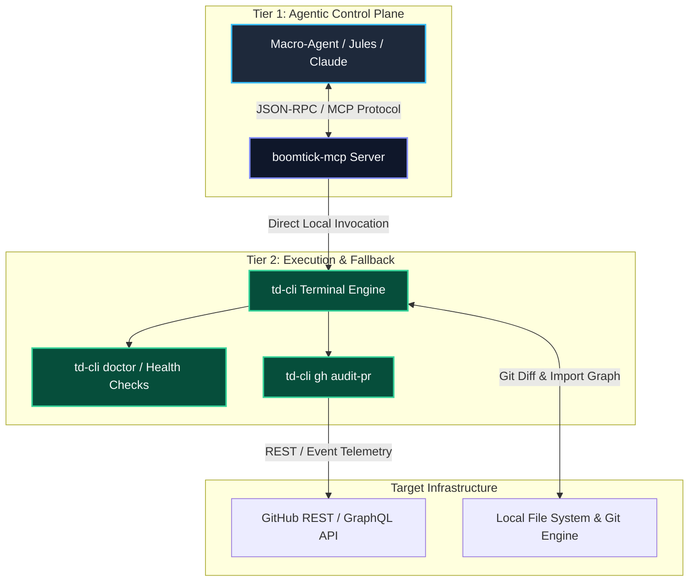

Autonomous engineering agents require predictable, secure, and context-efficient interfaces to inspect codebases, execute pull request audits, and run automated verification pipelines. When agents rely on loose shell scripts or fragmented documentation, token consumption explodes, execution non-determinism increases, and error recovery becomes fragile.

I engineered the **Boomtick DevAI Ecosystem** to solve these challenges. At its core is a **Dual-Layer Architecture** combining `boomtick-mcp` (a Model Context Protocol server for structured macro-agent tool invocation) and `td-cli` (a standalone terminal CLI serving as a deterministic local execution layer and human fallback). Together with a **Zero-Submodule Strategy** and a multi-tiered AI review system, this architecture provides unified governance across agentic and developer workflows.

---

## The Problem

Integrating AI agents into real-world software engineering workflows presents three core operational bottlenecks:

1. **Context Bloat and Prompt Fatigue**: Exposing full repository scripts or unrestricted shell access forces agents to consume thousands of tokens parsing usage instructions, leading to hallucinated arguments or incomplete command flags.
2. **Brittle Agent Execution**: Agents operating solely through ad-hoc bash commands lack structured parameter validation, type safety, and standardized error responses when underlying tools or external APIs fail.
3. **Submodule Overhead**: Distributing developer tooling across repositories using Git submodules introduces version skew, complex synchronizations, and detached HEAD state issues during autonomous CI/CD runs.

To address these pain points, I designed an ecosystem that cleanly separates high-level agentic decision-making from low-level execution mechanics.

---

## Dual-Layer Architecture

The Boomtick architecture strictly separates the control plane (agentic reasoning via MCP) from the data and execution plane (deterministic CLI commands and API integrations).



### Key Architectural Principles

- **Zero-Submodule Strategy**: Rather than embedding tooling via Git submodules across downstream repositories, tools are distributed as zero-dependency binaries and standalone execution packages resolved dynamically via path resolution scripts (`scripts/resolve-cli.sh`).
- **Multi-Tier AI Review System**: Incoming pull requests trigger structural evaluation pipelines where macro-agents utilize `boomtick-mcp` tools to inspect diffs, verify static analysis artifacts, and render structured review recommendations (`APPROVE`, `REQUEST_CHANGES`, or `COMMENT`).
- **Strict Tool Hierarchy**: `boomtick-mcp` exposes strongly typed, schema-validated tools to the agent. If the MCP protocol layer is unreachable or running in an isolated environment, the agent or developer seamlessly falls back to direct `td-cli` command execution.


*Figure 1: High-level system map illustrating the dual-layer flow from macro-agents down to local CLI fallback and GitHub API endpoints.*

---

## Relationship to Sister DevAI Tooling

While my previous articles focus on specific DevAI capabilities—such as the [Deployment Impact Analyzer](/research/deployment-impact-analyzer) (visual screenshot diffing) and the [GitOps PR Reviewer](/research/gitops-pr-reviewer) (automated Gemini review prompts)—`boomtick-mcp` and `td-cli` serve as the **underlying control and execution harness** that unifies them.

Rather than running standalone scripts for each audit step, the Boomtick ecosystem encapsulates these pipelines into standardized primitives:

- **Deployment Impact Analysis** is invoked via `td-cli impact:analysis` or the `run_impact_analysis` MCP tool.
- **GitOps Code Reviews** are dispatched via `td-cli gh audit-pr` or the `audit_pull_request` MCP tool.
- **Version Hallucination Guards** run through `td-cli versiontruth` or the `verify_versions` MCP tool.

By wrapping these distinct pipelines behind a single interface, agentic callers do not need to learn custom environment variables or CLI flags for every sub-tool.

---

## Active Operational Usage Today

In production and daily engineering workflows across my repositories, these tools operate across two primary modes:

1. **Interactive Agent Mode (`boomtick-mcp`)**: Loaded into MCP-compliant desktop clients (e.g. Claude Desktop, Jules agent sessions). When I instruct an agent to *"Audit PR #42 for visual and security regressions"*, the agent calls `boomtick-mcp.audit_pull_request` via JSON-RPC, executing the multi-stage check without spawning unconstrained terminal commands.
2. **Headless CI/CD & CLI Mode (`td-cli`)**: Executed inside GitHub Actions workflows (`.github/workflows/jules-fix-trigger.yml`) and local terminal environments. Containerized CI jobs invoke `scripts/resolve-cli.sh` to route execution directly to `td-cli gh audit-pr`, ensuring exact parity between developer terminal runs and automated pull request gates.

---

## Boomtick MCP Server (`boomtick-mcp`)

The primary interface for AI agents is `boomtick-mcp`, built natively on the Model Context Protocol (MCP). It translates abstract agent intents into validated, schema-constrained operations.

### Schema Safety and Context Optimization

By utilizing JSON Schema definitions for every exposed tool, `boomtick-mcp` prevents parameter hallucination before execution reaches the system shell.

```json
{
  "name": "audit_pull_request",
  "description": "Executes a multi-stage pull request health and impact audit.",
  "parameters": {
    "type": "object",
    "properties": {
      "pr_number": {
        "type": "integer",
        "description": "Target GitHub Pull Request number"
      },
      "include_impact_analysis": {
        "type": "boolean",
        "default": true
      }
    },
    "required": ["pr_number"]
  }
}
```

### Benefits of the MCP Layer

1. **Token Efficiency**: Agents receive structured JSON outputs rather than unstructured terminal logs, reducing context window overhead by up to 70%.
2. **Security Isolation**: Tools execute within defined boundaries, preventing arbitrary shell command injection or unauthorized directory traversal.
3. **Standardized Agent Client Support**: Operates out-of-the-box with compliant MCP clients including Claude Desktop, Jules, and custom agentic runners.


*Figure 2: `boomtick-mcp` loaded inside an agentic desktop interface, exposing structured audit and repository analysis tools.*

---

## Tier 2 Fallback: Terminal CLI (`td-cli`)

While `boomtick-mcp` serves agentic clients, `td-cli` provides the underlying deterministic command-line execution engine. It ensures that developers and CI/CD scripts maintain identical execution capabilities independently of LLM availability.

### Core CLI Capabilities

- `td-cli gh audit-pr`: Fetches pull request diffs, checks review status limits to prevent infinite automated review loops, and outputs deterministic markdown review templates.
- `td-cli doctor`: Validates local development environment prerequisites, workspace PATH resolution, node/pnpm dependency consistency, and required environment variables.
- `td-cli ai review`: Orchestrates local context ingestion and feeds structured prompts to local or remote inference backends.

```bash
# Running local environment verification and PR audit fallback
$ td-cli doctor
[OK] Node.js environment detected (v24.x)
[OK] PATH resolution script active (/github/workspace/scripts/resolve-cli.sh)
[OK] GitHub API authentication verified

$ td-cli gh audit-pr --pr 42
[INFO] Inspecting PR #42 diff...
[INFO] Impact Analysis: 3 components affected across 2 routes
[SUCCESS] Multi-model review generated: APPROVE
```


*Figure 3: High-contrast terminal output demonstrating `td-cli gh audit-pr` and `td-cli doctor` health checks in action.*

---

## Architectural Impact & Lessons Learned

Designing the Boomtick DevAI ecosystem reinforced a foundational principle in modern agentic engineering: **agents excel at decision-making when grounded by deterministic execution primitives.**

1. **Dual-Layer Resilience**: By decoupling the agent interface (`boomtick-mcp`) from the execution engine (`td-cli`), system updates to underlying scripts do not require modifying agent prompts or breaking schema definitions.
2. **Deterministic Triage**: Incorporating explicit execution guards in `td-cli` (such as checking previous review counts) prevents runaway loops in automated GitHub Actions environments.
3. **Unified Developer & Agent Workflows**: Using the same CLI binary for both agent tool calls and manual developer inspection ensures complete parity between local development and autonomous agent operations.
