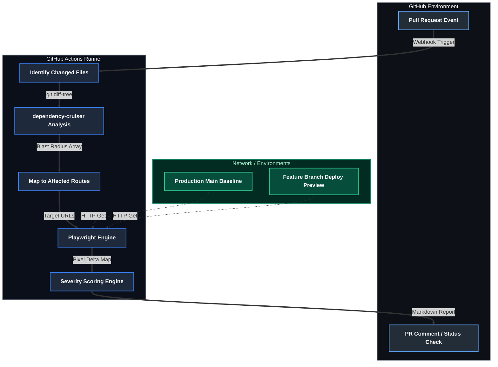

LLM code generation introduces unintended visual side effects—hallucinated UI components, modified badge styles, shifted accents, or unintended layout changes. Reviewing these multi-file diffs manually is error-prone, running full end-to-end test suites on every commit is too slow, and standard unit tests completely miss visual artifacts.

I built the **Deployment Impact Analyzer** to catch these discrepancies automatically. The pipeline traces every code modification through the project's dependency graph, identifies which user-facing routes are touched, and triggers targeted Playwright visual diffs using Pixelmatch. By scoping screenshots strictly to impacted views, it flags hallucinated elements and styling shifts directly in the pull request while cutting visual testing volume by up to 90%.

## The Architecture



- **Dependency Graph Parsing**: Traces modified files up to entry points to establish an explicit visual blast radius.
- **Route Resolution**: Maps structural code entry points directly to active application routing domains.
- **Targeted Visual Diffing**: Executes localized Playwright automated captures against a production baseline.
- **Asynchronous PR Feedback**: Generates layout shift metrics and updates the pull request conversation via GitHub APIs.

---

## 1. Import Graph Parsing with dependency-cruiser

I didn't want to test every page if only the "About" section changed. To achieve targeted testing, I use `dependency-cruiser` to analyze the project's import graph.

When modifying a file, I trace its dependents up the tree until I reach an entry point (a route or a page component).

```bash
# Example logic for finding dependents
npx depcruise --exclude "^node_modules" --output-type json src | \
  jq '.modules[] | select(.dependencies[].resolved == "src/components/Button.tsx") | .source'
```

---

## 2. Automated Playwright Screenshot Diffing

Once I have a list of affected routes, I trigger a Playwright-based capture service.

The pipeline performs a "sandwich" comparison:
1.  **Baseline**: Capture screenshots of the affected routes on the `main` branch.
2.  **Current**: Capture screenshots of the same routes on the feature branch.
3.  **Diff**: Use `pixelmatch` to generate a pixel-level delta.

To improve the signal-to-noise ratio, I automatically crop the diff to the bounding box of the changed area. This helps reviewers focus on the specific UI shift rather than scanning a full-page screenshot.

---

## 3. Severity Scoring & Reporting

Pixel diffs aren't all equal. A 1px shift in a footer is different from a broken hero section.

My scoring engine calculates a **Severity Score** based on:
- **Pixel Count**: The absolute number of changed pixels.
- **Percentage**: The ratio of changed pixels to the total area.
- **Layout Shift**: Detection of significant element movement.

If the score exceeds a configurable threshold, the pipeline marks the check as failed and requests a manual visual review.

---

## 4. GitHub Actions Integration

I orchestrated the entire system via GitHub Actions. I've optimized the workflow to use caching for the `dependency-cruiser` graph and parallelize Playwright workers to keep execution times under 5 minutes.

```yaml
name: Deployment Impact Analysis
on: [pull_request]

jobs:
  impact:
    runs-on: ubuntu-latest
    steps:
      - uses: actions/checkout@v4
      - run: pnpm install
      - name: Run Impact Analysis
        run: pnpm run impact:analysis
      - name: Visual Diffing
        run: pnpm run impact:visual-diff
      - name: Post Report
        run: python scripts/send-jules-impact.py
```

### Example Report Output

When opening a PR, the analyzer posts a summary directly to the GitHub conversation. This allows developers to see the impact at a glance without leaving their workflow.

| Route | Visual Diff | Severity | Action |
| :--- | :--- | :--- | :--- |
| `/blog/:slug` | 12.4% | 🔴 HIGH | Manual Review Required |
| `/about` | 0.0% | 🟢 LOW | Auto-passed |
| `/merch` | 1.2% | 🟡 MEDIUM | Review Suggested |

> **Implemented:** I use the `cropped` diff artifacts to show exactly where the pixels changed, saving reviewers from playing "spot the difference" on full-page screenshots.

| Before | After | Diff |
| :---: | :---: | :---: |
|  |  |  |

*A "sandwich" comparison showing the baseline, the new state, and the highlighted pixel delta.*

### Real-World Finding: From 404 to Overflow Resolution

Visual regression testing is particularly effective for catching "cumulative" bugs—issues that only appear once I integrate multiple components. During the development of this tool, I encountered a three-stage regression that perfectly illustrated the system's value.

#### 1. The Initial State (Missing Route)
Initially, a routing configuration error caused the analyzer to hit a "Content Not Found" page. While the code for the tool existed, I hadn't registered the dynamic route in the main portfolio index.

#### 2. The Regression (Text Overflow)
After fixing the routing, the page rendered, but a new issue emerged on mobile viewports. Long file paths in the `ArchitecturalAssetsList` component were overflowing their containers, breaking the layout and pushing the "Category" labels off-screen. This is a classic "invisible" regression that passes unit tests and type-checks but fails the "eyeball test."

#### 3. The Resolution (Truncation & Wrapping)
I implemented a fix using Tailwind's `truncate` and `flex-wrap` utilities, ensuring that assets are readable even on the narrowest devices.

| 1. Missing | 2. Diff | 3. Fixed |
| :---: | :---: | :---: |
|  |  |  |

*The mobile resolution sequence: from a 404 state to an overflow regression, and finally the resolved responsive layout.*

## Lessons Learned

The core engineering insight from this project is the value of multi-layered verification. Static analysis maps the system's structural vulnerabilities, but visual diffing provides the actual confirmation of interface integrity. Merging these workflows converts unpredictable visual evaluation into a deterministic, programmatic check.

The next evolution of this tool involves agentic auto-resolution: using LLMs to analyze the visual diff and decide if a change is an intentional improvement or an accidental regression.
