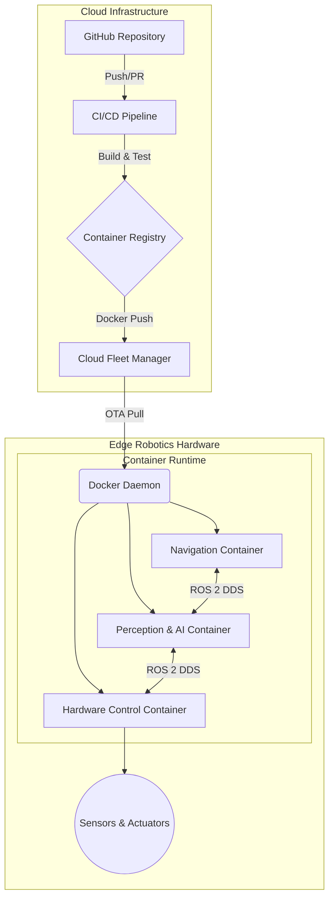

# Architecting Deployment & Edge Infrastructure

Bridging the gap between a functioning robotics prototype and a reliable production deployment requires robust infrastructure. For autonomous systems to operate safely and effectively in the real world, they need deterministic, containerized deployments, automated CI/CD pipelines, and secure cloud-to-edge connectivity.

The "Deployment & Edge Infrastructure" pillar focuses on standardizing these deployments to guarantee that onboard software behaves identically in the lab, in simulation, and out in the field.

---

## Edge Robotics Container Topology

To ensure consistent runtime environments across heterogeneous edge hardware, I leverage Docker containerization. This isolates ROS 2 nodes, AI inference models, and hardware drivers, ensuring reliable execution and simplifying OTA (Over-The-Air) updates.

### Key Infrastructure Principles:

1.  **Immutable Artifacts:** Every build produces an immutable Docker image. This ensures that what gets tested in CI is exactly what runs on the edge device.
2.  **Decoupled Services:** By isolating perception, planning, and control into separate containers, we can update individual components without bringing down the entire system or risking cross-dependency conflicts.
3.  **Automated Validation:** Before any container reaches the fleet manager, it must pass a rigorous CI/CD pipeline, including simulated unit tests and software-in-the-loop (SITL) checks.

*(Note: Detailed network architecture and hardware-specific deployment diagrams are currently being updated and will be added here soon.)*
