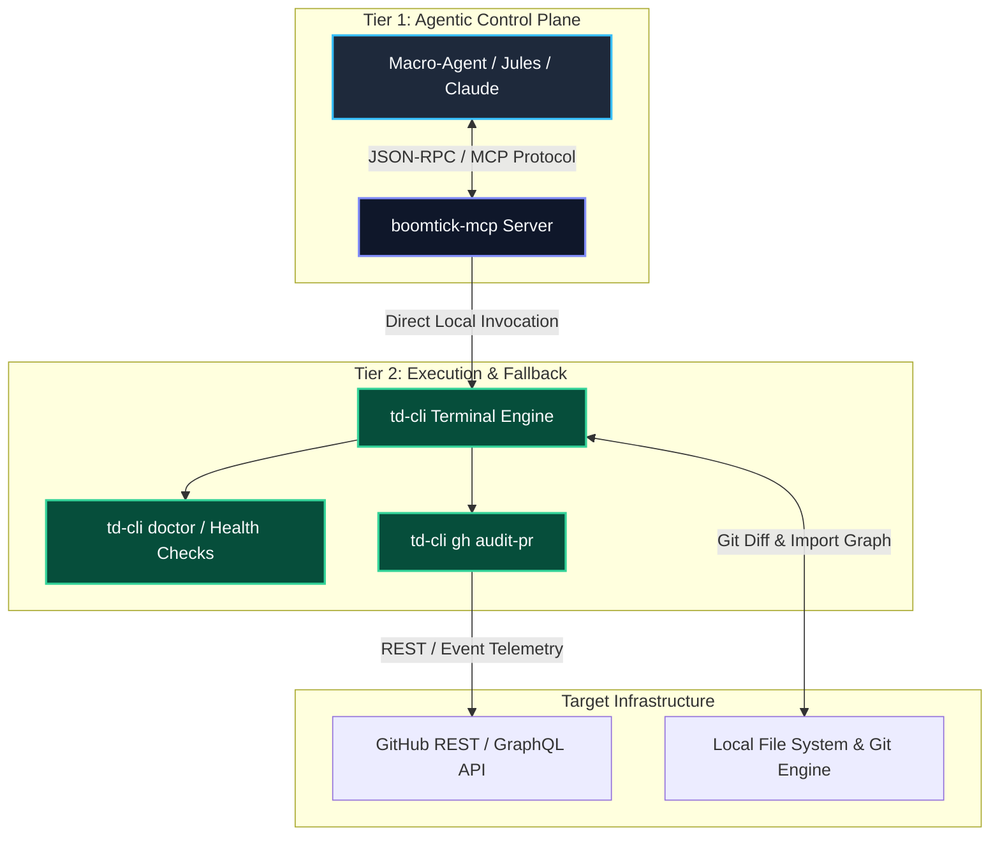

The first version of my AI review workflow made a classic mistake: I asked the model to do everything. It had to understand the repo, inspect the diff, infer the design system, read CI logs, and decide what mattered. Sometimes it worked; often it produced a confident wall of feedback that was hard to trust.

The better pattern is to shrink the model's job: collect the important pull request context first, then ask the model to review that prepared packet through structured tools.

I engineered the **Boomtick DevAI Ecosystem** around this exact principle. At its core is a **Dual-Layer Architecture** combining `boomtick-mcp` (a Model Context Protocol server for structured macro-agent tool invocation) and `td-cli` (a standalone terminal CLI serving as a deterministic local execution layer and human fallback). Together with a **Zero-Submodule Strategy** and a multi-tiered AI review system, this architecture provides unified governance across agentic and developer workflows.

---

## Dual-Layer Control & Execution Architecture

The Boomtick architecture strictly separates the control plane (agentic reasoning via MCP) from the data and execution plane (deterministic CLI commands and API integrations).



### Key Architectural Principles

- **Zero-Submodule Strategy**: Rather than embedding tooling via Git submodules across downstream repositories, tools are distributed as zero-dependency binaries and standalone execution packages resolved dynamically via path resolution scripts (`scripts/resolve-cli.sh`).
- **Multi-Tier AI Review System**: Incoming pull requests trigger structural evaluation pipelines where macro-agents utilize `boomtick-mcp` tools or `td-cli` commands to inspect diffs, verify static analysis artifacts, and render structured review recommendations (`APPROVE`, `REQUEST_CHANGES`, or `COMMENT`).
- **Strict Tool Hierarchy**: `boomtick-mcp` exposes strongly typed, schema-validated tools to the agent. If the MCP protocol layer is unreachable or running in an isolated environment, the agent or developer seamlessly falls back to direct `td-cli` command execution.


*Figure 1: High-level system map illustrating the dual-layer flow from macro-agents down to local CLI fallback and GitHub API endpoints.*

---

## 1. Aggregate PR Context Into a Structured Packet

Instead of having the model search the repository, run a script to assemble the review context. For BoomTick.blog and portfolio repos, I use `td-cli gh audit-pr <PR_NUMBER>` (or `boomtick-mcp.audit_pull_request`) to bundle:

- The PR title and description
- The changed files and their relative diffs
- Failing CI logs
- Linked issue content
- Project-specific review rules and design-token guidelines

This gathers everything the model needs into a single `.devai/review-context.md` file.

```bash
# Example aggregation pattern via td-cli engine
$ td-cli gh audit-pr --pr 42 --fetch
[INFO] Inspecting PR #42 diff against target branch 'main'...
[INFO] Parsing import dependency graph via dependency-cruiser...
[SUCCESS] Assembled .devai/review-context.md context packet
```

---

## 2. Boomtick MCP Server (`boomtick-mcp`) for Agentic Workflows

The primary interface for AI agents is `boomtick-mcp`, built natively on the Model Context Protocol (MCP). It translates abstract agent intents into validated, schema-constrained operations.

### Schema Safety and Context Optimization

By utilizing JSON Schema definitions for every exposed tool, `boomtick-mcp` prevents parameter hallucination before execution reaches the system shell.

```json
{
  "name": "audit_pull_request",
  "description": "Executes a multi-stage pull request health and impact audit.",
  "parameters": {
    "type": "object",
    "properties": {
      "pr_number": {
        "type": "integer",
        "description": "Target GitHub Pull Request number"
      },
      "include_impact_analysis": {
        "type": "boolean",
        "default": true
      }
    },
    "required": ["pr_number"]
  }
}
```


*Figure 2: `boomtick-mcp` loaded inside an agentic desktop interface, exposing structured audit and repository analysis tools.*

---

## 3. Tier 2 Fallback: Terminal CLI (`td-cli`)

While `boomtick-mcp` serves agentic clients, `td-cli` provides the underlying deterministic command-line execution engine. It ensures that developers and CI/CD scripts maintain identical execution capabilities independently of LLM availability.

```bash
# Running local environment verification and PR audit fallback
$ td-cli doctor
[OK] Node.js environment detected (v24.x)
[OK] PATH resolution script active (/github/workspace/scripts/resolve-cli.sh)
[OK] GitHub API authentication verified

$ td-cli gh audit-pr --pr 42
[INFO] Inspecting PR #42 diff...
[INFO] Impact Analysis: 3 components affected across 2 routes
[SUCCESS] Multi-model review generated: APPROVE
```


*Figure 3: High-contrast terminal output demonstrating `td-cli gh audit-pr` and `td-cli doctor` health checks in action.*

---

## 4. Orchestrate Inference with the Gemini API

I engineered the inference orchestration to call the Google Gemini API directly with the prepared context. I deliberately rely on Gemini's large context window to ingest massive diffs and build artifacts without truncation, ensuring the review agent has a complete picture before generating feedback.

```python
import os
import requests
import json
from pathlib import Path

GEMINI_API_KEY = os.getenv("GEMINI_API_KEY")
ENDPOINT = f"https://generativelanguage.googleapis.com/v1beta/models/gemini-3.5-pro:generateContent?key={GEMINI_API_KEY}"

context = Path(".devai/review-context.md").read_text()

prompt = f"""
You are reviewing a pull request.

Focus on:
1. correctness bugs
2. broken UI states
3. accessibility regressions
4. design-token violations
5. missing tests

Return valid JSON with this schema:
{{
  "blocking": [{{"file": "string", "reason": "string", "suggestion": "string"}}],
  "non_blocking": [{{"file": "string", "reason": "string"}}],
  "summary": "string"
}}

Context:
{context}
"""

response = requests.post(
    ENDPOINT,
    headers={"Content-Type": "application/json"},
    json={
        "contents": [{"parts": [{"text": prompt}]}],
        "generationConfig": {
            "responseMimeType": "application/json",
            "temperature": 0.2
        }
    },
    timeout=120,
)

response.raise_for_status()
result = response.json()
print(result["candidates"][0]["content"]["parts"][0]["text"])
```

---

## 5. Map Review States Deterministically

I designed the pipeline to explicitly prohibit the model from directly approving or blocking a pull request. Instead, a deterministic script reads the structured JSON findings and maps them strictly to GitHub review states:

- **`REQUEST_CHANGES`:** Triggers automatically if there are any items populated in the `blocking` list (e.g., build failures, accessibility regressions, missing props).
- **`COMMENT`:** Posts non-blocking suggestions from the `non_blocking` list (e.g., naming, cleanup, styling tips).
- **`APPROVE`:** Executes safely only when the `blocking` list is completely empty.

For instance, `td-cli ai review` or `scripts/send-jules-impact.py` submits the review payload directly to the GitHub API.


*Figure 4: Automated review feedback comment posted directly to a GitHub Pull Request.*

---

## 6. The Autonomous Repair Loop

To close the gap between detection and resolution, I engineered an autonomous repair loop utilizing Jules and specialized coding agents. When the CI pipeline fails, it does not just report the error—it triggers an active repair session.

The process is orchestrated via `.github/workflows/jules-fix-trigger.yml`, which detects CI failures and executes `td-cli ai repair`. This workflow bundles the failing CI logs, the active PR diff, and project-specific constraints into a secure repair context packet.

### The CI Repair Flow:
1. **CI Failure Detection:** GitHub Actions detects a failing test, linting error, or build step.
2. **Context Aggregation:** A script extracts the exact failing log block and relevant source diffs.
3. **Autonomous Repair Session:** `jules-fix-trigger.yml` initiates a coding agent session (via Jules or TD CLI) armed with the failing logs, diffs, and project constraints.
4. **Patch Generation:** The agent synthesizes a patch addressing the specific failure and either commits it directly to a fix branch or proposes it as PR feedback.
5. **Human Verification:** I review and merge the synthesized fix, ensuring human oversight remains in the loop.

---

## Summary of the Architecture

By consolidating the PR review orchestration into the **Boomtick DevAI Ecosystem**:
1. Agents interact via structured Model Context Protocol tools (`boomtick-mcp`).
2. Developers and CI workflows utilize deterministic CLI fallbacks (`td-cli`).
3. Google Gemini generates structured JSON findings over complete context packets.
4. Deterministic gatekeeper scripts apply GitHub review states without hallucination risks.

Placing deterministic boundary scripts before and after the inference step ensures automated code reviews remain predictable, audit-compliant, and reliable across all repositories.
