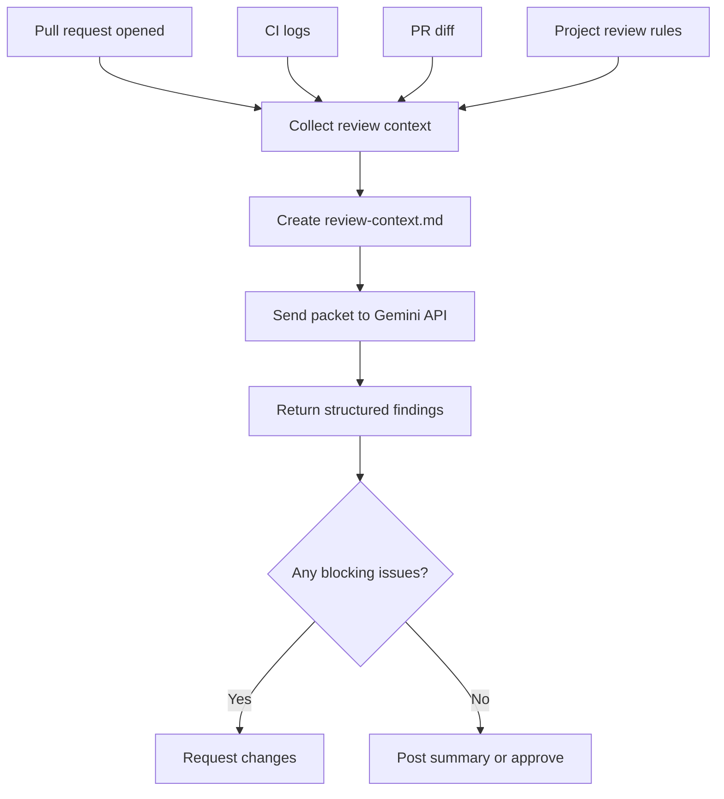

# Automating PR Reviews with GitHub Actions and Gemini

The first version of my AI review workflow made the classic mistake: I asked the model to do everything. It had to understand the repo, inspect the diff, infer the design system, read CI logs, and decide what mattered. Sometimes it worked; often it produced a confident wall of feedback that was hard to trust.

The better pattern is to shrink the model's job: collect the important pull request context first, then ask the model to review that prepared packet.



---

## 1. Aggregate PR Context Into a Structured Packet

Instead of having the model search the repository, run a script to assemble the review context. For BoomTick.blog, I use `dev-tools/td-cli gh audit-pr <PR_NUMBER> --fetch` (or a batch aggregator script like `dev-tools/aggregate-prs.sh`) to bundle:

- The PR title and description
- The changed files and their relative diffs
- Failing CI logs
- Linked issue content
- Project-specific review rules and design-token guidelines

This gathers everything the model needs into a single `.devai/review-context.md` file.

```bash
# Example aggregation pattern
python dev-tools/aggregate_pr_context.py \
  --target-branch main \
  --output .devai/review-context.md
```

---

## 2. Orchestrate Inference with the Gemini API

Call the Google Gemini API directly with the prepared context. Rely on Gemini's large context window to ingest diffs and build artifacts without truncation.

```python
import os
import requests
import json
from pathlib import Path

GEMINI_API_KEY = os.getenv("GEMINI_API_KEY")
ENDPOINT = f"https://generativelanguage.googleapis.com/v1beta/models/gemini-3.5-pro:generateContent?key={GEMINI_API_KEY}"

context = Path(".devai/review-context.md").read_text()

prompt = f"""
You are reviewing a pull request.

Focus on:
1. correctness bugs
2. broken UI states
3. accessibility regressions
4. design-token violations
5. missing tests

Return valid JSON with this schema:
{{
  "blocking": [{{"file": "string", "reason": "string", "suggestion": "string"}}],
  "non_blocking": [{{"file": "string", "reason": "string"}}],
  "summary": "string"
}}

Context:
{context}
"""

response = requests.post(
    ENDPOINT,
    headers={"Content-Type": "application/json"},
    json={
        "contents": [{"parts": [{"text": prompt}]}],
        "generationConfig": {
            "responseMimeType": "application/json",
            "temperature": 0.2
        }
    },
    timeout=120,
)

response.raise_for_status()
result = response.json()
print(result["candidates"][0]["content"]["parts"][0]["text"])
```

---

## 3. Generate Structured Findings for Downstream Automation

Configure Gemini with structured JSON output (`responseMimeType: "application/json"`). This allows scripts to programmatically parse and act on the feedback.

```json
{
  "blocking": [
    {
      "file": "src/components/Nav.tsx",
      "reason": "Mobile menu button has no accessible label",
      "suggestion": "Add aria-label=\"Open navigation menu\""
    }
  ],
  "non_blocking": [
    {
      "file": "src/styles/tokens.ts",
      "reason": "Spacing token could be reused here"
    }
  ],
  "summary": "One blocking accessibility issue found."
}
```

---

## 4. Map Review States Deterministically

Do not let the model directly approve or block a pull request. A script should read the JSON findings and map them to GitHub review states.

- **Request Changes:** Triggers if there are any items in the `blocking` list (e.g., build failures, accessibility regressions, missing props).
- **Comment:** Posts non-blocking suggestions (e.g., naming, cleanup, styling tips).
- **Approve:** Executes only when the `blocking` list is empty.

For instance, `dev-tools/submit_review.py` reads `.devai/review-result.json` and submits the review payload to the GitHub API.

```python
import json

with open(".devai/review-result.json") as f:
    findings = json.load(f)

event = "REQUEST_CHANGES" if findings["blocking"] else "APPROVE"

pr.create_review(
    body=findings["summary"],
    comments=findings["blocking"] + findings["non_blocking"],
    event=event,
)
```


---

## 5. Feed CI Failures to the Repair Loop

When CI fails, extract the error logs and treat them as context for a repair agent. Crucially, the agent should only suggest patches or comment on the PR; a human must review and approve before any code is merged.

### The CI Repair Flow:
1. **CI Failure:** GitHub Actions triggers on a build or test failure.
2. **Log Extraction:** A script extracts the failing log block.
3. **Repair Inference:** The repair agent receives the logs, diff, and affected files (triggered in this repo via `dev-tools/td-cli ai repair` or `jules-fix-trigger.yml`).
4. **PR Feedback:** The agent comments or proposes a patch.
5. **Human Review:** The developer reviews and merges the suggested fix.

---

## 6. Integrate Playwright Screenshot Diffing

Unit tests check code logic, but they miss layout shifts or broken responsive designs. Use Playwright screenshots of key pages (home page, articles, nav bars) as a tripwire to detect visual regressions.

```ts
import { test, expect } from "@playwright/test";

test("home page visual smoke test", async ({ page }) => {
  await page.goto("/");
  await expect(page).toHaveScreenshot("home-page.png", {
    fullPage: true,
  });
});
```

Verify changes visually on pull requests before they reach production.

---

## Summary of the Architecture

To set up the minimum viable version:
1. Create a context aggregator script to output `.devai/review-context.md`.
2. Send that markdown to the Gemini API requesting JSON output.
3. Parse the JSON and submit the review to GitHub.

By keeping the orchestration simple and placing deterministic boundary scripts before and after the inference step, you make your automated code review predictable, testable, and reliable.
