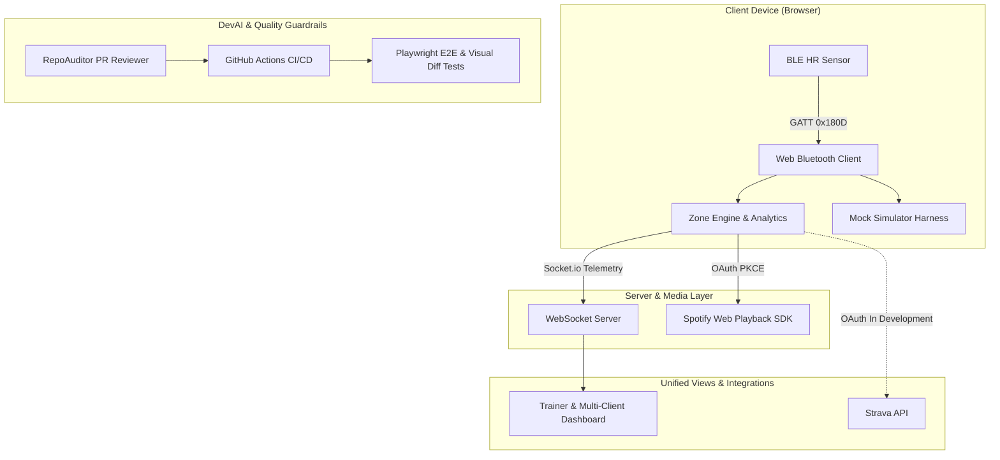

The Heart Rate Monitor (HRM) project bridges consumer fitness hardware with real-time browser environments. Originally built in 2020 as a fast remote-training prototype, HRM was completely re-architected in 2026 as a flagship testbed for DevAI workflows—proving how autonomous PR auditing, agentic CI/CD pipelines, and multi-client telemetry can streamline full-stack system delivery.

## Origin Story & Architectural Evolution

HRM was originally conceived and built during the COVID-19 pandemic for my mother, myself, and our personal trainer, Tim (from FitForLife gym). The goal was to maintain real-time biometric telemetry during remote group workouts when physical gyms were closed. Achieving a stable, frictionless experience required distinct architectural phases:

### Iteration 1: OpenCV Video Loopback

Initially, I captured BLE heart rate data via Python, overlaid a HUD text display onto the active video stream using `cv2.putText`, and outputted the composited stream to a `v4l2loopback` virtual camera device. I quickly abandoned this approach due to cross-platform OS driver fragility (struggling with DirectShow on Windows versus v4l2 on Linux).

### Iteration 2: Web Bluetooth + OBS VirtualCam

The second iteration utilized a Web Bluetooth client rendered in a browser window, which I composited into Zoom using OBS Studio VirtualCam. I abandoned this due to Zoom aggressively locking camera devices, video mirroring inconsistencies, and window resize scaling artifacts that broke the HUD alignment.

### v2 Distributed Topology (2026)

The final architecture moved to a decoupled, multi-client web topology. Browser clients stream BLE telemetry to a persistent WebSocket server, relaying active zone metrics, calorie calculations, and Tabata timer state to a unified trainer dashboard.

## The DevAI Catalyst (v1 -> v2 Rewrite)

Refactoring the multi-client WebSocket topology and complex Web Bluetooth mock states in v2 became tedious to verify manually. Managing continuous multi-client refactors directly prompted me to build RepoAuditor and automated PR review bots in GitHub Actions. Using GitHub Actions, Gemini-powered PR reviews, and automated visual regression testing (Playwright), I was able to validate complex Web Bluetooth mock states and UI layout integrity across updates.

## Core Technical Implementation

### Web Bluetooth GATT Lifecycle & Decoding

The foundation relies on the Web Bluetooth API to connect with peripheral sensors using the standard Bluetooth 4.0 / ANT+ Heart Rate Profile.

The client lifecycle begins by scanning for devices advertising the Heart Rate Service (UUID `0x180D`). Once connected, it subscribes to the Heart Rate Measurement Characteristic (`0x2A37`). The incoming data streams as a raw byte buffer. I decode the flags byte in real-time to determine if the HR value is 8-bit or 16-bit, and to extract optional fields like energy expended or RR-interval buffers. The client includes an auto-reconnect handler that gracefully manages transient signal losses.

### Zone Engine

To provide immediate visual feedback, I implemented a Zone Engine based on the standard maximum heart rate formula: $HR_{max} = 220 - \text{age}$.

The telemetry is mapped into dynamic zone buckets:
- **Zone 1 (Grey):** 50-60% (Very Light)
- **Zone 2 (Blue):** 60-70% (Light)
- **Zone 3 (Green):** 70-80% (Moderate)
- **Zone 4 (Orange):** 80-90% (Hard)
- **Zone 5 (Red):** 90-100% (Maximum)

### WebSocket Protocol & Stale Data Guardrails

Multi-client synchronization is handled over Socket.io. To maintain a reliable dashboard, I engineered strict stale data guardrails and heartbeat handling. If telemetry from a client ceases for more than 4 seconds, the dashboard displays `--`. If the client remains inactive for over 30 seconds, the user's card automatically unmounts from the instructor's grid to prevent clutter.

### Mock Simulator Test Harness

To ensure the system could scale and handle network jitter, I built a dedicated mocking engine (`/hrm_mock`). This simulator allows for multi-user stress testing and synthetic biometric signal generation without requiring physical peripherals.

### Synchronized Workout Intervals & Spotify API

The central server orchestrates a synchronized Tabata HIIT timer (countdown, work intervals, rest periods, audio feedback beeps) across all client views, guaranteeing sub-100ms latency for state replication.

Furthermore, I integrated the Spotify API and Web Playback SDK to synchronize music with the active workout state using OAuth PKCE for client-side token negotiation. A background token refresh loop maintains an uninterrupted session. The system exerts real-time playback control synced directly to the HIIT intervals, automatically adjusting playback based on the current timer phase.

### Interactive Controls & Analytics

The live application features interactive controls with a dual-mode timer (Tabata vs. Stopwatch), audio feedback cues, and in-browser Spotify player token management. I also built a workout history and analytics persistence layer that tracks elapsed duration, active calories burned, and historical session logs across multiple dates.

## System Topology

The following diagram illustrates the data flow and system topology, from the biometric peripheral through the web client to the synchronized servers and external APIs.

