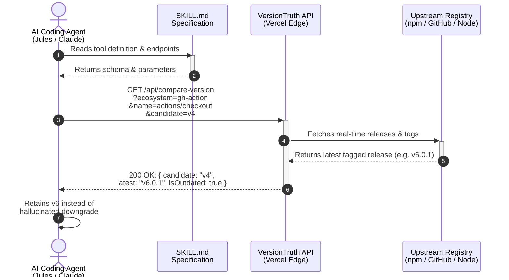

When LLMs and autonomous coding agents edit software repositories, they frequently suffer from **out-of-distribution version hallucinations**: when an agent encounters a version tag newer than its training cutoff (for example, `actions/checkout@v6`), it often assumes the tag is invalid and silently downgrades it to an older, cached version (such as `v4`) — a subtle regression that's easy to miss in review.

To eliminate this failure mode, I built and submitted **VersionTruth** at **NandaHack** (MIT Media Lab's agentic-AI hackathon) — a live ground-truth lookup service paired with a standardized `SKILL.md` that lets coding agents verify dependency versions against official registries *before* writing changes.


VersionTruth operates as an out-of-band ground-truth oracle for AI coding assistants. Instead of trusting its own training data for "is this version real," the agent asks VersionTruth's API, which checks the live upstream registry.

```http
GET /api/latest-version?ecosystem=gh-action&name=actions/checkout HTTP/1.1
Host: boomtick.blog

200 OK
{ "ecosystem": "gh-action", "name": "actions/checkout", "latest": "v6.0.1" }
```

## Root Cause Incident: The Out-of-Distribution Downgrade

The pattern repeats across three surfaces in modern repositories:

- `package.json` dependency versions
- `.nvmrc` / `.node-version` / `engines.node`
- `.github/workflows/*.yml` `uses:` pins

In every case, the failure is the same: an agent's internal sense of "the latest version I know about" silently overrides what's actually true right now.

The catalyst for VersionTruth was a recurring failure in agentic code review workflows. When deploying targeted reviewer agents—designed for low token usage, minimal context, and fast execution—both primary coding and reviewer agents confidently recommended downgrading `actions/checkout` to `@v4`.

For historical context, `v4.1.0` was released in September 2023, while `v5.0.1` launched in November 2025, and subsequent stable releases reached `v7.0.0`.


This represents a classic out-of-distribution data error. The models encountered version tags (e.g., `v6`) released after their training cutoffs. Lacking real-time registry access, they hallucinated that the unfamiliar version was invalid and suggested reverting to the latest version present in their training data.


This failure was not isolated to lightweight models like `gpt-4o-mini`. Testing confirmed that larger reasoning models, including Gemini 3.1 Pro, exhibited the exact same regression behavior, falsely identifying `v4` as the latest stable major release.


While Agentic DevAI increases engineering velocity, this incident highlights the critical need for deterministic, external validation when handling dynamic infrastructure dependencies.

## The Solution: VersionTruth Architecture

Instead of just diagnosing the failure mode, I packaged the live-registry-lookup logic as a small public API called VersionTruth, along with a hosted `SKILL.md` that tells any agent how to use it. The instruction to the agent is deliberately blunt: if you don't recognize a version string, that's a reason to *check*, not a reason to *revert*. Unfamiliarity isn't evidence of error.


The API lives as serverless functions sitting next to an existing Vite SPA—operating with zero changes to primary application codebases.





---

## API & Tool Specification

VersionTruth exposes lightweight HTTP endpoints that accept ecosystem queries and return structured status metadata.

### 1. Latest Version Query

```http
GET /api/latest-version?ecosystem=gh-action&name=actions/checkout HTTP/1.1
Host: boomtick.blog
```

**Response (`200 OK`):**
```json
{
  "ecosystem": "gh-action",
  "name": "actions/checkout",
  "latest": "v6.0.1",
  "updatedAt": "2026-07-08T12:00:00Z"
}
```

### 2. Candidate Version Comparison

```http
GET /api/compare-version?ecosystem=gh-action&name=actions/checkout&candidate=v4 HTTP/1.1
Host: boomtick.blog
```

**Response (`200 OK`):**
```json
{
  "candidate": "v4",
  "latest": "v6.0.1",
  "isOutdated": true,
  "isDeprecated": false,
  "recommendation": "Do not downgrade. v6.0.1 is valid and current."
}
```

---

## Step-by-Step Reproduction & Agent Integration Guide

Follow this guide to integrate VersionTruth into your own agentic dev pipeline or AI review agent context.

### Step 1: Add the SKILL.md Definition

In your repository's `.github/skills/versiontruth.md` or system prompt configuration, include the tool directive:

```markdown
# VersionTruth Agent Skill

When editing dependency files (`package.json`, `.node-version`, GitHub Actions workflows),
ALWAYS check candidate versions before reverting unfamiliar version strings.

- Oracle API: `https://boomtick.blog/api/compare-version`
- Ecosystems supported: `npm`, `node`, `gh-action`

Rule: Unfamiliarity is NOT evidence of hallucination.
If a version exceeds your training context cut-off, query VersionTruth first.
```

### Step 2: Implement the Deterministic Backstop in CI

Combine the pre-edit agent skill with an explicit post-edit CI check script (`scripts/verify_versions.py`):

```python
import sys
import requests

def verify_action_version(action_name, candidate_version):
    url = (
        "https://boomtick.blog/api/compare-version"
        f"?ecosystem=gh-action&name={action_name}&candidate={candidate_version}"
    )
    res = requests.get(url, timeout=5).json()
    if res.get("isOutdated"):
        print(
            f"⚠️ Warning: {action_name}@{candidate_version} is outdated.\n"
            f"Real latest is {res.get('latest')}"
        )
        return False
    return True

if __name__ == "__main__":
    valid = verify_action_version("actions/checkout", "v4")
    if not valid:
        sys.exit(1)
```
