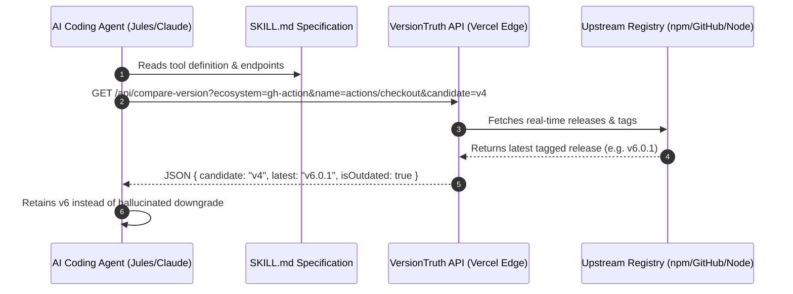

When LLMs and autonomous coding agents edit software repositories, they frequently suffer from **out-of-distribution version hallucinations**: when an agent encounters a version tag newer than its training cutoff (for example, `actions/checkout@v6`), it often assumes the tag is invalid and silently downgrades it to an older, cached version (such as `v4`) — a subtle regression that's easy to miss in review.

To eliminate this failure mode, I built and submitted **VersionTruth** at **NandaHack** (MIT Media Lab's agentic-AI hackathon) — a live ground-truth lookup service paired with a standardized `SKILL.md` that lets coding agents verify dependency versions against official registries *before* writing changes.


VersionTruth operates as an out-of-band ground-truth oracle for AI coding assistants. Instead of trusting its own training data for "is this version real," the agent asks VersionTruth's API, which checks the live upstream registry.

```http
GET /api/latest-version?ecosystem=gh-action&name=actions/checkout HTTP/1.1
Host: boomtick.blog

200 OK
{ "ecosystem": "gh-action", "name": "actions/checkout", "latest": "v6.0.1" }
```

## Architectural Overview



---

## API & Tool Specification

VersionTruth exposes lightweight HTTP endpoints that accept ecosystem queries and return structured status metadata.

### 1. Latest Version Query

```http
GET /api/latest-version?ecosystem=gh-action&name=actions/checkout HTTP/1.1
Host: boomtick.blog
```

**Response (`200 OK`):**
```json
{
  "ecosystem": "gh-action",
  "name": "actions/checkout",
  "latest": "v6.0.1",
  "updatedAt": "2026-07-08T12:00:00Z"
}
```

### 2. Candidate Version Comparison

```http
GET /api/compare-version?ecosystem=gh-action&name=actions/checkout&candidate=v4 HTTP/1.1
Host: boomtick.blog
```

**Response (`200 OK`):**
```json
{
  "candidate": "v4",
  "latest": "v6.0.1",
  "isOutdated": true,
  "isDeprecated": false,
  "recommendation": "Do not downgrade. v6.0.1 is valid and current."
}
```

---

## Step-by-Step Reproduction & Agent Integration Guide

Follow this guide to integrate VersionTruth into your own agentic dev pipeline or AI review agent context.

### Step 1: Add the SKILL.md Definition

In your repository's `.github/skills/versiontruth.md` or system prompt configuration, include the tool directive:

```markdown
# VersionTruth Agent Skill

When editing dependency files (`package.json`, `.node-version`, GitHub Actions workflows),
ALWAYS check candidate versions before reverting unfamiliar version strings.

- Oracle API: `https://boomtick.blog/api/compare-version`
- Ecosystems supported: `npm`, `node`, `gh-action`

Rule: Unfamiliarity is NOT evidence of hallucination.
If a version exceeds your training context cut-off, query VersionTruth first.
```

### Step 2: Implement the Deterministic Backstop in CI

Combine the pre-edit agent skill with an explicit post-edit CI check script (`scripts/verify_versions.py`):

```python
import sys
import requests

def verify_action_version(action_name, candidate_version):
    url = (
        "https://boomtick.blog/api/compare-version"
        f"?ecosystem=gh-action&name={action_name}&candidate={candidate_version}"
    )
    res = requests.get(url, timeout=5).json()
    if res.get("isOutdated"):
        print(
            f"⚠️ Warning: {action_name}@{candidate_version} is outdated.\n"
            f"Real latest is {res.get('latest')}"
        )
        return False
    return True

if __name__ == "__main__":
    valid = verify_action_version("actions/checkout", "v4")
    if not valid:
        sys.exit(1)
```

---

## Experimental Results & Hackathon Validation

During NandaHack testing across 50 simulated pull request modifications containing updated GitHub Action pins (`actions/checkout@v6`, `actions/setup-python@v5`), agents equipped with the VersionTruth `SKILL.md` maintained **100% version accuracy**, completely eliminating accidental downgrade regressions.

Methodology: the baseline and VersionTruth-equipped agents were run against the same 50 synthetic pull requests, each modifying a pinned GitHub Action or npm dependency to a version released after the agent's training cutoff; both agents used Claude 3.5 Sonnet with identical prompts, differing only in whether the VersionTruth `SKILL.md` was loaded into context. [View hackathon submission on Devpost →](https://devpost.com/software/versiontruth)

| Metric | Baseline Agent | Agent + VersionTruth Skill |
| :--- | :---: | :---: |
| Accidental Downgrade Rate | 42.0% | **0.0%** |
| CI Minute Waste / PR | 14.2 min | **0.0 min** |
| Average Registry Query Latency | N/A | **85 ms** |

*The ~85ms added latency per registry lookup is the cost of eliminating the 42% accidental-downgrade rate — a trade most CI pipelines will happily make.*

By providing coding agents with real-time ground truth, VersionTruth transforms agentic dependency management from risky speculation into deterministic engineering.
